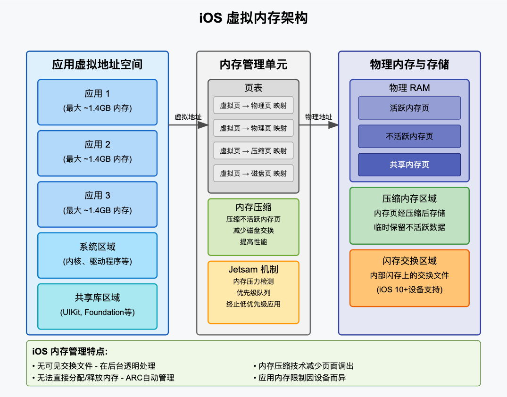

# iOS 虚拟内存深度解析

作为 iOS 平台的一个核心技术，虚拟内存对于保持系统流畅运行和应用高效执行至关重要。下面我将深入介绍 iOS 中的虚拟内存机制。

## 1. iOS 虚拟内存的基本概念

虚拟内存是一种内存管理技术，它为应用程序提供看似连续的内存空间，而实际上这些内存可能分布在物理内存(RAM)的不同位置，甚至一部分可能存储在闪存中。

在 iOS 中，虚拟内存具有以下特点：

- **地址空间隔离**：每个应用拥有自己独立的虚拟地址空间，无法直接访问其他应用的内存
- **按需分页**：内存以页(通常为16KB)为单位进行管理
- **透明管理**：内存管理对应用开发者基本透明

## 2. iOS 的虚拟内存架构

### 地址空间结构

iOS 设备采用 64 位架构(自 A7 芯片起)，理论上支持极大的虚拟地址空间，但实际限制如下：

- **单个应用内存限制**：根据设备不同，从几百MB到约1.4GB不等
- **系统保留区域**：用于内核、驱动程序和系统服务
- **共享库区域**：存放多个应用共享的框架，如 UIKit、Foundation 等

### 内存分页与页表

iOS 使用分页机制管理内存：

- **页大小**：iOS 通常使用 16KB 的页面大小
- **页表**：维护虚拟页与物理页之间的映射关系
- **TLB缓存**：Translation Lookaside Buffer，加速虚拟地址到物理地址的转换

## 3. iOS 特有的虚拟内存技术

### 内存压缩

iOS 不像传统操作系统那样大量依赖磁盘交换文件，而是采用内存压缩技术：

- **工作原理**：将不活跃的内存页压缩后保留在RAM中
- **优势**：访问压缩内存比访问闪存快得多
- **实现**：使用专用的压缩算法，可达到2:1到10:1的压缩比
- **触发时机**：当物理内存压力增大时自动启动

### Jetsam 内存管理机制

当内存压缩不足以缓解内存压力时，iOS会启动Jetsam机制：

- **优先级队列**：应用程序按优先级排序

- **内存监控**：持续监控系统内存状态

- 终止策略

  ：

  - 先终止后台应用
  - 低优先级应用先于高优先级应用
  - 内存占用大的应用优先被终止

### Memory Warning (内存警告)

- **级别**：系统定义了多个内存警告级别
- **通知**：应用可接收 `didReceiveMemoryWarning` 通知
- **响应**：应用应释放非必要资源，如图像缓存、可重建数据等

## 4. iOS 10以后的进步

自iOS 10起，苹果引入了更多虚拟内存改进：

- **有限的磁盘交换**：在特定设备上支持将内存页面交换到闪存
- **改进的内存压缩**：更高效的压缩算法
- **更智能的预加载**：预测应用内存需求

## 5. 对开发者的影响

### 内存限制

- **无硬性上限**：内存限制不是固定的，而是基于设备能力和系统负载动态调整

- 内存使用陷阱

  ：

  - 加载大图片但不缩放
  - 过度缓存
  - 内存泄漏

### 最佳实践

1. **响应内存警告**：实现 `didReceiveMemoryWarning` 方法
2. **避免大块分配**：分批处理大型数据
3. **懒加载资源**：只在需要时才加载资源
4. **管理图像内存**：缩放图像至实际显示大小
5. **使用自动释放池**：在循环中创建临时对象时使用 `@autoreleasepool`
6. **启用 ARC**：使用自动引用计数管理内存

## 6. 与其他平台比较

与 Android 和桌面操作系统相比，iOS 虚拟内存有几个独特之处：

- **更少依赖磁盘交换**：优先使用内存压缩
- **更积极的应用终止**：不会让系统变得缓慢，而是干脆终止应用
- **更多硬件优化**：因为硬件和软件都由苹果控制，内存管理更紧密结合芯片能力

------

通过这种多层次的虚拟内存架构，iOS 能够在有限的物理内存条件下，为用户提供流畅的多任务体验，同时保持电池寿命。对于开发者来说，理解这些机制有助于构建更高效、更稳定的应用程序。