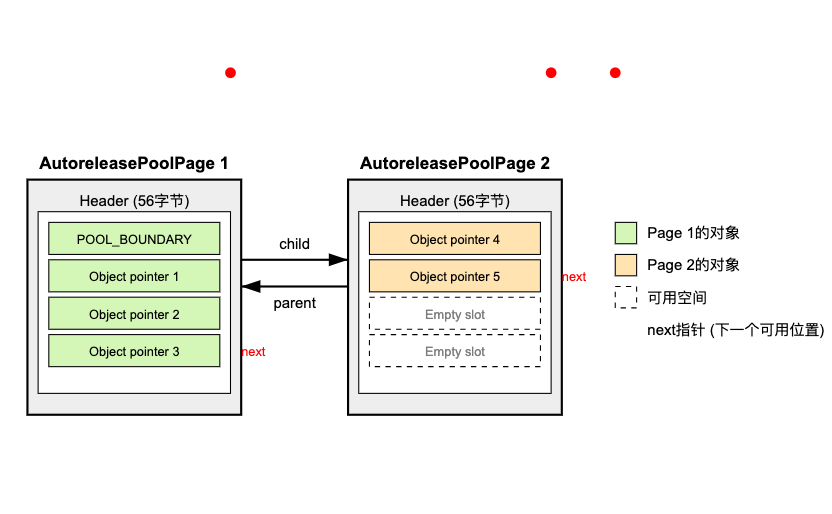
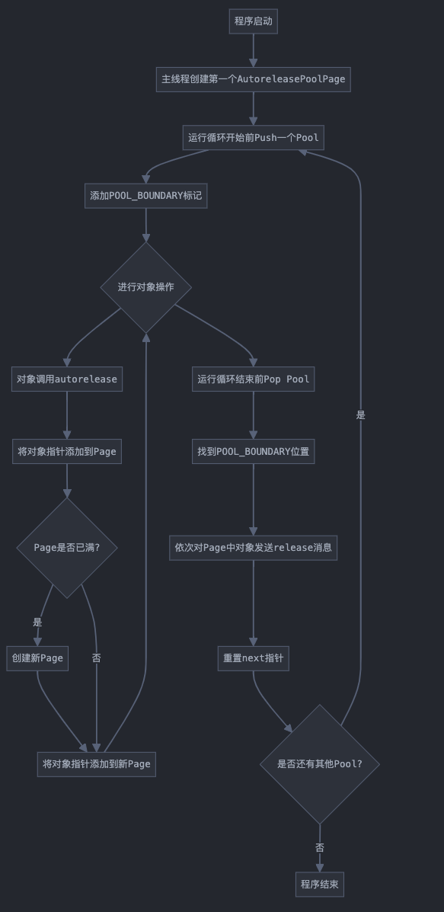

## iOS 面试题目


#### Swift语言特性

Swift是现代iOS开发的首选语言，其特性如泛型、协议、异步/等待（async/await）等需要深入理解。示例问题包括：

* 解释Swift类型系统如何处理泛型和类型擦除。

  * Swift的类型系统通过泛型允许编写灵活、可重用的代码，类型参数在编译时确定，生成特定类型的专用代码。类型擦除则通过协议或`Any`隐藏具体类型信息，运行时仅通过共同接口操作。例如，使用 `Array<Any>` 会擦除类型信息，而泛型如 `Array<Int>` 在运行时保留类型信息。

* 讨论使用结构体（structs）与类（classes）的性能影响。

  * 结构体：值类型，存储在 `栈` 上，赋值时复制，适合小数据，复制开销可能较大。  
  * 类：引用类型，存储在 `堆` 上，共享引用，适合大数据或需共享的场景。
    性能上，结构体访问更快，类涉及动态内存管理，可能较慢。建议小数据用结构体，大数据用类。

* Swift如何管理值类型和引用类型的内存？  

  * 值类型：如结构体，存储在 `栈` 上，赋值时复制，无引用计数。  
  * 引用类型：如类，存储在 `堆` 上，使用ARC管理引用计数，0时释放。
    值类型内存管理简单，引用类型需注意循环引用

  

####  Objective-C

尽管Swift逐渐取代Objective-C，但了解Objective-C的运行时、分类和内存管理仍是重要技能。示例问题包括：

- Objective-C运行时是什么，与其他语言有何不同？

  - Objective-C运行时提供动态方法调用、运行时类型信息等功能。不同点：支持动态方法解析，消息传递机制可拦截或转发，灵活性高，如运行时添加方法

- 如何实现分类（category），及其限制是什么？

  - 分类通过@interface ClassName (CategoryName)扩展类，示例：  

    ```objectivec
    @interface NSString (MyCategory)  
    - (void)newMethod;  
    @end  
    ```

    限制：不能添加实例变量，方法名冲突可能导致未定义行为，不能覆盖现有方法。  

    

- 解释方法交换（method swizzling）的概念和应用场景。

  - 方法交换动态替换方法实现，常用于日志、调试或框架行为修改。
    应用场景：添加全局日志，修改框架方法。
    示例：用method_exchangeImplementations交换方法，确保在load方法中执行。  

  

#### UIKit

UIKit是iOS界面开发的传统框架，涉及视图控制器、动画和布局优化。示例问题包括：

- 如何处理视图控制器之间的自定义过渡动画？

  - 通过实现UIViewControllerTransitioningDelegate，定义UIAnimationController处理呈现和消失动画。

    ```swift
    class CustomTransitionDelegate: NSObject, UIViewControllerTransitioningDelegate {  
        func animationController(forPresented presented: UIViewController, presenting: UIViewController, source: UIViewController) -> UIViewControllerAnimationController? {  
            return CustomPresentAnimationController()  
        }  
    }  
    ```

- layoutSubviews与drawRect的区别是什么？

  - layoutSubviews：调整子视图布局，bounds变化时调用。  
  - drawRect：自定义绘制内容，性能开销大，尽量减少使用。
    用途：前者布局，后者渲染；调用顺序：layoutSubviews先于drawRect。

- 如何优化UITableView的滚动性能？

  - 使用可重用单元格dequeueReusableCellWithIdentifier。  
  - 减少单元格子视图数量，优化Auto Layout。  
  - 批量更新数据用performBatchUpdates。  
  - 使用Instruments分析性能瓶颈。

  

#### Core Data

Core Data是iOS数据持久化的核心框架，涉及数据建模、关系处理和性能优化。示例问题包括：

- 如何在Core Data中处理实体之间的关系？
- 什么是获取请求（fetch request）与谓词（predicate）的区别？
  - 获取请求：定义从Core Data检索数据的规则，包括实体、排序、分批等。  
  - 谓词：条件过滤返回的对象，如NSPredicate(format: "age > 20")。
    获取请求可包含谓词以筛选结果。
- 如何优化Core Data处理大型数据集的性能？
  - 使用fetchBatchSize限制每次获取的对象数。  
  - 启用故障（faulting），按需加载数据。  
  - 为常用谓词属性建立索引。  
  - 使用背景上下文处理繁重操作，避免阻塞主线程。


#### 网络编程

网络编程是iOS开发的重要部分，包括HTTP请求、错误处理和安全通信。示例问题包括：

- 如何使用URLSession处理HTTP请求和响应？
- 处理网络失败和重试的策略有哪些？
  - 检查错误和HTTP状态码，通知用户失败。  
  - 实现指数退避重试，逐步增加重试间隔。  
  - 缓存响应，提供离线数据。  
  - 使用第三方库如Alamofire支持自动重试。
- 如何在iOS应用中实现安全网络通信？
  - 使用HTTPS加密通信。  
  - 实现证书固定，验证服务器证书。  
  - 使用令牌认证，确保请求安全。  
  - 加密敏感数据传输，防止窃听。


#### 并发性

并发性涉及GCD、NSOperationQueue和线程安全，是高性能iOS开发的关键。示例问题包括：

- 解释GCD的工作原理，如何用于后台任务？

  - GCD（Grand Central Dispatch）通过调度队列管理并发任务。  

    队列类型：串行队列顺序执行，并发队列并行执行。  

    后台任务：用dispatch_async在全局队列执行，示例：

    ```swift
    let backgroundQueue = DispatchQueue.global()  
    backgroundQueue.async {  
        // 后台任务  
    }  
    ```

- 如何使用DispatchGroup同步多个异步任务？

  - 创建DispatchGroup，跟踪任务。  
  - enter开始任务，leave结束，notify或wait等待完成。
    示例：

  ```swift
  let group = DispatchGroup()  
  for i in 1...5 {  
      group.enter()  
      DispatchQueue.global().async {  
          // 任务  
          group.leave()  
      }  
  }  
  group.wait() 
  ```

- 如何避免多线程环境中的死锁？

  - 一致锁顺序，避免嵌套锁。  
  - 使用条件变量等待，不持锁等待。  
  - 调试工具监控线程状态，检测潜在死锁。  
  - 最小化共享资源访问，减少竞争

* GCD与NSOperationQueue的区别是什么？  

  * GCD：基于块，低级API，适合简单任务。  
  * NSOperationQueue：基于对象，高级API，支持操作依赖和取消，适合复杂任务。
    GCD更轻量，NSOperationQueue更灵活。

  

#### 内存管理

内存管理涉及ARC、内存泄漏检测和性能优化，是iOS开发的重要技能。示例问题包括：

- ARC是什么，如何工作？
  - ARC（自动引用计数）自动管理对象生命周期，通过引用计数决定释放。  
    - 赋值增加计数，释放减少，0时销毁。  
    - 避免手动retain/release，减少内存泄漏。
- 如何检测和修复iOS应用中的内存泄漏？
  - 使用Instruments的Leaks工具检测。  
  - 检查代码，寻找循环引用，用弱引用解决。  
  - 确保deinit方法被调用，释放资源。  
  - 定期清理缓存，减少内存占用。
- weak与unowned引用的区别是什么？
  - weak：可为nil，引用对象释放后自动置nil，适合可选关系。  
  - unowned：假设对象永不释放，崩溃风险高，适合确定对象存活的场景。
- 如何管理大型数据结构或图片的内存？  
  - 使用懒加载，按需加载数据。  
  - 压缩图片，减少内存占用。  
  - 启用故障机制，Core Data按需加载。  
  - 监听低内存警告，释放缓存。


#### 设计模式

设计模式如MVC、MVVM、VIPER用于组织代码结构。示例问题包括：

- MVC模式在iOS开发中的应用是什么？
  - MVC（模型-视图-控制器）分离职责：  
    - 模型：数据和逻辑。  
    - 视图：UI组件。  
    - 控制器：管理模型和视图交互。
      iOS中，视图控制器常为控制器，模型为自定义类，视图为UIKit组件。
  
- 解释MVVM, MVC, MVP, VIPER模式及其优势。

  ## MVC (Model-View-Controller)

  **原理**：将应用分为数据层(Model)、界面层(View)和控制层(Controller)。

  **实现方式**：

  - Model：负责数据逻辑
  - View：负责界面展示
  - Controller：协调Model和View，处理用户输入

  **优势**：

  - 最简单直观，上手门槛低
  - Apple框架原生支持此模式
  - 适合小型应用快速开发

  **缺点**：

  - 在iOS实现中，Controller往往变得臃肿(被称为"Massive View Controller")
  - 测试性较差，Controller与View耦合度高
  - 代码复用性低

  ## MVP (Model-View-Presenter)

  **原理**：MVC的变种，用Presenter替代Controller，强化了视图与逻辑的分离。

  **实现方式**：

  - Model：处理数据逻辑
  - View：负责界面展示，但比MVC更被动
  - Presenter：包含所有UI逻辑，但不直接访问View属性

  **优势**：

  - View与Model完全解耦
  - UI逻辑集中在Presenter，更易测试
  - 解决了MVC中Controller臃肿问题

  **缺点**：

  - 比MVC更复杂，需要更多代码
  - Presenter与View通过接口交互，代码量增加
  - 需要手动建立View和Presenter的联系

  ## MVVM (Model-View-ViewModel)

  **原理**：引入ViewModel层，通过数据绑定机制实现View和Model的自动同步。

  **实现方式**：

  - Model：负责数据逻辑
  - View：负责界面展示，被动接收ViewModel的变化
  - ViewModel：转换Model数据为View可用格式，处理View事件

  **优势**：

  - 优秀的数据绑定机制，特别配合SwiftUI和Combine使用
  - 高度可测试性，ViewModel与UI无关
  - View与Model彻底分离，减少代码耦合

  **缺点**：

  - 需要数据绑定机制支持(RxSwift/Combine)才能发挥优势
  - 对于简单界面可能是过度设计
  - 理解数据流向需要一定学习曲线

  ## VIPER (View-Interactor-Presenter-Entity-Router)

  **原理**：更彻底的关注点分离，遵循单一职责原则的模块化架构。

  **实现方式**：

  - View：纯UI展示，无业务逻辑
  - Interactor：包含业务逻辑，操作Entity
  - Presenter：处理UI事件，格式化数据给View
  - Entity：纯数据模型
  - Router：负责页面导航和模块组装

  **优势**：

  - 极高的可测试性
  - 严格的关注点分离，适合大型应用
  - 模块化程度高，便于团队协作
  - 单一职责原则减少代码耦合

  **缺点**：

  - 学习曲线陡峭，上手难度大
  - 代码量显著增加，简单功能也需复杂结构
  - 开发速度较慢，适合长期维护项目

  ## 选择建议

  - 小型项目：MVC足够简单有效
  - 中型项目：MVVM平衡了复杂性和可维护性
  - 大型项目：VIPER提供最佳的长期可维护性
  - 团队熟悉度：选择团队最熟悉的架构往往比理论上最佳的架构更实用

  对于现代iOS开发，MVVM与SwiftUI+Combine组合是当前流行趋势，提供了良好的响应式编程体验。

- 何时使用单例模式（Singleton），提供一个示例？
  - 使用场景：全局访问共享资源，如设置管理。

- 解释观察者模式及其在iOS框架中的应用。  
  - 观察者模式：对象间一对多依赖，状态变化通知观察者。
    iOS应用：如NSNotificationCenter广播通知，KVO监控属性变化。
    示例：用通知中心监听事件，解耦组件。  

- iOS开发中常用的其他设计模式有哪些？  (未完)
  - 工厂模式：创建对象，如UICollectionViewCell工厂。  
  - 适配器模式：适配不同接口，如第三方库适配。  
  - 策略模式：定义算法族，如排序策略切换。  
  - 装饰器模式：动态添加功能，如视图装饰。

#### 应用生命周期

应用生命周期涉及状态管理、深链接和资源优化。示例问题包括：

- iOS应用的不同状态有哪些，如何处理状态转换？
- 如何处理深链接以导航到特定屏幕？
- 如何在应用后台时管理资源以减少内存使用？


#### 安全

安全涉及Keychain使用、HTTPS和证书固定。示例问题包括：

- 如何使用Keychain存储敏感数据？
  - 使用KeychainServices或KeychainAccess库存储数据，设置唯一标识符，加密存储密码或密钥，检索时用相同标识符，确保数据安全受设备保护。  
- HTTPS如何确保安全通信？
  - HTTPS通过SSL/TLS加密数据，验证服务器证书防止中间人攻击，确保传输数据不可读和篡改，iOS默认支持HTTPS通信。
- 如何防止应用被逆向工程？
  -    使用代码混淆，加密敏感数据，检测调试环境，定期更新修补漏洞，遵循安全编码实践，但需注意无绝对防逆向方法。  
- 如何确保应用符合GDPR或CCPA隐私法规？
  - 透明告知数据收集用途，获取用户明确同意，收集最小必要数据，保护数据安全，提供访问/删除数据功能，记录处理活动以符合法规。  
- 越狱检测是什么，为什么可能需要实现？
  - 越狱检测检查设备是否被修改以访问受保护区域，需实现以保护知识产权，维护安全环境，符合服务条款，但需注意检测可能被绕过。


#### 性能

性能优化涉及使用Instruments分析、启动时间优化和GPU性能。示例问题包括：

- 如何使用Instruments分析应用性能？
- 如何优化应用的启动时间？
  - 减少启动时执行代码，延迟加载非必需资源，使用预编译头加速开发，优化图片加载，分析启动瓶颈以改进
- 如何减少应用的二进制文件大小？
  - 启用Bitcode，移除调试符号，优化图片压缩，管理依赖避免包含多余库，清理未用代码减少体积。 


---------------

# 堆(Heap)与栈(Stack)的主要特点

## 栈(Stack)的特点

1. **内存分配方式**：自动分配和释放，由系统管理
2. **访问速度**：访问速度更快
3. **存储内容**：存储局部变量、函数参数、返回地址等
4. **生命周期**：随函数调用结束而释放
5. **空间大小**：相对较小，通常在几MB左右
6. **数据结构**：后进先出(LIFO - Last In First Out)
7. **使用特点**：存储的变量大小在编译时就已确定

## 堆(Heap)的特点

1. **内存分配方式**：动态分配和释放，需要程序员手动管理
2. **访问速度**：相对栈较慢
3. **存储内容**：存储动态创建的对象
4. **生命周期**：持续到被显式释放为止
5. **空间大小**：较大，理论上只受物理内存限制
6. **使用特点**：大小可以在运行时动态确定

## 在iOS/Swift开发中的体现

```swift
func stackAndHeapExample() {
    // 栈上分配
    let stackInt = 42                   // 值类型(Int)存储在栈上
    var stackArray = [1, 2, 3]          // 固定大小的值类型数组在栈上
    
    // 堆上分配
    let heapObject = NSObject()         // 引用类型存储在堆上
    let heapString = "Hello, World!"    // 虽然String是值类型，但较大字符串内容存储在堆上
    
    // Swift中的类(Class)是引用类型，存储在堆上
    class Person {
        var name: String
        init(name: String) {
            self.name = name
        }
    }
    
    let person = Person(name: "John")   // person对象存储在堆上
    
    // 栈指针(指向person对象)在函数结束时销毁
    // 但堆上的Person对象需要等待ARC回收
}
```

在iOS开发中，了解堆栈的区别对于高效内存管理和避免内存泄漏非常重要，尤其在编写性能敏感的应用时。


# class 和 struct 的区别

作为iOS开发中两种主要的数据类型，class(类)和struct(结构体)有以下关键区别：

## 1. 引用类型 vs 值类型

- **struct**: 值类型，赋值或传递时会创建副本
- **class**: 引用类型，赋值或传递时只传递引用(指针)

## 2. 内存管理方式

- **struct**: 栈上分配，生命周期由作用域控制
- **class**: 堆上分配，通过ARC(自动引用计数)管理生命周期

## 3. 继承特性

- **struct**: 不支持继承
- **class**: 支持单继承和多层继承

## 4. 构造器要求

- **struct**: 自动生成成员初始化器
- **class**: 必须手动为所有存储属性提供初始值或在初始化器中赋值

## 5. 可变性控制

- **struct**: 方法默认不能修改属性，需要使用`mutating`关键字
- **class**: 方法可以自由修改属性

## 6. 引用计数

- **struct**: 没有引用计数开销
- **class**: 有引用计数开销(ARC机制)

## 7. 线程安全性

- **struct**: 值类型通常更安全，因为每次操作都是独立副本
- **class**: 多线程访问同一实例需要额外同步机制

## 8. deinit析构函数

- **struct**: 不支持deinit方法
- **class**: 支持deinit方法，可以在对象被释放前执行清理工作

## 9. 类型转换和运行时检查

- **struct**: 类型检查更简单，主要在编译时
- **class**: 支持`is`、`as?`、`as!`操作符进行类型转换和检查

## 代码示例

```swift
// Struct示例
struct Point {
    var x: Int
    var y: Int
    
    mutating func moveBy(x deltaX: Int, y deltaY: Int) {
        x += deltaX
        y += deltaY
    }
}

// Class示例
class Person {
    var name: String
    var age: Int
    
    init(name: String, age: Int) {
        self.name = name
        self.age = age
    }
    
    func celebrateBirthday() {
        age += 1
    }
    
    deinit {
        print("\(name) is being deinitialized")
    }
}

// 使用区别示例
var point1 = Point(x: 0, y: 0)
var point2 = point1      // 创建副本
point2.moveBy(x: 10, y: 10)
print(point1)            // 输出: Point(x: 0, y: 0) - 原始值不变

var person1 = Person(name: "John", age: 30)
var person2 = person1    // 创建引用
person2.celebrateBirthday()
print(person1.age)       // 输出: 31 - 原始对象被修改
```

在iOS开发中，通常推荐优先使用struct，除非确实需要class的特性(如继承、引用语义等)。


# Bounds.origin 并不总是0

Bounds.origin 并不总是0。这是一个关于 UIView 的 bounds 属性的常见误解。

虽然在大多数默认情况下 `bounds.origin` 确实是 (0, 0)，但它可以被修改，并且在某些特定场景下会被系统或开发者修改。以下是几种 `bounds.origin` 不为零的情况：

1. **滚动视图中**：当 UIScrollView 滚动时，其 `bounds.origin` 会随着滚动位置变化。这是 UIScrollView 工作的核心机制。

```swift
let scrollView = UIScrollView(frame: CGRect(x: 0, y: 0, width: 300, height: 300))
scrollView.contentSize = CGSize(width: 600, height: 600)

// 默认时
print(scrollView.bounds.origin) // (0.0, 0.0)

// 滚动后
scrollView.contentOffset = CGPoint(x: 100, y: 200)
print(scrollView.bounds.origin) // (100.0, 200.0)
```

1. **手动设置时**：当你手动修改视图的 bounds 时，可以给 origin 设置非零值。

```swift
let view = UIView(frame: CGRect(x: 50, y: 50, width: 200, height: 200))
print(view.bounds.origin) // (0.0, 0.0)

// 手动修改 bounds.origin
var newBounds = view.bounds
newBounds.origin = CGPoint(x: 10, y: 20)
view.bounds = newBounds

print(view.bounds.origin) // (10.0, 20.0)
```

1. **处理坐标系转换**：修改 bounds.origin 可以改变子视图的绘制位置，这在某些特殊的坐标系转换或自定义绘制逻辑中很有用。
2. **实现视图内部滚动效果**：即使在非 UIScrollView 的视图中，也可以通过修改 bounds.origin 实现内容的"滚动"效果。

理解 bounds 和 frame 的区别很重要：

- **bounds** 是视图在其自身坐标系中的位置和大小
- **frame** 是视图在其父视图坐标系中的位置和大小

当修改 bounds.origin 时，视图内容的绘制位置会发生偏移，但视图在父视图中的位置（frame）不会改变。

在实际开发中，直接修改非滚动视图的 bounds.origin 的情况较少，但了解这一特性对于理解 iOS 视图系统的工作原理很重要。


# swift是动态语言还是静态语言？为啥？

Swift 是一种静态类型语言，但同时也具有一些动态特性。以下是判断的主要依据：

## Swift 作为静态类型语言的特征

1. **编译时类型检查**：Swift 在编译时检查变量类型，如果类型不匹配会产生编译错误，而不是等到运行时才发现问题。

2. **类型声明**：Swift 要求显式或隐式地声明变量类型。

   ```swift
   let explicitType: String = "Hello" // 显式类型声明
   let inferredType = "Hello"         // 类型推断，但仍是静态类型
   ```

3. **类型安全**：Swift 强制类型安全，编译器会阻止无效的类型转换。

4. **性能优化**：由于编译时已知类型信息，编译器可以进行更多优化。

## Swift 的动态特性

尽管是静态类型语言，Swift 也提供了一些动态特性：

1. **类型推断**：不需要总是显式声明类型，编译器可以推断。
2. **协议和泛型**：提供了类型抽象和灵活性。
3. **Objective-C 互操作性**：通过 @objc 和动态派发支持与 Objective-C 的互操作。
4. **反射和镜像 API**：可以在运行时检查类型。
5. **Any 和 AnyObject**：可以使用这些类型来处理未知类型的对象。

```swift
// 动态派发示例
@objc protocol MyProtocol {
    func someMethod()
}

// 反射示例
let mirror = Mirror(reflecting: someObject)
for child in mirror.children {
    print("\(child.label ?? ""): \(child.value)")
}
```

## 结论

Swift 本质上是一种静态类型语言，因为它的核心特性是在编译时检查和强制类型安全。这与动态语言（如 JavaScript、Python）在运行时进行类型检查的方式不同。

Swift 的设计初衷是结合静态语言的安全性和性能与动态语言的表达能力和灵活性。这种平衡使 Swift 成为一种强大的现代编程语言，特别适合 iOS 和 macOS 应用程序开发。


# mutating 关键字原理与使用

`mutating` 关键字是 Swift 中为结构体(struct)和枚举(enum)设计的一个重要特性，它与 Swift 的值类型本质和内存管理机制密切相关。

## 原理

### 值类型的不可变性

在 Swift 中，结构体和枚举是**值类型**，默认情况下它们的实例方法不能修改自身属性。这是因为：

1. 值类型在传递时会创建副本
2. Swift 默认保护值类型的实例免于在方法内被修改

### mutating 的内部工作机制

当你标记一个方法为 `mutating` 时，Swift 实际上做了这些事情：

1. **创建实例的可变副本**：当调用 mutating 方法时，Swift 会创建该实例的可变版本
2. **执行方法修改**：在这个可变副本上执行修改操作
3. **替换原实例**：方法执行完成后，用修改后的副本替换原来的实例

从内存角度看，`mutating` 方法修改的是实例在内存中的实际状态，而不仅仅是修改了某个属性的值。

## 使用场景

### 1. 修改结构体自身属性

```swift
struct Point {
    var x: Double
    var y: Double
    
    // 标记为 mutating 才能修改 x 和 y
    mutating func moveBy(deltaX: Double, deltaY: Double) {
        x += deltaX
        y += deltaY
    }
}

var point = Point(x: 1.0, y: 1.0)
point.moveBy(deltaX: 2.0, deltaY: 3.0) // 现在 point 是 (3.0, 4.0)
```

### 2. 完全替换 self

`mutating` 方法可以完全替换 `self`，这是其最强大的特性之一：

```swift
struct ColorPoint {
    var x: Int
    var y: Int
    var color: String
    
    mutating func reset() {
        // 完全替换 self
        self = ColorPoint(x: 0, y: 0, color: "black")
    }
}
```

### 3. 枚举状态转换

`mutating` 在枚举中特别有用，用于状态转换：

```swift
enum TrafficLight {
    case red, yellow, green
    
    mutating func next() {
        switch self {
        case .red:
            self = .green
        case .green:
            self = .yellow
        case .yellow:
            self = .red
        }
    }
}

var light = TrafficLight.red
light.next() // 变为 .green
```

## 注意事项

1. **只用于值类型**：`mutating` 关键字只用于 struct 和 enum，class 不需要使用它
2. **常量限制**：不能在常量(let)声明的结构体实例上调用 mutating 方法
3. **协议要求**：协议可以要求实现者提供 mutating 方法

```swift
protocol Togglable {
    mutating func toggle()
}

struct Switch: Togglable {
    var isOn: Bool
    
    mutating func toggle() {
        isOn = !isOn
    }
}
```

1. **多线程考虑**：虽然值类型通常更安全，但在多线程环境中修改共享的结构体仍需注意

`mutating` 关键字体现了 Swift 对类型安全和不可变性的重视，同时也为值类型提供了必要的可变性支持。

Swift的内存管理主要通过自动引用计数(ARC)机制工作，这是一个在编译时就确定的内存管理系统。以下是Swift内存管理的工作原理：


# Swift 内存管理是如何工作的？


1. **引用计数跟踪**：Swift的ARC为每个类实例在堆上分配内存时，会创建一个关联的引用计数。
2. **引用计数增加情况**：
   - 将实例赋值给变量、常量或属性
   - 将实例作为参数传递给函数
   - 在闭包中捕获实例
3. **引用计数减少情况**：
   - 引用变量超出作用域
   - 引用变量被赋值为nil
   - 引用变量被赋值为其他实例
4. **内存释放时机**：当引用计数降为0时，Swift会自动释放该实例占用的内存。

## 内存管理特性

### 值类型与引用类型

- **值类型**（结构体、枚举、基本类型）：
  - 存储在栈上或作为其他类型的一部分
  - 拷贝传值，赋值时会创建完整副本
  - 不由ARC管理
- **引用类型**（类）：
  - 存储在堆上
  - 传递引用，赋值只复制引用而非实例
  - 由ARC管理

### 强引用循环与解决方案

```swift
class Person {
    let name: String
    var apartment: Apartment?
    
    init(name: String) {
        self.name = name
    }
    
    deinit {
        print("\(name) 被释放")
    }
}

class Apartment {
    let number: Int
    weak var tenant: Person?  // 使用weak关键字避免循环引用
    
    init(number: Int) {
        self.number = number
    }
    
    deinit {
        print("公寓 \(number) 被释放")
    }
}
```

### 闭包中的内存管理

闭包会强引用它捕获的所有对象，可能导致循环引用：

```swift
class NetworkManager {
    var onCompletion: (() -> Void)?
    
    func fetchData() {
        // 错误：形成循环引用
        onCompletion = {
            self.processData()
        }
        
        // 正确：使用捕获列表
        onCompletion = { [weak self] in
            self?.processData()
        }
    }
    
    func processData() {
        print("处理数据")
    }
}
```

### weak vs unowned

- **weak**：
  - 引用可以为nil
  - 引用对象销毁时自动置为nil
  - 使用场景：生命周期不确定的对象引用
- **unowned**：
  - 引用不能为nil（更高效）
  - 引用对象销毁后不会自动置为nil
  - 使用场景：生命周期确定长于或等于当前对象

## 内存管理最佳实践

1. 尽可能使用值类型
2. 警惕代理(delegate)、闭包、父子视图控制器间的循环引用
3. 适当选择weak或unowned打破循环引用
4. 定期使用Instruments检查内存泄漏
5. 大型对象使用后及时置nil释放

Swift的ARC机制使开发者可以避免手动内存管理的复杂性，但了解其工作原理有助于编写高效稳定的代码。


# AutoreleasePool 内存管理机制详解

AutoreleasePool（自动释放池）是iOS和macOS内存管理中的重要机制，它在ARC环境下仍然发挥着重要作用。下面我将详细介绍其工作原理、实现细节和使用场景。

## 基本概念

AutoreleasePool 本质上是一个对象容器，它允许你延迟对象的释放时机。当一个对象被标记为autorelease时，它会被加入到当前的AutoreleasePool中，并在池被排空(drain)时释放。

## 内部实现与数据结构

### 数据结构

AutoreleasePool 在现代 Objective-C/Swift 运行时中实际是通过 `AutoreleasePoolPage` 类来实现的：

```objc
class AutoreleasePoolPage {
    static pthread_key_t const key;
    static uint8_t const SCRIBBLE = 0xA3;
    static size_t const SIZE = 
        PAGE_MAX_SIZE;  // 通常为4096字节

    static AutoreleasePoolPage * const EMPTY_POOL_PLACEHOLDER;

    static pthread_key_t key;
    
    AutoreleasePoolPage * const parent;
    AutoreleasePoolPage * child;
    uint32_t const depth;
    uint32_t hiwat;
    
    id *next;           // 指向下一个可用位置
    void *begin();      // 返回存储区域的开始位置
    void *end();        // 返回存储区域的结束位置
    bool empty();       // 判断页是否为空
    bool full();        // 判断页是否已满
    bool lessThanHalfFull();  // 判断页是否少于半满
}
```

### 页结构组织

AutoreleasePool 采用双向链表的方式组织多个 AutoreleasePoolPage：



### 工作原理

#### 1. 池的创建与嵌套

当创建一个新的AutoreleasePool时，系统会:

1. 向当前线程的AutoreleasePoolPage链表中添加一个标记（`POOL_BOUNDARY`，实际上是nil的哨兵对象）
2. 返回这个标记的地址，作为该池的标识符

```objc
void *objc_autoreleasePoolPush(void) {
    return AutoreleasePoolPage::push();
}
```

#### 2. 对象的加入

当一个对象被标记为autorelease时:

```objc
id objc_autorelease(id obj) {
    return AutoreleasePoolPage::autorelease(obj);
}
```

系统会:

1. 找到当前线程的AutoreleasePoolPage
2. 检查是否有足够空间存储指针
   - 如果有空间，将对象指针存入`next`位置，并将`next`递增
   - 如果没有空间，创建新的AutoreleasePoolPage并添加到链表中

#### 3. 池的排空(drain)

当调用`@autoreleasepool`块结束或显式调用`objc_autoreleasePoolPop`时:

```objc
void objc_autoreleasePoolPop(void *ctxt) {
    AutoreleasePoolPage::pop(ctxt);
}
```

系统会:

1. 找到标记位置对应的AutoreleasePoolPage
2. 依次向前遍历，对每个对象发送`release`消息
3. 重置`next`指针到合适位置

## 整个过程的流程图



## AutoreleasePool 在实际应用中的工作方式

### Runloop 中的应用

在iOS/macOS中，每次Runloop迭代开始前，系统会自动创建一个AutoreleasePool，在迭代结束时自动释放。这确保了临时对象在一次事件循环内就能被释放。

```
Runloop迭代开始
    |
    V
autoreleasepool push
    |
    V
处理各种事件(用户输入、定时器等)
    |
    V
autoreleasepool pop
    |
    V
Runloop迭代结束
```

### 手动使用 @autoreleasepool

```swift
@autoreleasepool {
    // 创建大量临时对象的代码
    for _ in 0..<100000 {
        let image = UIImage(named: "someImage")
        // 处理图像
    }
} // 池结束，临时对象立即释放
```

## 使用场景与最佳实践

1. **处理大量临时对象**：在处理大量临时对象（如图像处理、解析大文件）时，使用嵌套的AutoreleasePool可以降低内存峰值。

2. **非UI线程中**：在后台线程中使用AutoreleasePool，因为后台线程没有自动的Runloop和AutoreleasePool管理。

3. **循环中创建大量自动释放对象**：

   ```swift
   for _ in 0..<largeNumber {
       @autoreleasepool {
           // 处理单个项目
       }
   }
   ```

## 内存管理效率

AutoreleasePool的设计在内存管理上平衡了效率和开销：

1. **批量释放**：通过批量释放对象降低了频繁调用release的开销。
2. **页机制**：使用分页机制降低内存分配和管理的开销。
3. **线程局部存储**：每个线程拥有自己的AutoreleasePoolPage链表，避免了线程同步开销。

## 总结

AutoreleasePool是iOS/macOS内存管理中的核心机制，它通过延迟对象释放时机并批量处理，在保持内存使用效率的同时提供了编程便利性。即使在现代的ARC环境下，理解AutoreleasePool的工作原理对于开发高性能应用仍然非常重要。


# 对称加密与非对称加密比较

## 对称加密

### 特点

- **单密钥**：使用同一个密钥进行加密和解密
- **速度快**：计算复杂度低，适合大数据量加密
- **密钥分发难**：使用前需要安全地将密钥传递给通信双方
- **密钥数量多**：n个人两两通信需要n(n-1)/2个密钥

### 常见算法

- AES (Advanced Encryption Standard)：目前最流行的对称加密算法，支持128/192/256位密钥
- DES (Data Encryption Standard)：较老的算法，现已不安全
- 3DES (Triple DES)：DES的增强版，安全性更高但速度较慢
- ChaCha20：现代流加密算法，在某些平台上速度优于AES

### 使用场景

- 文件加密存储
- 数据库内容加密
- VPN数据加密传输
- 会话加密（在密钥交换后）
- 磁盘加密
- 大数据流加密

## 非对称加密

### 特点

- **密钥对**：使用公钥加密，私钥解密
- **速度慢**：计算复杂度高，通常比对称加密慢几个数量级
- **密钥分发安全**：公钥可以公开分发，无需安全通道
- **密钥数量少**：n个人通信只需要n对密钥
- **数字签名**：可用于身份验证和数据完整性验证

### 常见算法

- RSA：最知名的非对称加密算法
- ECC (椭圆曲线加密)：更高效，使用更短的密钥提供同等安全性
- DSA：专为数字签名设计
- ElGamal：基于离散对数问题的加密系统

### 使用场景

- HTTPS中的TLS握手阶段
- 数字证书和PKI体系
- 数字签名
- 密钥交换
- 安全电子邮件（如PGP）
- 加密货币交易

## 实际应用中的混合使用

在实际应用中，常将两种加密方式结合使用，形成混合加密系统：

1. 使用非对称加密安全地交换对称加密的会话密钥
2. 使用对称加密进行实际的数据加密传输
3. 使用非对称加密进行身份认证和数字签名

这种方式结合了两种加密方式的优点：非对称加密解决了密钥分发问题，而对称加密提供了高效的数据处理能力。

### 典型例子：HTTPS连接

1. 客户端向服务器发起连接请求
2. 服务器返回其公钥证书
3. 客户端验证证书，生成随机对称密钥
4. 客户端使用服务器公钥加密这个对称密钥并发送
5. 服务器用私钥解密获得对称密钥
6. 之后的通信使用这个对称密钥进行加密

通过这种方式，HTTPS协议既保证了通信安全，又保证了通信效率。


# 静态库与动态库比较分析

下面通过表格形式全面对比静态库与动态库的特点及其对应用启动时间的影响：

| 特性         | 静态库 (.a, .lib)              | 动态库 (.dylib, .so, .dll)         |
| ------------ | ------------------------------ | ---------------------------------- |
| **链接时机** | 编译时链接                     | 运行时链接                         |
| **集成方式** | 代码直接合并到可执行文件中     | 代码单独存在，运行时加载           |
| **最终产物** | 生成单一、独立的可执行文件     | 生成较小的可执行文件+多个库文件    |
| **内存占用** | 每个使用该库的进程都有独立副本 | 多个进程可共享同一份库内存         |
| **体积影响** | 增加应用体积                   | 减小应用体积(如多App共享同一库)    |
| **更新维护** | 需重新编译整个应用             | 可单独更新库文件，无需重新编译应用 |
| **加载速度** | 启动速度快(无额外加载)         | 启动速度可能较慢(需动态加载)       |
| **符号解析** | 编译时完成符号解析             | 运行时完成符号解析                 |
| **版本兼容** | 无版本冲突问题                 | 可能发生版本兼容性问题             |

## 对启动时间的影响

### 静态库对启动时间的影响

**优势：**

- **无加载时间**：所有代码已在编译时合并，不需要额外的加载和链接时间
- **无符号查找**：编译时已完成所有符号解析
- **无依赖解析**：不存在运行时依赖查找的额外开销

**劣势：**

- **可执行文件较大**：导致从存储加载到内存的时间增加
- **内存页加载**：更大的二进制文件可能需要更多内存页初始化

### 动态库对启动时间的影响

**优势：**

- **可执行文件小**：主二进制文件加载快
- **内存共享**：系统已加载的库可被多个应用共享，减少内存占用
- **懒加载可能**：非立即使用的库可推迟加载

**劣势：**

- **动态加载开销**：需要时间定位、验证和加载库文件
- **符号解析开销**：运行时进行符号查找和解析
- **依赖链复杂度**：复杂的依赖关系可能导致连锁加载，显著增加启动时间
- **动态链接器开销**：链接器的工作会增加启动时间

## 实际应用建议

基于启动时间考虑的选择策略：

1. **关键路径使用静态链接**：对于启动过程必需的核心功能库，静态链接可减少启动时间
2. **非关键功能使用动态链接**：非启动必需的功能可使用动态库，并考虑懒加载
3. **合理拆分动态库**：避免过度碎片化，小而多的动态库会增加启动时链接开销
4. **系统框架优先使用动态链接**：iOS/macOS系统框架已预加载到内存，动态链接它们不会增加额外开销
5. **考虑二进制大小与链接时间平衡**：静态链接虽无加载开销，但过大的二进制也会拖慢启动
6. **应用动态库合并**：iOS开发中使用动态框架(Framework)来将相关动态库组合，减少链接器负担

在iOS开发中，合理平衡静态库与动态库的使用，是优化应用启动时间的重要策略。针对频繁使用的核心库可考虑静态链接，而对于较大且使用频率较低的库则适合动态链接。
