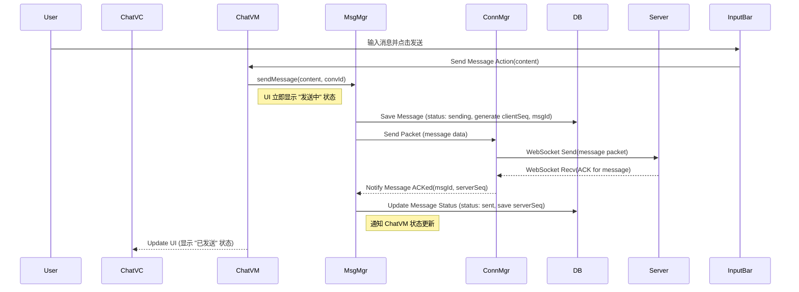
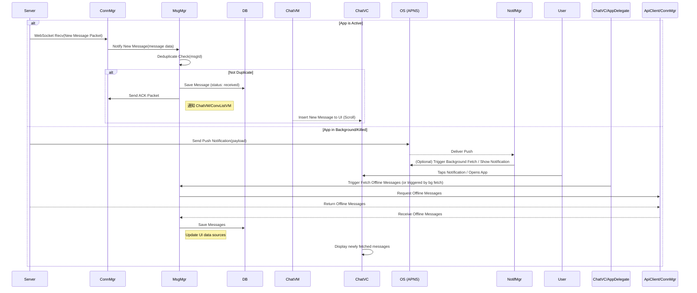

# 如何设计一个IM

好的，设计一个 iOS 端的 IM (Instant Messaging) 系统是一个复杂但非常常见的需求。它涉及到实时通信、数据存储、UI 性能、网络处理、状态管理等多个方面。下面我将从架构设计、关键技术点和注意事项几个方面来阐述，并给出示例图。

**一、 核心架构设计 (iOS Client)**

一个典型的 iOS IM 客户端可以采用分层架构，以实现高内聚、低耦合，便于维护和扩展：

1.  **UI 层 (View Layer):**
    *   **职责:** 负责界面的展示和用户交互。包括会话列表页、聊天页、联系人页、设置页等。
    *   **组件:** `UIViewController` 子类 (如 `ConversationListViewController`, `ChatViewController`)、`UITableView`/`UICollectionView` (用于展示列表和消息流)、自定义 `UITableViewCell`/`UICollectionViewCell` (用于不同类型的消息气泡、会话项)、`UITextView`/`UITextField` (输入框)、自定义输入工具栏、图片/视频查看器等。
    *   **原则:** 保持 UI 层“轻量”，主要负责展示数据和传递用户事件给下一层，不做或少做业务逻辑处理。

2.  **表示逻辑层 (Presentation Layer - 可选但推荐):**
    *   **职责:** 处理 UI 相关的逻辑，将数据模型转换为 UI 可以直接使用的视图模型，响应 UI 事件，调用业务逻辑层。
    *   **模式:** 可以采用 MVVM (ViewModel)、MVP (Presenter) 或类似的模式。
    *   **组件:** `ConversationListViewModel`, `ChatViewModel` 等。ViewModel/Presenter 不应依赖 UIKit (除了可能需要的基础类型如 `UIImage`，但也应尽量避免)。
    *   **优点:** 使 ViewController 瘦身，提高逻辑的可测试性。

3.  **业务逻辑层 (Service/Manager Layer):**
    *   **职责:** 封装核心的 IM 业务逻辑，协调网络、数据库、状态管理等。
    *   **组件:**
        *   `MessageManager`: 负责消息的发送、接收、存储、状态更新（发送中、已发送、已送达、已读）、消息拉取（历史消息、离线消息）等。
        *   `ConnectionManager`: 负责管理与 IM 服务器的长连接（如 WebSocket、MQTT），处理连接、断开、重连、心跳维持等。
        *   `UserManager`/`ContactManager`/`GroupManager`: 负责用户登录、个人信息、好友/群组关系的管理和存储。
        *   `ConversationManager`: 负责会话列表的管理、未读数计算等。
        *   `DatabaseManager`: 提供统一的数据库访问接口。
        *   `NotificationManager`: 处理 APNS 推送消息的接收和解析。

4.  **数据访问层 (Data Access Layer):**
    *   **职责:** 负责数据的持久化存储和读取。
    *   **组件:**
        *   **数据库:** 使用 Core Data, Realm, SQLite (配合 FMDB/GRDB.swift), 或 WCDB (微信开源的高性能数据库) 等。负责存储消息、会话、联系人、群组信息等。需要精心设计表结构和索引。
        *   **文件存储:** 存储图片、语音、视频、文件等媒体资源。通常存储在沙盒的特定目录下。
        *   **缓存:** (可选) 使用内存缓存 (`NSCache`) 或 `UserDefaults` 存储少量常用配置或状态。

5.  **网络层 (Network Layer):**
    *   **职责:** 处理与服务器的通信。
    *   **组件:**
        *   **长连接通道:** WebSocket 或 MQTT 客户端库的实现。负责实时消息的收发、信令（心跳、ACK、状态同步）的传输。
        *   **短连接通道 (API Client):** 使用 `URLSession` 或基于其封装的网络库 (Alamofire, Moya) 调用 RESTful API。用于登录、注册、拉取历史消息、获取用户信息、上传/下载媒体文件等非实时性操作。

6.  **基础组件层 (Core/Utility Layer):**
    *   **职责:** 提供通用的工具和核心数据模型。
    *   **组件:** 数据模型 (Model) 定义 (如 `User`, `Message`, `Conversation`, `Group`)、加密/解密工具、日志库、日期/字符串处理工具、线程管理工具等。

**示例图：iOS IM 客户端分层架构**

```mermaid
graph TD
    subgraph UI Layer
        ConvListVC[ConversationListView]
        ChatVC[ChatView (TableView/CollectionView)]
        InputBar[Input Toolbar]
        ContactVC[ContactListView]
        OtherUI[Other UI Components]
    end

    subgraph Presentation Layer (MVVM Example)
        ConvListVM[ConversationListViewModel]
        ChatVM[ChatViewModel]
        ContactVM[ContactViewModel]
    end

    subgraph Service/Manager Layer
        MsgMgr[MessageManager]
        ConnMgr[ConnectionManager]
        UserMgr[UserManager]
        ConvMgr[ConversationManager]
        DBMgr[DatabaseManager]
        NotifMgr[NotificationManager]
    end

    subgraph Data Access Layer
        DB[(Database: CoreData/Realm/WCDB)]
        FileStore[(File Storage)]
        Cache[(Memory/Disk Cache)]
    end

    subgraph Network Layer
        WebSocket[WebSocket/MQTT Client]
        ApiClient[API Client (URLSession)]
    end

    subgraph Core/Utility Layer
        Models[Data Models]
        Utils[Utilities (Crypto, Log, etc.)]
    end

    %% Dependencies %%
    ConvListVC --> ConvListVM;
    ChatVC --> ChatVM;
    InputBar --> ChatVM;
    ContactVC --> ContactVM;

    ConvListVM --> ConvMgr;
    ConvListVM --> UserMgr;
    ChatVM --> MsgMgr;
    ChatVM --> ConnMgr;
    ChatVM --> UserMgr;
    ContactVM --> UserMgr;

    MsgMgr --> DBMgr;
    MsgMgr --> ConnMgr;
    MsgMgr --> FileStore; %% For Media Messages
    ConnMgr --> WebSocket;
    UserMgr --> ApiClient;
    UserMgr --> DBMgr;
    ConvMgr --> DBMgr;
    DBMgr --> DB;
    NotifMgr -- interacts with --> OS(iOS System: APNS);

    WebSocket -- Network Traffic --> Server(IM Server);
    ApiClient -- Network Traffic --> Server;

    Service/Manager Layer -- Uses --> Models & Utils;
```

**二、 关键技术点与注意事项**

1.  **实时通信协议选择:**
    *   **WebSocket:** 基于 TCP，提供全双工通信。实现相对简单，Web 端兼容性好。适用于大多数场景。需要自己实现应用层协议（消息格式、心跳、ACK 等）。
    *   **MQTT:** 基于 TCP 的发布/订阅模式消息协议。轻量级，低带宽消耗，低功耗，提供不同 QoS (Quality of Service) 等级保证消息传递。非常适合移动端和物联网场景，尤其在网络不稳定时表现更好。有成熟的 Broker 和客户端库。
    *   **选择:** 两者都可用。MQTT 在移动端弱网和功耗方面略有优势，但 WebSocket 更通用。选择取决于团队熟悉度、后端架构和具体需求。

2.  **长连接管理:**
    *   **心跳 (Heartbeat):** 客户端和服务器需要定时互相发送心跳包，以检测连接是否断开（防止 TCP 连接假死），并维持 NAT 路由表项。心跳间隔需要根据网络状况动态调整。
    *   **断线重连:** 必须实现健壮的断线重连机制。连接断开后，应尝试重新连接，采用**指数退避 (Exponential Backoff)** 策略，避免频繁无效重连。重连成功后需要重新同步状态和拉取离线消息。
    *   **前后台切换:** App 进入后台时，长连接可能被系统暂停或断开。需要监听 App 生命周期事件，在回前台时检查连接状态并重连。可以利用 VoIP Push 或其他后台机制尝试维持连接或快速唤醒。

3.  **消息处理:**
    *   **消息模型设计:** 需要包含：唯一消息 ID (`msgId`)、客户端生成序号 (`clientSeq` - 用于排序和去重)、服务器生成序号 (`serverSeq` - 全局有序)、会话 ID (`convId`)、发送者/接收者 ID、消息类型 (文本、图片、语音...)、消息内容、时间戳、发送状态 (发送中、成功、失败)、已读状态等。
    *   **消息可靠性 (ACK):**
        *   **发送方:** 发送消息后，等待服务器返回 ACK 确认。未收到 ACK 需要设置超时重试机制。
        *   **接收方:** 收到消息后，向服务器发送 ACK。
        *   服务器需要处理 ACK，确保消息至少传递一次 (At-Least-Once) 或精确一次 (Exactly-Once，更复杂，通常结合去重实现)。
    *   **消息顺序:** 由于网络延迟和重传，客户端收到的消息顺序可能与发送顺序不一致。通常依赖**服务器生成的连续序号 (`serverSeq`)** 来保证消息的最终顺序。客户端收到消息后按 `serverSeq` 排序插入数据库和 UI。
    *   **消息去重:** 在重试或网络问题时，可能收到重复消息。根据**唯一消息 ID (`msgId`)** 或**发送者 ID + `clientSeq`** 进行去重，避免重复存储和显示。
    *   **消息状态同步:** 发送中、已发送、对方已接收（送达）、对方已读状态的更新需要服务器通过长连接或 Push 通知客户端。

4.  **数据存储 (数据库):**
    *   **选型:** Core Data、Realm 对 ORM 友好，WCDB 性能优异尤其适合 IM 场景（微信在用）。SQLite + GRDB.swift 灵活性高。选择取决于团队和性能需求。
    *   **表设计:**
        *   `Conversation`: 会话 ID, 类型 (单聊/群聊), 最后一条消息摘要, 最后消息时间, 未读数, 置顶状态, 草稿等。
        *   `Message`: 消息 ID, 会话 ID, serverSeq, clientSeq, 发送者 ID, 消息类型, 内容 (或媒体文件路径), 时间戳, 发送/已读状态等。
        *   `User`, `Group` 等。
    *   **索引:** 为经常查询的字段（如 `convId`, `serverSeq`, `timestamp`）创建索引，是保证查询性能的关键。
    *   **性能:** 数据库操作（尤其是写入和大量读取）**必须**在**后台线程**执行，避免阻塞主线程。使用合适的并发模型（如 Core Data 的 `NSPrivateQueueConcurrencyType`）。
    *   **数据迁移:** 随着版本迭代，数据库 Schema 可能变更，需要实现平滑的数据迁移方案。

5.  **UI 性能优化 (聊天界面):**
    *   **Cell 复用:** `UITableView` / `UICollectionView` 的基础。
    *   **高度缓存:** 计算和缓存 Cell 高度，避免滚动时重复计算，尤其是对于内容动态的 Cell（文本、图片）。可以使用 `UITableViewAutomaticDimension`，但复杂布局可能需要手动计算和缓存。
    *   **异步布局与渲染:** 对于复杂的 Cell，将布局计算、文本绘制、图片解码等耗时操作放到后台线程完成，主线程只负责最终的渲染。可以使用 `AsyncDisplayKit (Texture)` 框架，或自行实现类似机制。
    *   **数据源优化:** 使用 `DiffableDataSource` (iOS 13+) 或其他 Diffing 算法进行**增量更新**，避免 `reloadData()` 带来的性能开销和闪烁。
    *   **图片/视频处理:** 异步加载、按需解码、缩略图、懒加载。
    *   **避免离屏渲染:** 注意圆角、阴影等的性能影响。

6.  **后台与推送:**
    *   **APNS (Apple Push Notification Service):** 当 App 在后台或被杀死时，依赖 APNS 接收新消息通知。
    *   **推送内容:** 推送 Payload 应包含足够的信息（如会话 ID, 消息 ID, 发送者，部分内容摘要）让 App 在收到推送后能快速更新未读数、显示通知，并在用户打开 App 时定位到相应会话，甚至在后台 fetch 时拉取完整消息。注意 Payload 大小限制。
    *   **静默推送 (Silent Push):** `content-available: 1`。可以在 App 后台时唤醒 App 执行一小段代码（如拉取消息、更新状态），但受系统限制（频率、电量）。
    *   **VoIP Push:** 如果实现音视频通话，可以使用 VoIP Push 获得更高的后台唤醒优先级。

7.  **安全:**
    *   **传输层安全:** 所有 API 请求和长连接必须使用 **TLS (HTTPS, WSS)** 加密。
    *   **端到端加密 (E2EE):** 对于注重隐私的应用，需要实现端到端加密（如使用 Signal Protocol）。消息在发送端加密，只有接收端能解密，服务器无法看到明文内容。实现复杂，需要管理密钥。
    *   **身份认证:** 安全的登录机制（Token, OAuth 等）。
    *   **数据存储安全:** 本地敏感数据（如用户 Token, 密钥, 数据库文件）需要加密存储。

8.  **其他:**
    *   **状态同步:** 用户在线状态 (Presence)、“正在输入”状态等，通过长连接实时同步。
    *   **多端同步:** 如果支持多设备登录，需要处理好消息同步、已读状态同步、会话同步等问题。服务器需要维护每个设备的状态。
    *   **离线处理:** 发送消息时如果离线，需要将消息存入本地队列，标记为待发送，在网络恢复后自动发送。
    *   **流量与电量消耗:** 优化心跳频率、减少不必要的数据传输、后台操作限制等。
    *   **可测试性:** 各层应易于进行单元测试和集成测试。

**示例图：简化消息流**

**发送消息:**


**接收消息:**


设计一个好的 IM 系统需要持续迭代和优化，尤其是在性能、稳定性和用户体验方面。