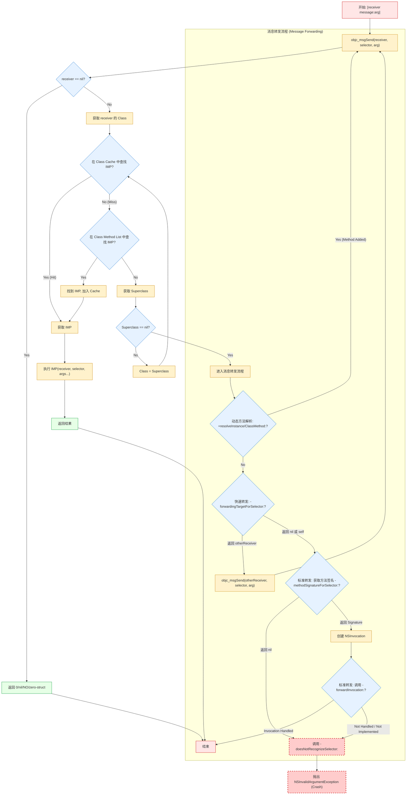

# 简述下Objective-C中调用方法的过程(2)

好的，我们来更详细地阐述 Objective-C 的方法调用（消息发送）过程，特别是深入到消息转发的各个阶段，并配上流程图。

**核心回顾：消息传递**

Objective-C 方法调用不是直接的函数调用，而是向对象发送**消息**。这个过程高度动态，由运行时系统 (Runtime) 负责。

`[receiver message:arg]` 在编译时被转换为 `objc_msgSend(receiver, selector, arg)`。

**详细过程：**

1.  **`objc_msgSend` 入口与 `nil` 检查**
    *   执行流进入 `objc_msgSend(receiver, selector, ...)` 函数。
    *   **第一步检查:** `receiver` 是否为 `nil`？
        *   **是:** 直接返回零值（`nil`, `0`, `NO`, `CGRectZero` 等，取决于方法声明的返回类型），调用结束。**这是向 `nil` 发送消息安全的原因。**
        *   **否:** 继续下一步。

2.  **查找 IMP (Implementation Pointer - 方法实现的函数指针)**
    *   **获取类对象:** 通过 `receiver` 的 `isa` 指针找到其所属的类对象 (Class Object)。(现代系统中使用 Non-Pointer `isa`，运行时会从中提取类指针)。
    *   **查找方法缓存 (Cache):**
        *   每个类对象内部都有一个高速缓存 (`cache_t`)，用于存储最近使用过的 `selector` 到 `IMP` 的映射。
        *   运行时首先以 `selector` 为 key 在这个缓存中快速查找。
        *   **缓存命中 (Cache Hit):** 如果找到对应的 `IMP`，则直接跳转到第 3 步 (执行 IMP)。这是**最快**的路径。
        *   **缓存未命中 (Cache Miss):** 继续在类的方法列表中查找。
    *   **查找当前类的方法列表 (Method List):**
        *   运行时搜索当前类对象的方法列表 (`method_list_t`)。这是一个包含 `Method` 结构体（包含 `selector`, 类型编码, `IMP`）的列表。
        *   遍历列表，比较 `selector` 是否匹配。
        *   **找到:** 获取对应的 `IMP`，将其**添加**到该类的方法缓存中（为了下次快速查找），然后跳转到第 3 步 (执行 IMP)。
        *   **未找到:** 继续查找父类。
    *   **查找父类的方法列表:**
        *   运行时通过类对象的 `superclass` 指针获取父类的类对象。
        *   重复**查找缓存**和**查找方法列表**的步骤（先查父类缓存，再查父类方法列表）。
        *   这个过程沿着继承链**递归向上**，直到找到 `selector` 对应的 `IMP` 或到达根类 (`NSObject`) 且仍未找到。
        *   **找到 (在父类中):** 获取 `IMP`，将其**添加**到**当前类**(而不是父类)的方法缓存中（关键优化：下次在本类实例上调用此方法时就能快速命中），然后跳转到第 3 步 (执行 IMP)。
        *   **未找到 (直到根类):** 说明该 `receiver` 的类及其所有父类都没有实现这个方法。此时，启动**消息转发**流程（第 4 步）。

3.  **执行 IMP**
    *   获取到 `IMP` 后，`objc_msgSend` 会像调用普通 C 函数一样调用它。
    *   `IMP` 指向的函数实际会接收至少两个隐式参数：
        *   `id self`: 指向消息接收者 `receiver`。
        *   `SEL _cmd`: 指向本次调用的 `selector`。
    *   其后跟着显式传递的参数（如 `arg`）。
    *   方法体内的代码被执行，返回值通过 `objc_msgSend` 返回给调用者。调用结束。

4.  **消息转发 (Message Forwarding)**
    *   当在类继承链中完全找不到 `IMP` 时，运行时并不会立即崩溃，而是提供了三步机会来处理这个未识别的消息：

    *   **阶段 1: 动态方法解析 (Dynamic Method Resolution)**
        *   **触发:** 运行时首先检查该类是否能**动态地**为这个 `selector` 添加一个实现。
        *   **调用:**
            *   对于实例方法，调用类的 `+resolveInstanceMethod:(SEL)sel`。
            *   对于类方法，调用元类的 `+resolveClassMethod:(SEL)sel`。
        *   **目的:** 开发者可以在这个方法里使用 `class_addMethod()` 函数动态地添加一个方法的实现。
        *   **结果:**
            *   如果该方法**添加了实现**并返回 `YES`，运行时会认为方法已经存在，**重新启动消息发送过程**（从第 2 步的“查找方法缓存”开始，这次通常会直接找到并执行新添加的 IMP）。
            *   如果该方法返回 `NO`，或者没有添加实现，则进入转发阶段 2。

    *   **阶段 2: 快速转发路径 (Fast Forwarding Path / Forwarding Target)**
        *   **触发:** 如果动态方法解析未能处理。
        *   **调用:** 运行时调用 `receiver` 的 `-forwardingTargetForSelector:(SEL)aSelector` 方法。
        *   **目的:** 允许 `receiver` 将这条消息**直接转发**给另一个**能够处理该消息的对象**。这是一种轻量级的转发，开销较小。
        *   **结果:**
            *   如果该方法返回一个**非 `nil` 且非 `self`** 的对象（`alternativeReceiver`），运行时会将消息**重新发送**给这个 `alternativeReceiver`，即执行 `objc_msgSend(alternativeReceiver, selector, ...)`. **注意：消息的接收者变了！** 之后的过程就如同 `alternativeReceiver` 收到消息一样。
            *   如果该方法返回 `nil` 或 `self`，表示没有备用接收者，运行时进入转发阶段 3。

    *   **阶段 3: 标准转发路径 (Normal Forwarding Path / Full Invocation)**
        *   **触发:** 如果快速转发路径也未能处理。这是最重载、最灵活但也最复杂的转发机制。
        *   **步骤 3a: 获取方法签名 (Method Signature)**
            *   **调用:** 运行时调用 `receiver` 的 `-methodSignatureForSelector:(SEL)aSelector` 方法。
            *   **目的:** 必须获取一个 `NSMethodSignature` 对象，它描述了未找到的方法的参数类型和返回类型。这是创建 `NSInvocation` 对象所必需的。
            *   **结果:**
                *   如果该方法返回一个有效的 `NSMethodSignature` 对象，则进入步骤 3b。
                *   如果该方法返回 `nil`（表示无法确定方法签名），运行时认为无法继续转发，直接调用 `doesNotRecognizeSelector:`。
        *   **步骤 3b: 转发调用 (Forward Invocation)**
            *   **调用:** 运行时使用上一步获取的 `NSMethodSignature` 和原始消息（包括 `selector` 和所有参数）创建一个 `NSInvocation` 对象。然后调用 `receiver` 的 `-forwardInvocation:(NSInvocation *)anInvocation` 方法，并将这个 `NSInvocation` 对象作为参数传入。
            *   **目的:** 这是最后的机会。开发者可以在 `-forwardInvocation:` 中对 `anInvocation` 做任何事情：
                *   修改 `invocation` 的目标 (`target`)、选择器 (`selector`) 或参数。
                *   将 `invocation` 发送给一个或多个其他对象 (`[anInvocation invokeWithTarget:otherObject]`)。
                *   记录日志、或者干脆不做任何事来“吞掉”这个消息。
                *   实现复杂的代理模式或模拟多重继承等。
            *   **结果:** 如果 `-forwardInvocation:` 方法被正确实现并处理了 `anInvocation`（即使只是简单返回），消息就算被处理了。如果该方法没有被实现（继承自 `NSObject` 的默认实现会调用 `doesNotRecognizeSelector:`），或者实现中没有有效处理，则消息未被处理。

5.  **最终失败: `doesNotRecognizeSelector:`**
    *   **触发:**
        *   标准转发路径中 `-methodSignatureForSelector:` 返回 `nil`。
        *   标准转发路径中 `-forwardInvocation:` 未被实现或未处理调用。
    *   **行为:** 运行时调用 `receiver` 的 `-doesNotRecognizeSelector:(SEL)aSelector` 方法。
    *   **默认实现:** `NSObject` 中该方法的默认实现是抛出一个 `NSInvalidArgumentException` 异常，通常导致应用程序**崩溃**并报告 "unrecognized selector sent to instance"。

**流程图 (Flow Chart) 示例**

这张图展示了从消息发送开始，经过 `nil` 检查、缓存查找、方法列表查找、父类查找，最终找到 `IMP` 并执行的正常流程。如果找不到 `IMP`，则进入消息转发的三个阶段：动态解析、快速转发、标准转发，最后如果都失败则调用 `doesNotRecognizeSelector:` 导致崩溃。

希望这个更详细的解释和流程图能帮助你彻底理解 Objective-C 的方法调用过程！