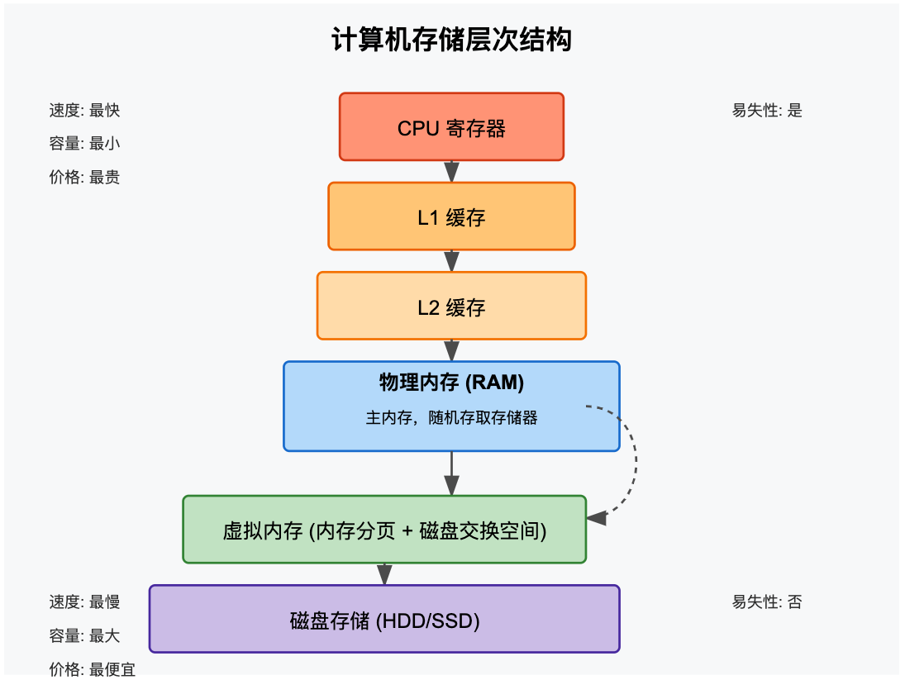

# 计算机存储层次结构图

我将为您创建一个图表来说明内存、物理内存和磁盘等存储组件之间的关系。

## 计算机存储层次结构及其关系

上图展示了计算机中不同类型存储之间的层次关系。以下是详细解释：

### 主要组件及关系

1. **CPU寄存器**
   - 速度最快、容量最小的存储
   - 直接位于CPU内部
   - 用于存储当前正在处理的数据和指令
2. **缓存（Cache）**
   - L1缓存：速度极快，直接集成在CPU核心上
   - L2缓存：速度快，通常共享于多个CPU核心
   - L3缓存（图中未显示）：位于L2和RAM之间的额外缓存层
3. **物理内存（RAM）**
   - 主内存，随机存取存储器
   - 提供CPU直接访问的工作空间
   - 易失性存储（断电后数据丢失）
   - 比缓存慢，但容量更大
4. **虚拟内存**
   - 结合物理内存和磁盘空间创建的逻辑内存
   - 通过内存分页将数据在RAM和磁盘之间交换
   - 让应用程序认为有更多内存可用
   - 内存不足时，将不常用页面交换到磁盘上
5. **磁盘存储（HDD/SSD）**
   - 非易失性存储（断电后数据保留）
   - 容量最大、速度最慢
   - 用于长期存储数据
   - 包括机械硬盘(HDD)和固态硬盘(SSD)

### 性能和特性对比

- **速度层次**：寄存器 > L1缓存 > L2缓存 > RAM > SSD > HDD
- **容量层次**：HDD/SSD > RAM > 缓存 > 寄存器
- **价格层次**：寄存器(每GB) > 缓存 > RAM > SSD > HDD
- **易失性**：寄存器/缓存/RAM会在断电后丢失数据，而磁盘存储不会

### 数据流动

数据在这些存储层次间不断移动：

- 处理数据时，从磁盘加载到RAM
- 需要读取时，从RAM加载到缓存
- 最后加载到CPU寄存器进行计算
- 计算完毕后，再按相反方向回写

这种层次结构设计，平衡了速度、容量和成本的需求，是现代计算机系统的基础架构。