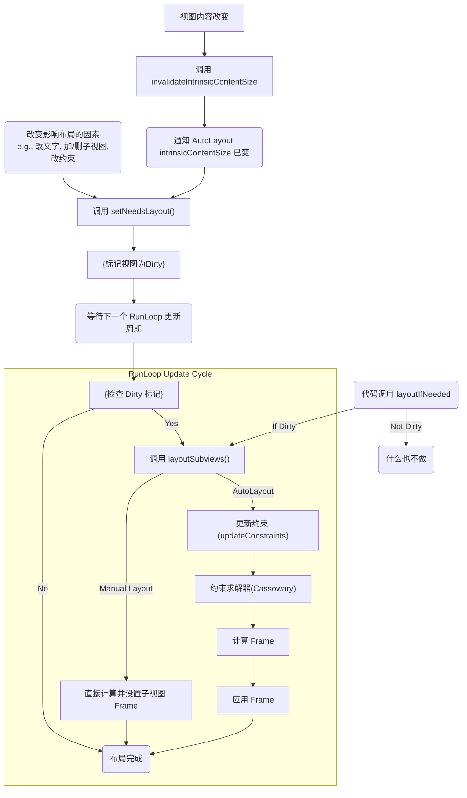

# 资深需要考虑的问题

**一、 iOS 核心知识 (深度与细节)**

**1. 内存管理 & Swift 语言: ARC, 循环引用, `weak`/`unowned`**

*   **Swift ARC 工作原理:**
    *   **核心思想:** Swift 使用自动引用计数 (ARC) 来管理应用程序的内存使用。其基本原理是：每个类实例都有一个“引用计数”属性，记录当前有多少“强引用”指向它。
    *   **计数增减:**
        *   当你创建一个新的类实例并将其分配给一个变量/常量时，该实例的引用计数变为 1。
        *   当有其他变量/常量也指向这个实例时（例如赋值、数组添加），引用计数会增加。
        *   当一个强引用变量/常量不再指向该实例时（例如变量被重新赋值、超出作用域、被设为 `nil`），引用计数会减少。
    *   **释放时机:** 一旦实例的引用计数降为 0，意味着没有任何强引用指向它，ARC 会自动回收该实例所占用的内存（调用其 `deinit` 方法，然后释放内存）。
    *   **“自动”的体现:** 编译器在编译时会自动插入适当的 `retain` (增加计数) 和 `release` (减少计数) 指令，开发者无需手动管理。

*   **与 Objective-C ARC 的异同:**
    *   **相同点:** 基本原理都是基于引用计数来自动管理内存；都需要开发者处理循环引用问题（使用 `weak` 或 `unowned`）。
    *   **不同点:**
        *   **`unowned` 的行为:** Swift 的 `unowned` 假定引用的对象永远不会为 `nil`，在对象释放后访问 `unowned` 引用会直接**崩溃**。Objective-C 的 `unsafe_unretained` (类似 `unowned`) 访问已释放对象会导致野指针，行为未定义（可能崩溃，也可能读到脏数据）。
        *   **`weak` 的行为:** Swift 的 `weak` 引用必须是可选类型 (`Optional`)，当引用的对象被释放时，`weak` 变量会自动变为 `nil`（称为**零化弱引用 Zeroing Weak Reference**）。Objective-C 的 `weak` 也有类似行为。这是两者处理 `weak` 的共同点和关键安全特性。
        *   **性能:** Swift 的 ARC 在编译期进行了更多优化，例如对于局部变量，编译器可能能推断出不需要进行引用计数操作。Swift 对值类型（Struct/Enum）的大量使用也从根本上减少了引用计数的需要。
        *   **闭包捕获:** Swift 闭包捕获变量的机制更明确（捕获列表），Objective-C Block 也有类似概念但语法不同。

*   **循环引用场景:**
    *   **对象间相互强引用:** 两个类实例互相持有对方的强引用属性。 (经典例子: `Person` 和 `Apartment`)
    *   **闭包捕获 `self`:** 一个类的实例持有一个闭包（如作为属性或传递给某个方法），而这个闭包内部又强引用了该实例 (`self`)。如果闭包的生命周期与实例相关联（比如闭包是实例的属性），就可能形成循环。

    ```swift
    class Person {
        var name: String
        var job: Job?
        init(name: String) { self.name = name }
        deinit { print("\(name) is being deinitialized") }
    }
    
    class Job {
        var title: String
        // Strong reference back to the person - potential cycle!
        var employee: Person?
        init(title: String) { self.title = title }
        deinit { print("Job \(title) is being deinitialized") }
    }
    
    var alice: Person? = Person(name: "Alice")
    var developerJob: Job? = Job(title: "iOS Developer")
    
    alice?.job = developerJob
    developerJob?.employee = alice // Creates a strong reference cycle!
    
    alice = nil
    developerJob = nil
    // Neither Alice nor the Job will be deinitialized because of the cycle. MEMORY LEAK!
    ```

*   **打破循环引用的其他方法 (除了 `weak`/`unowned`):**
    *   **闭包捕获列表 (Capture Lists):** 这是最常用的方法。在闭包定义时，使用 `[weak self]` 或 `[unowned self]` 来明确指定如何捕获 `self` (或其他可能引起循环的变量)。
        ```swift
        class NetworkFetcher {
            var onDataReceived: ((Data) -> Void)?
            let url = URL(string: "...")!
        
            func fetchData() {
                // Without capture list: strong capture of self -> potential cycle if NetworkFetcher holds the closure
                // URLSession.shared.dataTask(with: url) { data, _, _ in
                //     if let data = data {
                //         self.handleData(data) // Strong capture of self
                //     }
                // }.resume()
        
                // With weak capture list: breaks the cycle
                URLSession.shared.dataTask(with: url) { [weak self] data, _, _ in
                    // self is now an optional Person? inside the closure
                    guard let strongSelf = self, let data = data else { return }
                    strongSelf.handleData(data) // Use strongSelf
                }.resume()
            }
        
            func handleData(_ data: Data) { /* ... */ }
            deinit { print("NetworkFetcher deinitialized") }
        }
        ```
    *   **手动断开引用:** 在适当的时候（例如 `viewDidDisappear`, `deinit` 之前），显式地将导致循环的强引用设置为 `nil`。但这需要精确控制时机，容易出错，不如 `weak`/`unowned` 或捕获列表优雅。
    *   **使用值类型:** 如果可以将其中一方设计为 Struct 或 Enum，它们是值类型，赋值即拷贝，不会产生引用计数和循环引用问题。

*   **`unowned` 的适用场景和风险:**
    *   **适用场景:** 当你**非常确定**一个引用在其生命周期内**绝对不会**变为 `nil` 时。通常发生在两个对象的生命周期紧密绑定，一个对象的存在必然依赖于另一个对象（例如，`Customer` 和 `CreditCard`，信用卡对象可能 `unowned` 引用其所属的客户对象，假设信用卡不能脱离客户存在）。或者确定被引用的对象生命周期**一定长于**引用它的对象。
    *   **风险:** **主要风险是崩溃！** 如果错误地使用了 `unowned`，而被引用的对象在使用 `unowned` 变量之前被释放了，那么访问这个 `unowned` 变量将直接导致程序崩溃（试图访问一个不存在的对象）。它不像 `weak` 那样会安全地变成 `nil`。因此，除非有充分理由且风险可控，否则优先使用 `weak`。

---

**2. Swift 值类型 vs 引用类型, COW**

*   **核心差异:**

    | 特性               | 值类型 (Struct, Enum, Tuple)                                 | 引用类型 (Class, Actor, Function/Closure)                    |
    | :----------------- | :----------------------------------------------------------- | :----------------------------------------------------------- |
    | **内存分配**       | 通常在**栈 (Stack)** 上分配（如果不是嵌套在类或闭包中）。栈分配速度快。 | 总是在**堆 (Heap)** 上分配。堆分配相对较慢，需要管理（ARC）。 |
    | **赋值行为**       | **拷贝 (Copy)**。赋值或传递时，会创建内容的完整副本。修改副本不影响原始值。 | **引用 (Reference)**。赋值或传递时，传递的是指向内存地址的引用（指针）。多个变量可以指向同一个实例。修改一个引用的实例会影响所有指向它的变量。 |
    | **性能**           | 通常更快（栈分配，无 ARC 开销，数据局部性好）。但如果结构体很大，拷贝开销可能显著。 | 相对较慢（堆分配，ARC 开销，可能的数据非局部性）。但避免了大对象的拷贝开销。 |
    | **线程安全**       | 天然**更安全**。因为传递的是副本，不同线程操作的是各自的数据，不易产生数据竞争（Data Race）。（需注意内部含有引用类型属性的情况） | **需要特别注意**。多个线程可能同时访问和修改同一个实例，需要加锁 (Lock, Actor 等) 来保证线程安全，否则易产生数据竞争。 |
    | **恒等性 (`===`)** | 没有恒等性概念。比较 (`==`) 通常基于值的内容（需实现 `Equatable`）。 | 有恒等性 (`===`)，判断两个引用是否指向**同一个**内存实例。比较 (`==`) 可重载，通常也基于内容（需实现 `Equatable`）。 |

*   **Copy-on-Write (COW):**
    *   **目的:** 这是针对值类型（特别是 Swift 标准库中的集合类型如 `Array`, `Dictionary`, `String`）的一种**优化策略**，旨在**避免不必要的拷贝开销**，使其在表现得像值类型的同时，尽可能地拥有引用类型的性能优势。
    *   **实现原理:**
        1.  当一个值类型实例（如数组 `a`）被赋值给另一个变量（`b = a`）时，系统**并不会立即**进行完整的内存拷贝。相反，`b` 内部会**共享** `a` 的底层存储（例如指向同一个内存缓冲区）。
        2.  系统会使用某种机制（例如内部引用计数，或者检查内存地址是否唯一被引用 `isKnownUniquelyReferenced`）来跟踪这个共享存储有多少个引用。
        3.  **关键点:** 只有当其中一个变量（如 `b`）尝试**修改**其内容时，系统会检查这个底层存储是否被共享（引用计数 > 1 或 `isKnownUniquelyReferenced` 返回 `false`）。
        4.  如果**是共享的**，系统此时**才会真正执行拷贝**操作，为 `b` 创建一个新的独立内存副本，然后在新副本上执行修改。`a` 仍然指向原始的、未修改的存储。
        5.  如果**不是共享的**（只有 `b` 自己引用），则直接在原地修改，无需拷贝。

    **图示：Copy-on-Write (COW)**
    ```mermaid
    graph TD
        subgraph Initial State
            A["let a = [1, 2, 3]"] --> Storage1("[Buffer: 1, 2, 3 | RefCount: 1]");
        end
    
        subgraph After ["`let b = a`(No Copy Yet)"]
            A2[a] --> StorageShared["([Buffer: 1, 2, 3 | RefCount: 2])"];
            B1[b] --> StorageShared;
        end
    
        subgraph After ["`b.append(4)` (Write triggers Copy)"]
            A3[a] --> StorageOrig["([Buffer: 1, 2, 3 | RefCount: 1])"];
            B2[b] --> StorageNew["([Buffer: 1, 2, 3, 4 | RefCount: 1])"]; %% b gets a new copy and modifies it %%
        end
    ```

*   **COW 失效情况:**
    
    *   **直接访问底层存储:** 如果通过不安全的方式（如 `withUnsafeBufferPointer`）获取了底层存储的指针，并试图在多个“副本”间共享修改，COW 机制可能被绕过或行为不确定。
    *   **持有存储的引用:** 如果值类型内部持有了对其存储缓冲区的强引用（这在自定义 COW 实现中可能发生），并且该引用在别处也被持有，`isKnownUniquelyReferenced` 可能不会返回 `true`，导致不必要的拷贝。
    *   **非标准库类型:** COW 是 Swift 标准库集合类型的特性。自定义的 Struct 默认不会有 COW 行为，除非你手动实现它（通常涉及一个内部持有的引用类型 Box）。
    
*   **利用值类型提升性能和安全性:**
    *   **性能:**
        *   对于小型数据结构，优先使用 Struct/Enum，避免堆分配和 ARC 开销。
        *   利用 COW 特性，在函数间传递大型集合（如数组）时，如果函数内部只是读取而不修改，可以避免实际的拷贝开销。
    *   **安全性:**
        *   **减少副作用:** 函数接收值类型参数时，知道对参数的修改不会影响到调用者的数据，更容易推理代码行为。
        *   **线程安全:** 在多线程环境中，传递值类型副本可以天然避免数据竞争，简化并发编程。将共享状态封装在值类型中（如果适用）比用类加锁更安全。例如，配置信息、简单的数据模型等适合用 Struct。

---

**3. Swift Actor**

*   **是什么:** `Actor` 是 Swift 5.5 引入的一种**新的引用类型**，专门用于在并发环境中**安全地管理可变状态**。它旨在解决传统并发模型（如 GCD + 锁）中常见的数据竞争问题。
*   **解决了什么问题:**
    *   **数据竞争 (Data Races):** 多个线程在没有同步的情况下同时访问（至少一个是写入）共享的可变数据，导致结果不可预测或崩溃。Actor 通过**隔离 (Isolation)** 机制来防止这种情况。
*   **工作机制 - 隔离:**
    *   Actor 保护其内部的可变状态（属性）。对 Actor 内部状态的访问（包括读取和写入）**必须**是**异步 (asynchronous)** 的，通过 `await` 关键字进行。
    *   这意味着从 Actor 外部访问其属性或调用其方法，需要暂停当前任务，将访问请求发送给 Actor，Actor 会在一个**串行化的执行上下文**中处理这些请求，确保同一时间只有一个任务在访问其状态。这就像给 Actor 配备了一个隐形的“调度员”，保证所有访问其内部数据的操作都是排队进行的。
*   **与 GCD 队列 / `NSLock` 的比较:**
    *   **优势:**
        *   **编译器级别的安全:** 编译器会强制检查跨 Actor 边界的访问，如果尝试同步访问 Actor 的隔离状态，会产生编译错误。这比依赖开发者手动、正确地使用锁或队列要安全得多。
        *   **避免死锁（部分）:** Actor 内部调用 `async` 方法时支持**重入 (reentrancy)**（见下文），这有助于避免某些类型的死锁（比如 Actor A `await` Actor B 的方法，同时 Actor B `await` Actor A 的方法，如果不支持重入会死锁）。传统的锁则容易发生死锁。
        *   **结构化并发:** 与 Swift 的 `async/await` 语法无缝集成，代码更简洁、易读。
        *   **避免优先级反转（理论上）:** Actor 的执行模型理论上更能抵抗优先级反转问题（低优先级任务持有高优先级任务需要的锁）。
    *   **劣势:**
        *   **强制异步:** 所有跨 Actor 的交互都是异步的，对于需要同步获取结果的场景可能不方便（尽管通常异步是并发环境下的更优选择）。
        *   **重入的复杂性:** Actor 的重入特性虽然避免了某些死锁，但也可能引入状态不一致的问题，需要开发者理解并小心处理（见下文）。
        *   **性能开销:** Actor 的消息传递和任务切换机制相比细粒度的锁可能有更高的开销，但在防止数据竞争的收益面前通常是值得的。
*   **`nonisolated`:**
    *   **作用:** 用 `nonisolated` 标记 Actor 的属性或方法，表示它们**不**受 Actor 的隔离保护。
    *   **使用场景:**
        *   **常量 (`let`) 属性:** 常量在初始化后不会改变，天然线程安全，可以标记为 `nonisolated` 以允许从外部同步访问。
        *   **只依赖 `nonisolated` 状态或外部参数的方法:** 如果一个方法不需要访问 Actor 内部的可变状态，可以标记为 `nonisolated`，允许外部同步调用。
        *   **遵循某些协议:** 有些协议要求同步的方法或属性，如果 Actor 需要遵循这些协议，可能需要将对应成员标记为 `nonisolated`（需要确保线程安全）。
    ```swift
    actor Counter {
        private var value = 0
        nonisolated let id: UUID // Constant, safe to access synchronously
    
        func increment() {
            value += 1
        }
    
        func getValue() -> Int {
            value
        }
    
        nonisolated func describe() -> String { // Doesn't access mutable state 'value'
            return "Counter ID: \(id)"
        }
    }
    
    let counter = Counter(id: UUID())
    // Accessing isolated state requires await
    // let currentValue = await counter.getValue()
    // Calling isolated method requires await
    // await counter.increment()
    
    // Accessing nonisolated property is synchronous
    let counterId = counter.id
    // Calling nonisolated method is synchronous
    let description = counter.describe()
    ```
*   **`@MainActor`:**
    *   **作用:** `@MainActor` 是一个特殊的**全局 Actor**，它代表**主线程**。用 `@MainActor` 标记类、结构体、枚举、函数或闭包，可以确保它们的代码总是在主线程上执行。
    *   **使用场景:**
        *   **UI 更新:** 所有 UIKit/AppKit 的操作必须在主线程进行。将 ViewController、View、以及任何直接操作 UI 的代码标记为 `@MainActor`，可以保证线程安全。
        *   **需要主线程执行的逻辑:** 任何需要在主队列上执行的任务。
    ```swift
    @MainActor // Entire class runs on the main thread
    class MyViewModel: ObservableObject {
        @Published var message = "Loading..."
    
        func fetchDataAndUpdateUI() async {
            // Perform background work (implicitly non-MainActor unless specified otherwise)
            let data = await fetchFromServer()
    
            // Update @Published property, which triggers UI update.
            // Since the class is @MainActor, this assignment is guaranteed
            // to happen on the main thread.
            message = "Data loaded: \(data)"
        }
    
        func fetchFromServer() async -> String {
            // This function might run on a background thread
            // ... network request ...
            return "Some Data"
        }
    }
    ```
*   **Actor 重入 (Reentrancy):**
    *   **概念:** 当一个 Actor 的方法执行到 `await` 点暂停时，Actor 会**释放**其执行锁，允许**其他**发送给该 Actor 的消息（调用其他方法或访问属性）在其暂停期间被处理。当 `await` 的操作完成后，原始方法会恢复执行。这种在 `await` 期间允许 Actor 处理其他消息的特性就是**重入**。
    *   **可能带来的问题:** **状态不一致**。如果在 `await` 之前读取了 Actor 的某个状态，`await` 期间 Actor 可能处理了其他消息修改了这个状态，当 `await` 返回后，之前读取的状态可能已经**过时**了。开发者需要意识到这一点，避免基于旧状态做决策，或者在必要时重新读取状态。
    ```swift
    actor BankAccount {
        var balance: Double = 100
    
        func withdraw(_ amount: Double) async throws {
            guard balance >= amount else { throw BankError.insufficientFunds }
    
            // Imagine a slow network call to verify something
            print("Balance before await: \(balance)") // Prints 100 initially
            await Task.sleep(nanoseconds: 1_000_000_000) // Simulate delay
    
            // !!! DANGER ZONE !!!
            // While sleeping, another task could call deposit() or another withdraw()
            // Let's say another task deposits 50, balance becomes 150.
            // Or another task withdraws 80, balance becomes 20.
    
            // This check uses the balance *after* the await, which might have changed.
            // If balance became 20, this check is still based on the initial check (>= amount)
            // but the actual withdrawal might fail if not rechecked implicitly or explicitly.
            // Swift Actors try to manage this, but complex logic needs care.
    
            // A safer approach often involves making the state change atomic *before* the await if possible,
            // or re-validating *after* the await.
    
            print("Balance after await: \(balance)") // Could be different!
            balance -= amount // Potential issue if state changed unfavorably
            print("Withdrawal successful. New balance: \(balance)")
        }
    
        func deposit(_ amount: Double) {
             balance += amount
             print("Deposit successful. New balance: \(balance)")
        }
    }
    ```
    **关键:** 在 `await` 之后，不要假设 Actor 的状态和你 `await` 之前观察到的一样。如果后续操作依赖这个状态，可能需要重新读取或设计逻辑以适应状态变化。

---

**4. Swift `some` 和 `any` (Opaque Types and Existential Types)**

*   **`some Protocol` (Opaque Types - 不透明类型):**
    *   **含义:** 表示“**存在某一个具体的、符合 `Protocol` 的类型，但我不告诉你（或现在不能确定）具体是哪个类型**”。这个具体的类型在**编译时**就已经确定了，并且对于同一个 `some Protocol` 声明，返回的**必须**是**同一个**具体类型。
    *   **作用:**
        *   **隐藏实现细节:** 函数或属性可以返回一个符合协议的具体类型，但调用者不需要知道这个具体类型是什么，只需要知道它符合某个协议即可。这有助于保护模块的内部实现。
        *   **保持类型一致性:** 保证了返回/持有的是一个单一的、确定的底层类型。
    *   **性能:** 通常性能更好。因为底层具体类型在编译时是已知的，编译器可以进行**静态派发 (Static Dispatch)** 或优化，避免动态派发的开销。
    *   **编译期检查:** 编译器知道具体的底层类型，可以进行更严格的类型检查。
    *   **限制:** 不能用于存储**不同**具体类型的集合。例如，`[some Equatable]` 是无效的，因为数组元素必须是同一类型，而 `some Equatable` 可能代表 `Int` 或 `String` 等不同类型。
    *   **场景:**
        *   **函数返回值:** `func createShape() -> some Shape { return Circle() }` (调用者只知道是个 Shape，不知道是 Circle)
        *   **属性类型:** `var myView: some View { Text("Hello") }` (在 SwiftUI 中常见)
        *   **泛型返回值:** `func makeEquatable<T: Equatable>(_ value: T) -> some Equatable { return value }` (返回的具体类型与输入 T 一致)

*   **`any Protocol` (Existential Types - 存在类型 / 类型擦除):**
    *   **含义:** 表示“**任何一个符合 `Protocol` 的类型**”。它是一个**容器**（称为**存在容器 Existential Container**），可以持有**任何**符合该协议的具体类型实例。变量可以持有 `Int`，之后又可以持有 `String`（如果它们都符合该协议）。
    *   **作用:**
        *   **处理异构集合:** 允许你在一个集合（如数组）中存储**不同**的具体类型，只要它们都符合同一个协议。
        *   **类型擦除:** 当你需要一个变量或参数能够接受多种符合协议的类型时使用。
    *   **性能:** 通常性能**较差**。
        *   **存在容器开销:** 需要额外的内存来存储存在容器（包含值本身或其引用，以及类型信息和协议见证表）。
        *   **动态派发 (Dynamic Dispatch):** 调用协议方法时，需要运行时查找具体类型的实现，有额外开销。
    *   **编译期检查:** 编译器只知道它符合协议，丢失了具体的类型信息，某些类型相关的优化和检查无法进行。
    *   **场景:**
        *   **存储不同类型的数组:** `let items: [any Drawable] = [Circle(), Square(), Triangle()]`
        *   **函数参数接受多种类型:** `func draw(_ thing: any Drawable) { thing.draw() }`
        *   **属性持有不同类型:** `var currentAction: any Action`

    **图示：some vs any (Conceptual)**
    
    ```mermaid
    graph TD
        subgraph `func getShape() -> some Shape` (Opaque Type)
           A[Compiler Knows:] --> B{Returns ONE specific type, e.g., always Circle};
           B --> C[Caller sees: 'some Shape'];
           C --> D[Performance: Static Dispatch (often)];
           D --> E[Use Case: Hide implementation detail];
        end
    
        subgraph `var drawer: any Drawable` (Existential Type)
           X[Compiler Knows:] --> Y{Can hold ANY type conforming to Drawable};
           Y --> Z[Runtime knows: Currently holds Circle OR Square OR ...];
           Z -- Contains --> Value(Actual Value);
           Z -- Contains --> TypeInfo(Type Metadata);
           Z -- Contains --> WitnessTable(Protocol Method Pointers);
           Z --> W[Performance: Dynamic Dispatch + Container Overhead];
           W --> V[Use Case: Heterogeneous collections, Type Erasure];
        end
    ```
    
*   **总结:**
    *   用 `some Protocol` 当你需要隐藏具体类型但保证返回/持有的是**单一、固定**的类型，并且关心性能。它是“返回一个符合协议的**特定**东西”。
    *   用 `any Protocol` 当你需要处理**多种**符合协议的不同类型，比如放在一个数组里，或者变量需要能持有不同类型的值。它是“返回一个符合协议的**任意**东西”。需要接受其潜在的性能开销。

---

**5. Swift 泛型系统, 关联类型 (Associated Types)**

*   **Swift 泛型系统:**
    *   **目的:** 允许你编写**灵活、可重用**的函数和类型，它们可以处理**任何类型**，同时保持**类型安全**。避免了为不同类型编写重复代码。
    *   **核心:** 使用**占位符类型 (Placeholder Types)**，通常用 `T`, `U`, `V` 等表示。这些占位符在定义时不指定具体类型，在使用泛型函数或类型时，由编译器根据传入的实际类型来推断或显式指定。
    *   **泛型函数:**
        ```swift
        func swapValues<T>(_ a: inout T, _ b: inout T) { // T is a placeholder type
            let temporaryA = a
            a = b
            b = temporaryA
        }
        var x = 5
        var y = 10
        swapValues(&x, &y) // T is inferred as Int
        var s1 = "Hello"
        var s2 = "World"
        swapValues(&s1, &s2) // T is inferred as String
        ```
    *   **泛型类型:**
        ```swift
        struct Stack<Element> { // Element is a placeholder type
            var items: [Element] = []
            mutating func push(_ item: Element) { items.append(item) }
            mutating func pop() -> Element { return items.removeLast() }
        }
        var intStack = Stack<Int>() // Element becomes Int
        intStack.push(1)
        var stringStack = Stack<String>() // Element becomes String
        stringStack.push("A")
        ```
    *   **类型约束 (Type Constraints):** 可以要求占位符类型必须符合某个协议或继承自某个类。
        ```swift
        func findIndex<T: Equatable>(of valueToFind: T, in array:[T]) -> Int? { // T must conform to Equatable
            for (index, value) in array.enumerated() {
                if value == valueToFind { // Requires Equatable for ==
                    return index
                }
            }
            return nil
        }
        ```

*   **关联类型 (Associated Types):**
    *   **是什么:** 在**协议 (Protocol)** 定义内部使用的**占位符类型名称**。它允许协议的部分定义（如方法参数、返回值、属性类型）依赖于一个**尚未指定**的类型，这个具体类型将由**遵循该协议的类型**来确定。
    *   **解决什么问题:** 解决了**协议不能直接定义泛型类型参数**的问题。协议描述的是一种能力或契约，有时这种能力需要涉及到某种“相关类型”，但协议本身并不想限制这个相关类型具体是什么。
    *   **对比:** 泛型用在具体类型（Struct, Class, Enum）或函数上，定义时使用 `<T>`。关联类型用在协议（Protocol）里，定义时使用 `associatedtype ItemType`。

*   **如何解决协议限制 & 举例:**
    *   **限制:** 假设你想定义一个“容器”协议，它应该能包含某种类型的元素，并提供添加和获取元素的方法。如果不用关联类型，很难表达“容器里的元素类型”。
    *   **使用关联类型:**
        ```swift
        protocol Container {
            // Associated type: Placeholder for the element type
            associatedtype Item
            // Method that uses the associated type
            mutating func append(_ item: Item)
            // Property that uses the associated type
            var count: Int { get }
            // Subscript that uses the associated type
            subscript(i: Int) -> Item { get }
        }
        
        // Concrete type conforming to the protocol specifies the actual type for Item
        struct IntStack: Container {
            // Explicitly specify Item = Int (can also be inferred)
            // typealias Item = Int
            var items: [Int] = []
            mutating func append(_ item: Int) { // 'item' is Int, matching Item
                items.append(item)
            }
            var count: Int { items.count }
            subscript(i: Int) -> Int { // Returns Int, matching Item
                items[i]
            }
        }
        
        struct StringQueue: Container {
            // Item is inferred as String here
            var items: [String] = []
            mutating func append(_ item: String) {
                items.append(item)
            }
            var count: Int { items.count }
            subscript(i: Int) -> String {
                items[i]
            }
        }
        
        // Generic function using the protocol with associated type via constraints
        func processContainer<C: Container>(container: C) where C.Item: Equatable {
            print("Container has \(container.count) items.")
            // We can use properties/methods defined by Container
            // We can also use methods from the constraint (Equatable) on the Item type
            if let first = container.count > 0 ? container[0] : nil, first == first { // Example using Equatable
                 print("First item exists and is equatable.")
            }
        }
        
        let stack = IntStack(items: [1, 2, 3])
        processContainer(container: stack) // C is IntStack, C.Item is Int (which is Equatable)
        
        let queue = StringQueue(items: ["A", "B"])
        processContainer(container: queue) // C is StringQueue, C.Item is String (which is Equatable)
        ```
    *   **总结:** 关联类型让协议可以定义与**遵循者相关**的类型契约，使得协议更加灵活和强大，能够描述更复杂的泛型关系，例如各种集合类型、数据源协议等。它是 Swift 协议和泛型系统的重要组成部分。

---

好的，我们继续按顺序详细解答剩下的问题。

---

**一、 iOS 核心知识 (深度与细节) - 续**

**6. UI & 渲染: `CALayer` 和 `UIView` 的关系, `contents`, 动画, `CATransaction`**

*   **`CALayer` 和 `UIView` 的关系:** (在之前的回答中已详细解释)
    *   **核心:** 每个 `UIView` 都有一个根 `CALayer` (`view.layer`)，负责该视图内容的实际绘制和动画。`UIView` 主要作为 `CALayer` 的**代理**和**事件响应者**，处理用户交互、布局逻辑，并提供更高级别的接口。`CALayer` 更接近底层图形硬件 (GPU)，专注于高效渲染和视觉效果。
    *   **为什么需要 `CALayer`?** 分工（逻辑 vs 渲染）、性能（GPU 加速）、丰富的视觉效果（圆角、阴影、动画）、轻量级（可独立于 `UIView` 使用）。

*   **`CALayer` 的 `contents` 属性:**
    *   **作用:** `contents` 属性用于**直接设置图层显示的内容**，通常是一个 `CGImageRef` (Core Graphics 图像引用)。这是 `CALayer` 显示位图（图片）的主要方式。
    *   **工作方式:** 当你给 `contents` 赋值一个 `CGImage` 时，图层会直接将这个图像绘制到它的区域内。这比通过 `drawRect:` 或 `drawLayer:inContext:` 方法绘制要高效得多，因为它避免了 CPU 的软件绘制过程，可以直接将图像数据交给 GPU 处理。`UIImageView` 内部主要就是通过设置其 `layer.contents` 来显示图片的。
    *   **相关属性:** `contentsGravity` (类似 `UIView` 的 `contentMode`，控制内容如何缩放填充)、`contentsScale` (处理 Retina 屏幕的 `scale` 因子)、`contentsRect` (指定只显示原始图像的一部分，用于 Image Sprites) 等。

*   **隐式动画 (Implicit Animation) vs 显式动画 (Explicit Animation):**
    *   **隐式动画:**
        *   **触发:** 当你**直接修改** `CALayer` 的某些**可动画属性** (Animatable Properties，如 `bounds`, `position`, `backgroundColor`, `opacity`, `transform` 等) 时，系统会自动为你创建一个**默认的过渡动画**（通常是淡入淡出或平滑过渡，持续约 0.25 秒）。这种“自动发生”的动画就是隐式动画。
        *   **前提:** 隐式动画默认只在 `UIView` 关联的图层上**启用**。对于独立创建的 `CALayer` 或在 `UIView` 动画块之外修改属性，需要特定的上下文（见 `CATransaction`）。
        *   **特点:** 简单方便，适用于简单的属性变化过渡。控制力较弱。
        ```swift
        // 在 UIView 内部修改 layer 属性，通常会触发隐式动画
        myView.layer.opacity = 0.0 // 会自动产生渐隐动画
        
        // 对于独立 Layer，直接修改默认无动画
        let standaloneLayer = CALayer()
        // ... setup layer ...
        standaloneLayer.opacity = 0.0 // 通常瞬间改变，无动画
        ```
    *   **显式动画:**
        *   **触发:** 开发者**手动创建**一个 `CAAnimation` 对象（如 `CABasicAnimation`, `CAKeyframeAnimation`, `CATransition`, `CASpringAnimation`, `CAAnimationGroup`），配置动画的细节（时长、目标值、时间曲线、重复次数等），然后**添加**到 `CALayer` 上 (`layer.add(animation, forKey: ...)`).
        *   **特点:** **完全控制**动画的各个方面。可以实现复杂、自定义的动画效果。适用于所有 `CALayer`，无论是否关联 `UIView`。动画执行时，属性的**模型值 (Model Value)** 会立刻变成最终值，而**呈现值 (Presentation Value)** 会在动画期间平滑过渡。
        ```swift
        let fadeOut = CABasicAnimation(keyPath: "opacity")
        fadeOut.fromValue = 1.0
        fadeOut.toValue = 0.0
        fadeOut.duration = 0.5
        myView.layer.add(fadeOut, forKey: "opacityAnimation")
        // 动画结束后，需要手动设置最终值，否则会弹回
        myView.layer.opacity = 0.0
        ```

*   **`CATransaction` 的作用:**
    *   **核心:** Core Animation 使用**事务 (Transaction)** 的概念来**组合和管理**图层树的多个属性更改，并将它们作为一个原子更新提交给渲染服务器。
    *   **作用:**
        1.  **批处理更改:** 将在同一个 `CATransaction` 内发生的多个图层属性修改**打包**在一起，确保它们同时生效。
        2.  **控制动画参数:** 允许你为当前事务内的**隐式动画**设置参数，如**动画时长 (`setAnimationDuration:`)**、**时间曲线 (`setAnimationTimingFunction:`)**、以及**是否禁用动画 (`setDisableActions:`)**。
        3.  **完成回调:** 允许你设置一个**完成块 (`setCompletionBlock:`)**，在当前事务（包括其所有动画）完成后执行。
    *   **使用方式:**
        *   **隐式事务:** Core Animation 在每次 RunLoop 循环中会自动开始一个新的事务，所有在该循环中对可动画属性的修改都会被包含。
        *   **显式事务:** 你可以通过调用 `CATransaction.begin()`, `CATransaction.commit()` 来手动创建和提交事务，并在两者之间设置事务参数。
        ```swift
        CATransaction.begin()
        CATransaction.setAnimationDuration(2.0) // 设置本次事务中隐式动画时长为2秒
        CATransaction.setCompletionBlock {
            print("动画完成!")
        }
        
        myView.layer.opacity = 0.5
        myView.layer.position = CGPoint(x: 100, y: 100) // 这两个修改会一起动画，持续2秒
        
        CATransaction.commit()
        
        // 禁用隐式动画
        CATransaction.begin()
        CATransaction.setDisableActions(true) // 禁用动画
        myView.layer.opacity = 1.0 // 瞬间改变，无动画
        CATransaction.commit()
        ```

**图示：隐式动画 vs 显式动画**
```mermaid
graph TD
    subgraph 隐式动画 (Implicit Animation)
        A[修改 Layer 的可动画属性\n(如 myView.layer.opacity = 0)] -- 在 UIView 管理下 --> B{Core Animation 自动创建\n默认动画 (e.g., 淡出)};
        B --> C[动画执行];
    end

    subgraph 显式动画 (Explicit Animation)
        X[开发者创建 CAAnimation 对象\n(e.g., CABasicAnimation)];
        Y[配置动画参数\n(时长, 目标值, 曲线等)];
        Z[调用 layer.add(animation, forKey: ...)];
        X --> Y --> Z --> W[动画执行 (精确控制)];
    end

    subgraph CATransaction (事务)
        T1[CATransaction.begin()] --> T2[设置动画参数\n(时长, 曲线, 禁用? 完成块?)];
        T2 --> T3[修改多个 Layer 属性];
        T3 --> T4[CATransaction.commit()];
        T4 --> T5[所有修改作为一个整体\n应用动画或立即生效];
    end
```

---

**7. UI & 渲染: 视图布局过程 (Layout Cycle)**

*   **iOS 视图布局过程 (Layout Cycle):** 这是一个当视图的尺寸或位置需要改变时，系统用来计算和应用这些改变的过程。它不是瞬间完成的，而是被集成到应用程序的 RunLoop 中。主要包含三个关键方法：
    1.  **`setNeedsLayout()`:**
        *   **作用:** 通知系统：“这个视图的布局**已经变得无效** (dirty)，需要在**未来的某个时刻**重新计算。” 它只是打上一个“需要重新布局”的**标记**，并**不会**立即触发布局。
        *   **调用时机:** 当视图的某些属性（通常不是 `frame` 或 `bounds` 本身，而是影响布局的内部状态或约束）发生变化，需要重新计算子视图的位置或自身大小时调用。例如，文本标签内容改变可能影响其 `intrinsicContentSize`，需要重新布局。或者添加/删除了子视图。
        *   **效果:** 系统会在**下一个 RunLoop 周期**的更新阶段检查这个标记，如果标记存在，则会调用该视图的 `layoutSubviews()` 方法。

    2.  **`layoutIfNeeded()`:**
        *   **作用:** 命令系统：“**立即**检查这个视图以及它的子视图树是否标记为‘需要重新布局’，如果是，就**立刻执行** `layoutSubviews()` 来完成布局。” 如果视图没有被标记，这个方法什么也不做。
        *   **调用时机:** 当你需要**在当前代码执行点之后，立即获得**视图更新布局后的 `frame` 或其他几何属性时调用。例如，在动画块之前强制完成布局，以便动画从正确的初始状态开始。
        *   **效果:** 如果视图或其子视图被标记为需要布局，会**同步地**调用 `layoutSubviews()` (或 `updateConstraints()` -> `layoutSubviews()`)，直到布局完成才返回。**注意:** 不要在 `layoutSubviews` 或 `updateConstraints` 内部调用 `layoutIfNeeded`，可能导致无限循环。

    3.  **`layoutSubviews()`:**
        *   **作用:** 这是**实际执行布局**的地方。子类**重写 (override)** 这个方法来**手动计算和设置其子视图**的 `frame` 或**更新约束**。系统会在确定需要重新布局后（通常是在 `setNeedsLayout` 标记后的下一个 RunLoop，或被 `layoutIfNeeded` 强制触发时）调用此方法。
        *   **职责:**
            *   计算所有子视图的大小和位置。
            *   直接设置子视图的 `frame`, `bounds`, `center`。
            *   对于使用 Auto Layout 的视图，这里通常不是直接设置 `frame`，而是父视图调整自身或子视图的约束，或者调用子视图的布局方法。系统会在之后根据更新的约束计算最终 `frame`。
        *   **注意事项:**
            *   **不要**主动调用 `layoutSubviews()`，这是系统调用的方法。你应该调用 `setNeedsLayout` 或 `layoutIfNeeded` 来触发它。
            *   `layoutSubviews` 的默认实现什么也不做。
            *   在 `layoutSubviews` 中进行布局计算可能比较耗时，应尽量优化。
            *   **调用 `super.layoutSubviews()`** 通常是好的实践，除非你完全接管了父类的布局逻辑。

*   **`intrinsicContentSize` (固有内容大小):**
    *   **含义:** 某些视图（如 `UILabel`, `UIButton`, `UIImageView`）根据其自身的内容（文字、图片等）就有一个**自然的、最合适的大小**。这个大小就是 `intrinsicContentSize`。
    *   **作用:** 在 Auto Layout 中，系统会根据这个固有内容大小自动创建**内容优先级**的约束（Content Hugging Priority 和 Compression Resistance Priority）。
        *   **Content Hugging (内容拥抱):** 视图**抵抗**被拉伸得比其 `intrinsicContentSize` 更大的优先级。优先级越高，越不容易被拉伸。
        *   **Compression Resistance (压缩抵抗):** 视图**抵抗**被压缩得比其 `intrinsicContentSize` 更小的优先级。优先级越高，越不容易被压缩。
    *   **自定义视图:** 对于自定义视图，你可以重写 `intrinsicContentSize` 属性，返回基于其内容的自然大小，这样它就能更好地与 Auto Layout 协作。如果内容变化了导致 `intrinsicContentSize` 变化，需要调用 `invalidateIntrinsicContentSize()` 来通知 Auto Layout 系统需要重新查询。

*   **Auto Layout 约束计算原理 (Cassowary 算法):**
    *   **核心思想:** Auto Layout 将界面布局问题转化为求解一组**线性等式和不等式**的问题。你设置的每个约束（`Constraint`）都代表一个数学方程（如 `view1.leading = view2.trailing + 8`）或不等式（如 `view.width >= 50`）。
    *   **Cassowary 算法:** iOS（和 macOS）使用 [Cassowary](https://constraints.cs.washington.edu/cassowary/) 约束求解工具包（或其变种）来找到满足所有这些等式和不等式（约束）的一组最优解（即每个视图的 `frame`）。
    *   **过程（简化版）:**
        1.  **收集约束:** 系统收集视图层级中所有激活的约束。
        2.  **建立方程组:** 将约束转化为线性方程和不等式。
        3.  **求解:** Cassowary 算法使用**增量式**的方法来求解这个方程组。它维护一个可行的解，并在添加、删除或修改约束时，高效地更新解，找到新的最优布局。它会考虑约束的**优先级 (priority)**，优先满足高优先级的约束，在无法满足所有约束时，会牺牲低优先级的约束。
        4.  **应用结果:** 求解器计算出每个视图的 `x, y, width, height`，系统将这些值应用到视图的 `frame` 上。
    *   **关键:** 开发者只需声明性地定义视图之间的关系（约束），而不需要编写具体的 `frame` 计算代码。求解器负责复杂的计算。

**图示：Layout Cycle**



---

**8. UI & 渲染: 离屏渲染 (Offscreen Rendering)**

*(此问题在之前的回答中已有非常详细的图文解释，这里简要重述关键点)*

*   **是什么:** 指无法直接在当前屏幕缓冲区（Framebuffer）一次性完成，需要先在内存中创建一个**临时的、屏幕外的缓冲区 (Offscreen Buffer)**，进行绘制、处理（如裁剪、蒙版、阴影计算），然后将结果**拷贝**回屏幕缓冲区的渲染方式。
*   **触发操作:**
    *   `layer.cornerRadius` + `layer.masksToBounds / view.clipsToBounds` (最常见)
    *   `layer.mask` (图层蒙版)
    *   `layer.shadowXXX` (复杂阴影，未指定 `shadowPath`)
    *   `layer.allowsGroupOpacity` (组透明度) 和 `layer.shouldRasterize` (光栅化)
    *   `drawRect:` 中复杂的 Core Graphics 绘制，特别是涉及裁剪或多步操作的。
*   **影响性能原因:**
    *   **创建离屏缓冲区:** 额外的内存分配和管理开销。
    *   **上下文切换 (Context Switch):** GPU 需要在屏幕缓冲区和离屏缓冲区之间切换渲染目标，耗时。
    *   **结果拷贝:** 需要将离屏缓冲区的结果拷贝回屏幕缓冲区。
    *   这些额外开销可能导致单帧渲染时间超过 16.67ms (60fps)，引发**卡顿**。
*   **检测:** Xcode -> Debug -> View Debugging -> Rendering -> **Color Offscreen-Rendered Yellow** (触发区域显示黄色)。Instruments 的 Core Animation 工具查看 GPU 使用率和帧率。
*   **优化:**
    *   **圆角:** 使用预处理带圆角的图片、避免 `masksToBounds` (如果内容不超出)、Core Graphics 绘制 (权衡)、特殊技巧（如叠加遮罩图层）。
    *   **阴影:** 设置 `layer.shadowPath` 明确告知阴影形状。
    *   **光栅化 (`shouldRasterize`):** 谨慎使用，适用于内容复杂但不常变的视图，可缓存渲染结果，但增加内存并可能在内容变化时更慢。
    *   **避免 `mask`:** 寻求替代实现。
    *   **优化 `drawRect:`:** 简化绘制逻辑，或考虑用 `CALayer` 组合替代。

**图示参考上一回答中的"渲染路径对比"。**

---

**9. UI & 渲染: SwiftUI**

*   **SwiftUI 理解:** SwiftUI 是苹果推出的下一代 UI 框架，采用**声明式 (Declarative)** 语法来构建用户界面。开发者只需**描述**界面的状态和布局，而 SwiftUI 框架负责在状态变化时**自动、高效地**更新界面。
*   **声明式语法:**
    *   **核心:** 你不直接命令界面如何一步步改变 (Imperative，如 UIKit 的 `label.text = "new"`), 而是描述界面应该**长什么样**基于当前的**状态 (State)**。
    *   **例子:**
        ```swift
        struct ContentView: View {
            @State private var isLoggedIn = false // 状态
        
            var body: some View { // 描述界面
                if isLoggedIn {
                    Text("Welcome!") // 如果登录，显示欢迎
                } else {
                    Button("Log In") { // 否则，显示登录按钮
                        isLoggedIn = true // 按钮点击改变状态
                    }
                }
            }
        }
        // 当 isLoggedIn 改变时，SwiftUI 会自动计算差异并更新界面
        ```
*   **数据流 (Data Flow):** SwiftUI 提供了一套属性包装器 (Property Wrappers) 来管理和响应数据变化，驱动 UI 更新。
    *   **`@State`:** 用于管理视图**内部的、简单的、私有的**值类型状态（如 Bool, Int, String, Struct）。当 `@State` 变量改变时，视图会**重新计算 `body`**。是数据**唯一**的“真理之源 (Source of Truth)”。
    *   **`@Binding`:** 创建一个对 `@State` (或其他数据源) 的**双向绑定**。允许子视图**读取并修改**父视图拥有的 `@State` 数据，而无需直接持有数据。传递的是引用。
    *   **`@ObservedObject`:** 用于**引用**一个外部的、符合 `ObservableObject` 协议的**引用类型 (Class)** 对象。当该对象的 `@Published` 属性发生变化时，视图会重新计算 `body`。视图**不拥有**这个对象，其生命周期由外部管理。如果持有 `ObservedObject` 的视图被重新创建，它可能会得到一个新的对象实例。
    *   **`@StateObject`:** (iOS 14+) 与 `@ObservedObject` 类似，也是引用 `ObservableObject`。但关键区别在于，`@StateObject` **由视图拥有和管理其生命周期**。即使视图被重新创建，`@StateObject` 也能保证其引用的对象实例**保持不变**，直到视图本身被销毁。是引用类型数据的“真理之源”。通常在视图**创建**其 ViewModel 时使用。
    *   **`@EnvironmentObject`:** 用于从视图层级的**环境 (Environment)** 中读取一个 `ObservableObject`。对象实例在父视图（或更高层级）通过 `.environmentObject()` 修饰符注入。允许深层嵌套的子视图方便地访问顶层共享的数据，避免了逐层传递 `@Binding` 或 `@ObservedObject`。

    **图示：SwiftUI 数据流 (简化)**
    ```mermaid
    graph TD
        subgraph View A (父视图)
            A1[@State var count = 0] -- Source of Truth --> A_Body[body];
            A_Body -- Creates --> B(View B);
            A1 -- Pass Binding --> B_Binding[@Binding var count];
            A_Env(SomeDataModel()) --> A_Mod[.environmentObject(SomeDataModel())];
        end
    
        subgraph View B (子视图)
            B_Binding -- Reads & Writes --> A1; %% 双向绑定
            B_Body[body] -- Reads/Uses --> B_Binding;
        end
    
        subgraph View C (孙子视图, 在 B 内部)
             C_EnvObj[@EnvironmentObject var model: SomeDataModel] -- Reads --> A_Env;
             C_Body[body] -- Reads/Uses --> C_EnvObj;
        end
    
        subgraph View D (使用 ViewModel)
            D_StateObj[@StateObject var vm = MyViewModel()] -- Owns & Listens --> VM(MyViewModel: ObservableObject);
            D_Body[body] -- Reads/Uses --> D_StateObj;
            VM_Published[@Published var data] -- Changes --> D_StateObj(Notifies View D);
        end
    
        subgraph View E (使用外部 ViewModel)
            E_ObservedObj[@ObservedObject var vm: MyViewModel] -- References & Listens --> VM_External(External MyViewModel Instance);
             E_Body[body] -- Reads/Uses --> E_ObservedObj;
             VM_External_Published[@Published var data] -- Changes --> E_ObservedObj(Notifies View E);
        end
    
       A_Mod --> C_EnvObj; %% 环境对象注入
       %% ViewModel 可能在外部创建并传递
    ```

*   **与 UIKit 对比:**
    *   **优点:**
        *   **声明式:** 代码更简洁、直观，易于理解和维护 UI 结构。
        *   **数据驱动:** 强大的数据绑定机制，自动处理 UI 更新，减少手动同步状态的错误。
        *   **跨平台:** 更容易编写跨 Apple 平台 (iOS, macOS, watchOS, tvOS) 的代码。
        *   **实时预览:** Xcode Previews 提供强大的实时界面预览和调试能力。
        *   **与 Swift 语言特性结合:** 充分利用 Swift 的值类型、协议、函数式编程等特性。
    *   **缺点:**
        *   **成熟度:** 相对 UIKit 较新，某些 UIKit 提供的复杂控件或 API 可能尚未完全覆盖或不够完善。
        *   **生态系统:** UIKit 拥有庞大成熟的第三方库和社区资源积累。
        *   **灵活性限制:** 对于某些非常规、高度自定义的布局和交互，声明式可能不如 UIKit 的命令式控制灵活。
        *   **最低版本要求:** 需要较新的 iOS 版本 (iOS 13+)。
        *   **学习曲线:** 对于习惯了 UIKit 的开发者，需要转变思维方式。

*   **混合使用 UIKit 和 SwiftUI:**
    *   **挑战:**
        *   **数据流桥接:** 如何在 SwiftUI 视图和 UIKit 视图/控制器之间传递和同步状态。
        *   **生命周期管理:** 如何协调两者不同的生命周期事件。
        *   **导航:** 如何在两者之间进行平滑的导航切换。
        *   **布局:** 如何让 SwiftUI 视图和 UIKit 视图在布局上和谐共存。
    *   **解决方案:**
        *   **`UIViewRepresentable`:** 在 SwiftUI 视图中**嵌入和管理** UIKit 的 `UIView`。你需要实现 `makeUIView`, `updateUIView` 等方法来创建、更新 UIKit 视图，并可能使用 `Coordinator` 来处理代理回调和事件。
        *   **`UIViewControllerRepresentable`:** 在 SwiftUI 视图中**嵌入和管理** UIKit 的 `UIViewController`。类似 `UIViewRepresentable`，处理创建和更新。
        *   **`UIHostingController`:** 在 UIKit 代码中**嵌入** SwiftUI 视图。将你的 SwiftUI `View` 包裹在一个 `UIHostingController` 实例中，然后像使用普通 `UIViewController` 一样使用它（如 push, present, add as child）。
        *   **数据传递:** 可以通过 `@Binding` (配合 `Coordinator`)、`ObservableObject` (共享实例或通过环境注入到 HostingController 的 rootView)、或者闭包/代理等方式进行。

*   **SwiftUI 布局过程:**
    *   **不同于 UIKit:** UIKit 基于约束 (Auto Layout) 或 Frame 计算。SwiftUI 的布局是一个**三步协商过程**：
        1.  **父视图提议 (Propose):** 父视图向子视图提供一个建议的尺寸（可能是固定的，也可能是一个范围）。
        2.  **子视图决定 (Choose):** 子视图根据父视图的提议和自身的特性（内容大小、`frame` 修饰符、`fixedSize` 等）来决定自己的尺寸。
        3.  **父视图放置 (Place):** 父视图根据子视图决定的尺寸，将子视图放置在自己的坐标系中（这由布局容器如 `VStack`, `HStack`, `ZStack` 或修饰符如 `position`, `offset` 决定）。
    *   **核心机制:** 布局修饰符 (`frame`, `padding`, `aspectRatio` 等) 和布局容器 (`VStack`, `HStack`, `ZStack`, `List`, `Form`, `GeometryReader` 等) 共同作用来影响这个协商过程。布局是**递归**进行的，从顶层视图开始，向下传递提议，再向上传递最终尺寸。

---

好的，我们继续解答后续问题。

---

**一、 iOS 核心知识 (深度与细节) - 续**

**10. 并发编程: GCD vs `OperationQueue`**

*(此问题在之前的回答中已有非常详细的图文解释，这里简要重述关键点)*

*   **比较:**

    | 特性         | GCD (Grand Central Dispatch)                  | `OperationQueue`                                  |
    | :----------- | :-------------------------------------------- | :------------------------------------------------ |
    | **抽象层级** | 较低层，面向 C 的 API，更接近系统线程         | 较高层，面向对象的 API                            |
    | **任务单元** | 代码块 (Closure/Block)                        | `Operation` 对象                                  |
    | **核心概念** | 队列 (Queue), 同步/异步执行                   | 操作 (Operation), 队列 (Queue)                    |
    | **主要优势** | 轻量、简洁，适合简单的异步任务、任务组通知等  | 功能丰富：依赖管理、取消、状态监控、并发数控制    |
    | **依赖管理** | 相对复杂 (需用 `DispatchGroup`, `Barrier` 等) | 非常方便 (`addDependency`)                        |
    | **取消任务** | 有限 (只能取消尚未开始执行的任务)             | 强大 (可取消执行中任务，需任务配合 `isCancelled`) |
    | **状态监控** | 不直接支持 KVO                                | 支持 KVO (`isReady`, `isExecuting`, etc.)         |
    | **并发控制** | 间接 (通过队列类型)                           | 直接 (`maxConcurrentOperationCount`)              |
    | **底层**     | 直接与系统内核交互管理线程池                  | 通常构建在 GCD 之上，提供额外功能                 |

*   **底层实现差异:**
    *   **GCD:** 直接构建在操作系统内核提供的机制（如 `workqueue` 或 `pthread`）之上，管理一个高效的全局线程池。开发者通过提交任务到不同的队列（串行/并发，主/全局）来间接控制任务的执行方式和线程使用。调度由系统底层完成，非常高效。
    *   **`OperationQueue`:** 是苹果在 GCD 之上构建的一个**更高层次的抽象**。`OperationQueue` 内部通常会使用一个或多个 GCD 队列来实际调度和执行 `Operation`。它封装了 GCD 的复杂性，并添加了面向对象的特性（如依赖、取消、KVO）。你可以把它看作是 GCD 的一个“高级用户界面”。

*   **适用场景:**
    *   **GCD:** 简单的后台任务、一次性异步调用、需要极高性能且抽象开销敏感的场景、使用 `DispatchGroup` 等待一组任务完成、使用 `DispatchBarrier` 实现线程安全的读写。
    *   **`OperationQueue`:** 复杂的任务流、需要任务间依赖关系、需要中途取消任务、需要监控任务状态、需要精确控制并发数量、需要将任务逻辑封装复用（创建 `Operation` 子类）。

*   **管理复杂任务依赖关系:**
    *   **GCD:** 主要使用 `DispatchGroup` 和 `DispatchSemaphore`。
        *   `DispatchGroup`: 可以将多个任务关联到一个组，然后使用 `group.notify()` 在所有任务完成后执行一个回调。适合“等待多个并行任务都完成”的场景。
        *   `DispatchSemaphore`: 可以用作信号量来控制同时访问某个资源的线程数量，也可以用来强制任务按特定顺序执行（一个任务等待另一个任务发出信号）。相对底层，容易出错。
        *   `DispatchBarrier`: 在**并发队列**中，栅栏任务会等待所有在它之前提交的任务执行完毕，然后它自己独占执行，执行完毕后，队列恢复并发执行。适合实现读写锁模型。
    *   **`OperationQueue`:** **极其方便**。使用 `operationB.addDependency(operationA)` 即可指定 `operationB` 必须在 `operationA` 完成后才能开始执行。可以构建复杂的依赖图。

**图示参考上一回答中的 "GCD vs OperationQueue" 图示。**

---

**11. 并发编程: `DispatchSemaphore`, `DispatchGroup`, `DispatchBarrier`**

*   **`DispatchSemaphore` (信号量):**
    *   **作用:** 控制**同时访问**某个**有限资源**的**线程数量**。它维护一个计数值。
    *   **核心方法:**
        *   `init(value: Int)`: 初始化信号量，`value` 表示允许同时访问资源的线程数。
        *   `wait()`: 尝试访问资源。如果计数值 > 0，则将计数值减 1 并立即返回，允许线程继续执行。如果计数值 <= 0，则线程**阻塞**，直到计数值再次大于 0 (其他线程调用了 `signal()`)。可以设置超时时间。
        *   `signal()`: 释放资源。将计数值加 1。如果有线程正在 `wait()` 上阻塞，则唤醒其中一个。
    *   **使用场景:**
        *   **控制并发数:** 限制同时执行某个代码块（如网络请求）的线程数量，防止资源耗尽或服务端压力过大。
            ```swift
            let semaphore = DispatchSemaphore(value: 3) // 最多允许3个并发下载
            let queue = DispatchQueue.global()
            
            for i in 0..<10 {
                queue.async {
                    semaphore.wait() // 请求访问权限，最多3个能通过
                    print("开始下载任务 \(i)")
                    // 模拟下载
                    sleep(2)
                    print("完成下载任务 \(i)")
                    semaphore.signal() // 释放权限
                }
            }
            ```
        *   **任务同步:** 确保某个任务必须在另一个任务完成后执行（虽然 `DispatchGroup` 或 `OperationQueue` 依赖更常用）。一个任务在结束时 `signal()`，另一个任务在开始前 `wait()`。

*   **`DispatchGroup` (调度组):**
    *   **作用:** 将多个**异步任务**关联在一起，并在所有这些任务都**完成时**得到通知。
    *   **核心方法:**
        *   `enter()`: 手动通知 Group，一个任务**即将开始**。必须与 `leave()` 配对使用。
        *   `leave()`: 手动通知 Group，一个先前 `enter()` 的任务**已经完成**。
        *   `async(group:qos:flags:execute:)`: 将一个任务异步提交到指定队列，并自动管理 `enter()` 和 `leave()`。这是更常用的方式。
        *   `wait()`: **同步**阻塞当前线程，直到 Group 中的所有任务完成。可以设置超时。
        *   `notify(qos:flags:queue:execute:)`: **异步**地在指定队列上安排一个闭包，在 Group 中所有任务完成后执行。**这是最推荐的方式**，避免阻塞线程。
    *   **使用场景:**
        *   **等待多个并行操作完成:** 例如，同时发起多个网络请求，等所有请求都返回结果后再更新 UI。
            ```swift
            let group = DispatchGroup()
            let queue = DispatchQueue.global()
            var results: [String?] = Array(repeating: nil, count: 3)
            
            queue.async(group: group) {
                print("开始请求 1")
                sleep(1) // 模拟网络请求
                results[0] = "结果 1"
                print("完成请求 1")
            }
            queue.async(group: group) {
                print("开始请求 2")
                sleep(2) // 模拟网络请求
                results[1] = "结果 2"
                print("完成请求 2")
            }
            queue.async(group: group) {
                print("开始请求 3")
                sleep(1) // 模拟网络请求
                results[2] = "结果 3"
                print("完成请求 3")
            }
            
            // 推荐：所有任务完成后，在主线程执行回调
            group.notify(queue: .main) {
                print("所有请求完成！结果: \(results)")
                // 在这里更新 UI
            }
            
            // 不推荐：会阻塞当前线程
            // group.wait()
            // print("所有请求完成！结果: \(results)")
            ```

*   **`DispatchBarrier` (调度栅栏):**
    *   **作用:** 在一个**并发队列 (Concurrent Queue)** 中创建一个**同步点**。提交到并发队列的栅栏任务会：
        1.  等待所有在它**之前**提交到该队列的任务执行完成。
        2.  然后，栅栏任务**自己独占**地执行（此时队列表现得像串行队列，其他任务无法执行）。
        3.  栅栏任务执行完毕后，队列**恢复并发**执行后续提交的任务。
    *   **核心用法:** 使用 `queue.async(group:qos:flags:execute:)` 中的 `flags` 参数传入 `.barrier`。
    *   **使用场景:**
        *   **实现线程安全的读写操作 (读写锁):** 对于需要并发读取但写入时必须独占的数据结构（如缓存字典），可以使用并发队列配合栅栏来实现。读取操作使用普通的 `async` 提交，写入操作使用 `async(flags: .barrier)` 提交。
            ```swift
            // 必须是自己创建的并发队列，不能用全局并发队列
            private let concurrentQueue = DispatchQueue(label: "com.example.threadSafeDictQueue", attributes: .concurrent)
            private var internalDict: [String: Any] = [:]
            
            func set(_ value: Any, forKey key: String) {
                // 写入操作使用 barrier
                concurrentQueue.async(flags: .barrier) {
                    print("写入操作开始...")
                    self.internalDict[key] = value
                    sleep(1) // 模拟耗时
                    print("写入操作完成 for key: \(key)")
                }
            }
            
            func get(forKey key: String) -> Any? {
                var result: Any?
                // 读取操作使用普通的 async (同步 sync 也可以，但会阻塞调用线程)
                concurrentQueue.sync { // 使用 sync 确保能拿到返回值
                    print("读取操作 for key: \(key)")
                    result = self.internalDict[key]
                }
                return result
            }
            
            // 测试
            set("Value1", forKey: "key1")
            set("Value2", forKey: "key2")
            
            DispatchQueue.global().async { print("读取 key1: \(get(forKey: "key1"))") }
            DispatchQueue.global().async { print("读取 key2: \(get(forKey: "key2"))") }
            
            set("Value3", forKey: "key3") // 这个写入会等前面的读取完成（如果是 sync 的话），并且阻塞后面的读取
            
            DispatchQueue.global().async { print("再次读取 key1: \(get(forKey: "key1"))") }
            ```
            **注意:** 栅栏只对**同一个并发队列**生效。使用全局并发队列 (`DispatchQueue.global()`) 时，栅栏效果无法保证，因为系统可能在不同线程上调度任务。必须使用**自己创建**的并发队列。

**图示：DispatchBarrier**
```mermaid
graph TD
    subgraph Concurrent Queue (e.g., myConcurrentQueue)
        A[Task 1 (Read)] --> Execution;
        B[Task 2 (Read)] --> Execution;
        C[Task 3 (Barrier Write)] -- Waits for A & B --> ExecutionBarrier[Barrier Execution (Exclusive)];
        D[Task 4 (Read)] -- Waits for C --> Execution;
        E[Task 5 (Read)] -- Waits for C --> Execution;
    end

    subgraph Timeline
        Time1(Time 1) --> A & B (Concurrent Execution);
        Time2(Time 2) --> C (Starts after A & B finish);
        Time3(Time 3) --> C (Finishes);
        Time4(Time 4) --> D & E (Concurrent Execution starts after C);
    end
```

---

**12. 并发编程: 死锁 (Deadlock)**

*   **死锁是如何产生的:** 死锁是指两个或多个**线程（或进程）** 中的每一个都在**等待**其中另一个线程**释放**自己所**持有**的**资源**，从而导致所有线程都**无限期地**阻塞，无法继续执行的情况。
*   **产生死锁的四个必要条件 (Coffman Conditions):**
    1.  **互斥 (Mutual Exclusion):** 资源在同一时刻只能被一个线程持有。 (例如，一个锁只能被一个线程获取)。
    2.  **持有并等待 (Hold and Wait):** 一个线程至少持有一个资源，并且正在等待获取其他线程持有的资源。
    3.  **非抢占 (No Preemption):** 资源不能被强制性地从持有它的线程中剥夺，只能由持有者自愿释放。
    4.  **循环等待 (Circular Wait):** 存在一个线程等待链 {T0, T1, ..., Tn}，使得 T0 等待 T1 持有的资源，T1 等待 T2 持有的资源，...，Tn 等待 T0 持有的资源。

*   **举例说明:**
    *   **经典例子：两个锁互相等待**
        ```swift
        let lockA = NSLock()
        let lockB = NSLock()
        let queue1 = DispatchQueue(label: "queue1")
        let queue2 = DispatchQueue(label: "queue2")
        
        queue1.async {
            print("Queue 1: Trying to acquire lock A...")
            lockA.lock()
            print("Queue 1: Acquired lock A")
            sleep(1) // 给 queue2 一点时间运行
        
            print("Queue 1: Trying to acquire lock B...")
            lockB.lock() // <--- Queue 1 is blocked here, waiting for lock B
            print("Queue 1: Acquired lock B")
            // ... do work ...
            lockB.unlock()
            lockA.unlock()
            print("Queue 1: Finished")
        }
        
        queue2.async {
            print("Queue 2: Trying to acquire lock B...")
            lockB.lock()
            print("Queue 2: Acquired lock B")
            sleep(1) // 给 queue1 一点时间运行
        
            print("Queue 2: Trying to acquire lock A...")
            lockA.lock() // <--- Queue 2 is blocked here, waiting for lock A
            print("Queue 2: Acquired lock A")
            // ... do work ...
            lockA.unlock()
            lockB.unlock()
            print("Queue 2: Finished")
        }
        // Output: Both queues will acquire their first lock, then block forever waiting for the second. DEADLOCK!
        ```
        这里，Queue 1 持有 Lock A 等待 Lock B，而 Queue 2 持有 Lock B 等待 Lock A，形成了循环等待。

    *   **GCD 同步派发到当前串行队列:**
        ```swift
        let serialQueue = DispatchQueue(label: "mySerialQueue")
        
        serialQueue.async {
            print("Outer block running on serialQueue")
            // ... some work ...
        
            // DANGER: Synchronously dispatching back to the SAME serial queue
            serialQueue.sync { // <--- DEADLOCK!
                // This block wants to run on serialQueue,
                // but serialQueue is currently busy running the outer block,
                // and the outer block is blocked waiting for this inner block to finish.
                print("Inner block running - THIS WILL NEVER PRINT")
            }
        
            print("Outer block finished - THIS WILL NEVER PRINT")
        }
        ```
        这里，外部闭包在 `serialQueue` 上运行，它调用 `sync` 又想把内部闭包也派发到 `serialQueue` 上**并等待**它完成。但 `serialQueue` 是串行的，它必须等外部闭包执行完才能执行内部闭包，而外部闭包又在等内部闭包，形成死锁。**主队列 (`DispatchQueue.main`) 也是串行队列，在主线程上 `sync` 到主队列是死锁的常见原因！**

*   **预防和检测策略:**
    *   **预防:**
        1.  **破坏循环等待 - 锁顺序:** 规定所有线程必须按照**相同**的全局顺序来获取锁。例如，总是先获取 Lock A 再获取 Lock B。这样就不会出现一个线程持有 A 等 B，另一个持有 B 等 A 的情况。
        2.  **破坏持有并等待 - 一次性获取所有资源:** 尝试一次性获取所有需要的锁，如果不能全部获取到，则释放已持有的锁并重试。或者使用 `tryLock()` 尝试获取锁，如果失败则先释放持有的锁。
        3.  **破坏非抢占 (较少用):** 允许高优先级线程抢占低优先级线程持有的资源（操作系统层面可能实现，应用层面难）。
        4.  **避免不必要的锁:** 使用无锁数据结构 (Lock-Free Data Structures) 或 Actor 等更高级的并发原语。
        5.  **避免在持有锁时执行耗时或可能阻塞的操作:** 如网络请求、复杂的计算、调用 `sync` 或 `wait`。
        6.  **小心 `sync`:** 特别是避免 `sync` 到当前正在执行的串行队列（包括主队列）。优先使用 `async`。
        7.  **使用 `DispatchSemaphore` 的超时 `wait(timeout:)`:** 避免无限期等待。
    *   **检测:**
        1.  **代码审查:** 仔细检查锁的使用逻辑，特别是涉及多个锁或跨队列 `sync` 的地方。
        2.  **Xcode 运行时工具:**
            *   **Thread Sanitizer (TSan):** 主要用于检测数据竞争，但有时数据竞争是死锁的前兆或相关问题。在 Scheme -> Run -> Diagnostics 中勾选 "Thread Sanitizer"。
            *   **查看线程状态:** 当怀疑死锁时，暂停程序执行 (Pause)，在 Debug Navigator 中查看每个线程的调用栈。如果多个线程都卡在获取锁 (`lock()`, `wait()`, `sync`) 的地方，并且互相等待对方持有的资源，就可能是死锁。
            *   **Instruments:** Time Profiler 可以显示线程阻塞情况，但直接定位死锁原因可能比较困难。
        3.  **日志:** 在获取和释放锁的关键点添加日志，分析死锁发生时的线程状态和锁持有情况。
        4.  **Watchdog 机制:** 在主线程或其他关键线程上设置定时器，如果长时间无响应（可能由死锁引起），则记录当前线程状态或 Crash。

---

**13. 并发编程: 其他并发模型或库**

除了 Swift Concurrency (async/await, Actors) 和传统的 GCD/OperationQueue/NSLock/NSRecursiveLock/pthread_mutex，我还了解和接触过以下一些并发模型或库：

*   **响应式编程 (Reactive Programming) 框架:**
    *   **Combine:** 苹果官方的响应式框架 (iOS 13+)，与 SwiftUI 和 Swift Concurrency 紧密集成。它提供了一套声明式的 API 来处理**异步事件流 (Publishers)**。开发者通过组合各种**操作符 (Operators)** 来转换、过滤、合并这些事件流，并最终将结果**订阅 (Subscribers)** 给处理者（如更新 UI）。它能很好地处理复杂的数据依赖和异步事件序列。
    *   **RxSwift:** 一个非常流行的第三方响应式编程框架，启发了 Combine 的设计。它拥有庞大的社区和丰富的操作符。原理与 Combine 类似，基于 Observable 序列、操作符和订阅者。
    *   **优缺点:**
        *   优点: 强大的抽象能力，能以声明式方式优雅处理复杂异步逻辑和数据流；统一了错误处理；易于组合和链式调用。
        *   缺点: 学习曲线陡峭；调试可能比较困难（调用栈不易追踪）；可能引入额外的性能开销。

*   **第三方 Promise/Future 库:**
    *   **PromiseKit, Hydra, Google Promises 等:** 在 Swift 的 `async/await` 普遍可用之前，这些库提供了基于 Promise/Future 模式的异步编程解决方案。Promise 代表一个异步操作的最终结果（成功值或错误）。它们通过 `.then()` (成功时执行)、`.catch()` (失败时执行)、`.finally()` (总会执行) 等链式调用来组织异步流程，避免了回调地狱 (Callback Hell)。
    *   **现状:** 随着 `async/await` 成为 Swift 官方标准，这些库的使用可能会逐渐减少，但理解 Promise 模式仍然有价值。

*   **C++ 标准库并发支持:**
    *   **`std::thread`, `std::mutex`, `std::condition_variable`, `std::future`, `std::async`:** 如果项目中使用了 C++ 或需要与 C++ 代码交互，了解 C++ 标准库提供的跨平台并发工具也很重要。它们提供了与 Pthreads 或 Foundation/GCD 类似的基础并发原语。

*   **并发数据结构 (Concurrent Data Structures):**
    *   **例如 Intel TBB (Threading Building Blocks) 或自定义实现:** 对于需要极高性能的并发访问场景，有时会使用专门设计的无锁 (Lock-Free) 或细粒度锁 (Fine-Grained Locking) 的数据结构，如并发队列、并发哈希表等。这些通常需要深厚的并发理论知识来实现和使用。

*   **协程 (Coroutines) - 概念上:**
    *   虽然 Swift 的 `async/await` 在语法上类似协程，但其底层实现基于状态机和线程池调度。了解其他语言（如 Kotlin, Python, C#）中协程的概念和实现（通常更轻量级，不一定绑定到线程）有助于拓宽视野。协程允许函数在执行中暂停，并在稍后从暂停点恢复，是实现协作式多任务的一种方式。

选择哪种并发模型取决于具体的需求、团队熟悉度、项目复杂度、性能要求以及与现有代码库的兼容性。现代 Swift 开发中，优先考虑使用 Swift Concurrency (async/await, Actors)，并结合 Combine 处理复杂事件流，在必要时才回退到 GCD 或 OperationQueue。

---

好的，我们继续深入网络与数据部分。

---

**一、 iOS 核心知识 (深度与细节) - 续**

**14. 网络 & 数据: `URLSession` 配置, 代理, 后台任务, 断点续传**

*   **`URLSession` 的不同配置 (`URLSessionConfiguration`):**
    `URLSession` 通过 `URLSessionConfiguration` 对象来配置其行为和策略。主要有三种预设配置：
    1.  **`.default` (默认配置):**
        *   **行为:** 使用基于磁盘的持久化缓存（遵循 HTTP 缓存协议）、将 Cookie 存储在共享的 `HTTPCookieStorage` 中、将凭据存储在共享的 `URLCredentialStorage` 中。表现类似于标准的浏览器行为。
        *   **适用场景:** 大多数标准的网络请求场景，需要利用 HTTP 缓存和 Cookie 管理。
    2.  **`.ephemeral` (临时的/无痕配置):**
        *   **行为:** **不**使用任何持久化存储。缓存、Cookie 和凭据都只存储在**内存**中，并且仅限于该 Session 的生命周期。当 Session 失效后，所有相关数据都会被清除。类似于浏览器的“无痕模式”或“隐私模式”。
        *   **适用场景:** 需要隐私的场景（不留下浏览痕迹）、避免使用或干扰全局 Cookie/缓存的情况、进行网络测试时希望每次请求都是“干净”的。
    3.  **`.background` (后台配置):**
        *   **行为:** 专门用于在**应用程序不在前台时**（甚至被系统挂起或终止后）执行**上传和下载任务**。这些任务由**操作系统的一个独立进程** (`nsurlsessiond`) 来管理。
        *   **配置要求:** 必须提供一个唯一的**标识符 (identifier)**，以便在 App 重启后能重新关联到同一个后台 Session。只能使用**代理方法 (`URLSessionDelegate`)** 来接收事件和数据，不能使用基于闭包的回调。
        *   **适用场景:** 下载大文件、上传用户生成的内容等耗时操作，即使用户切换到其他 App 或锁屏，任务也能继续进行。

*   **`URLSessionDelegate` 的代理方法调用时机 (部分关键代理):**
    `URLSession` 提供了多个协议 (`URLSessionDelegate`, `URLSessionTaskDelegate`, `URLSessionDataDelegate`, `URLSessionDownloadDelegate`, `URLSessionUploadDelegate`, `URLSessionStreamDelegate` 等) 来处理 Session 和 Task 的各种事件。以下是一些关键代理方法及其调用时机：
    *   **`URLSessionDelegate`:**
        *   `urlSessionDidFinishEvents(forBackgroundURLSession:)`: 当**后台 Session** 的所有任务都完成后（成功或失败），并且相关的代理方法都调用完毕时被调用。这是在后台任务完成后更新 UI 或执行清理操作的好地方。
        *   `urlSession(_:didBecomeInvalidWithError:)`: 当 Session 因为错误而**失效**时调用。
    *   **`URLSessionTaskDelegate`:** (所有 Task 类型共享)
        *   `urlSession(_:task:willPerformHTTPRedirection:newRequest:completionHandler:)`: 当任务遇到 HTTP **重定向**时调用，允许你检查新请求并决定是否跟随重定向。
        *   `urlSession(_:task:didReceive:completionHandler:)`: 当任务需要进行 **HTTP 认证**（如 Basic, Digest, NTLM 或需要客户端证书）时调用。你需要提供凭据或指定处理方式。
        *   `urlSession(_:task:didCompleteWithError:)`: 当**任何类型**的任务完成时（无论成功还是失败）**最终**都会调用。如果 `error` 不为 `nil`，则表示任务失败。
    *   **`URLSessionDataDelegate`:** (用于 `URLSessionDataTask`)
        *   `urlSession(_:dataTask:didReceive:completionHandler:)`: 当服务器返回**响应头**时调用。允许你检查状态码、响应头等，并决定是否将 Data Task 转换为 Download Task 或取消。
        *   `urlSession(_:dataTask:didBecome:)`: (可选) 当 Data Task 被转换为 Download Task 时调用。
        *   `urlSession(_:dataTask:didReceive:)`: 当接收到一部分**响应体数据**时调用。可能会被**多次**调用。你需要在这里拼接数据。
        *   `urlSession(_:dataTask:willCacheResponse:completionHandler:)`: 在任务即将缓存响应之前调用，允许你**修改或阻止**缓存行为。
    *   **`URLSessionDownloadDelegate`:** (用于 `URLSessionDownloadTask`)
        *   `urlSession(_:downloadTask:didFinishDownloadingTo:)`: 当下载**成功完成**时调用。`location` 参数是一个**临时文件**的 URL，你需要在这个方法返回**之前**将文件**移动或复制**到你的 App 沙盒内的永久位置，否则临时文件会被删除。
        *   `urlSession(_:downloadTask:didWriteData:totalBytesWritten:totalBytesExpectedToWrite:)`: 在下载过程中，当写入数据到临时文件时**定期**调用，用于**更新下载进度**。
        *   `urlSession(_:downloadTask:didResumeAtOffset:expectedTotalBytes:)`: 当使用**断点续传**数据成功恢复下载时调用。

*   **实现后台下载/上传:**
    1.  **创建后台配置:** 使用 `URLSessionConfiguration.background(withIdentifier: "com.myapp.backgroundTransfer")` 创建一个带唯一标识符的配置。
    2.  **创建后台 Session:** 使用该配置和代理 (`self`) 创建 `URLSession` 实例 (`URLSession(configuration: backgroundConfig, delegate: self, delegateQueue: nil)`，注意 `delegateQueue` 设为 `nil` 会使用一个私有的串行队列处理代理方法)。**持有**这个 Session 的强引用（比如作为 AppDelegate 或某个单例的属性）。
    3.  **创建后台任务:** 使用后台 Session 创建 `downloadTask(with: request)` 或 `uploadTask(with: request, fromFile: fileURL)`。**不要**使用带 completionHandler 的便利方法。
    4.  **启动任务:** 调用 `task.resume()`。
    5.  **实现代理方法:** 至少实现 `URLSessionDownloadDelegate` (下载) 或 `URLSessionTaskDelegate` (上传完成) 以及 `URLSessionDelegate` 中的 `urlSessionDidFinishEvents(forBackgroundURLSession:)`。在下载完成代理方法中**处理临时文件**，在任务完成代理方法中处理错误，在 `urlSessionDidFinishEvents` 中更新 UI 或调用之前保存的 completion handler。
    6.  **处理 App 重启:** 在 `AppDelegate` 的 `application(_:handleEventsForBackgroundURLSession:completionHandler:)` 方法中：
        *   **保存**系统传入的 `completionHandler` (非常重要！必须在所有后台事件处理完毕后调用它通知系统)。
        *   使用传入的 `identifier` **重新创建**或获取之前创建的后台 `URLSession` 实例（确保使用相同的标识符）。系统会自动将挂起的事件重新关联到这个 Session 的代理上。

*   **断点续传 (Resumable Download) 原理:**
    1.  **服务器支持:** 服务器必须支持 HTTP 的 `Range` 请求头。这意味着客户端可以请求文件的**一部分**（例如 `Range: bytes=1024-` 表示从第 1024 字节开始到文件结束）。服务器响应时会返回 `206 Partial Content` 状态码，并在 `Content-Range` 响应头中告知返回的数据范围。
    2.  **下载中断:** 当下载任务因为网络问题、App 退出或其他原因中断时，`URLSessionDownloadTask` 在失败时（`didCompleteWithError`）的 `error` 对象中的 `userInfo` 字典里，可能会包含一个键 `NSURLSessionDownloadTaskResumeData`。这个键对应的值 (`Data`) 就是**恢复数据**。
    3.  **保存恢复数据:** 你需要**保存**这个 `resumeData` (例如写入文件)。它里面包含了足够的信息让 Session 知道下次从哪里继续下载（主要是已下载部分的大小和一些服务器信息如 ETag 或 Last-Modified，用于验证文件未改变）。
    4.  **恢复下载:** 当用户想要继续下载时，使用之前保存的 `resumeData` 调用 `URLSession` 的 `downloadTask(withResumeData: resumeData)` 方法来创建一个**新的**下载任务。
    5.  **Session 处理:** `URLSession` 会解析 `resumeData`，向服务器发起一个带有 `Range` 请求头的请求，从上次中断的位置继续下载。如果服务器文件未改变且支持 Range 请求，下载就会从断点处恢复。
    6.  **代理回调:** 恢复成功后，会调用 `urlSession(_:downloadTask:didResumeAtOffset:expectedTotalBytes:)` 代理方法。后续的下载过程与普通下载一样。

---

**15. 网络 & 数据: HTTPS, SSL/TLS, 证书 Pinning**

*   **HTTPS (Hypertext Transfer Protocol Secure) 工作原理:**
    *   HTTPS 本质上是 **HTTP + SSL/TLS**。它在标准的 HTTP 应用层协议和 TCP 传输层协议之间增加了一个**安全层 (SSL/TLS)**，用于提供：
        1.  **数据加密 (Confidentiality):** 防止传输过程中的数据被窃听。即使被截获，也是密文。
        2.  **数据完整性 (Integrity):** 防止数据在传输过程中被篡改。通过消息认证码 (MAC) 校验。
        3.  **身份认证 (Authentication):** 验证通信对方（主要是服务器，也可以是客户端）的身份是否是其所声称的身份。通过数字证书实现。
    *   **流程:** 客户端发起 HTTPS 请求 -> 进行 SSL/TLS 握手 -> 握手成功，建立安全通道 -> 在加密通道上传输 HTTP 请求和响应数据 -> 断开连接。

*   **SSL/TLS 握手过程 (简化版):**
    SSL (Secure Sockets Layer) 是 TLS (Transport Layer Security) 的前身，现在通常都指 TLS。握手是为了在客户端和服务器之间安全地协商出后续通信要使用的**对称加密密钥**和**加密算法**。
    1.  **Client Hello:** 客户端向服务器发送：
        *   支持的 TLS 版本号。
        *   一个客户端生成的**随机数 (Random1)**。
        *   支持的**加密套件 (Cipher Suites)** 列表 (包含对称加密算法、密钥交换算法、哈希算法等)。
        *   支持的压缩方法等。
    2.  **Server Hello:** 服务器回应：
        *   确认使用的 TLS 版本号。
        *   一个服务器生成的**随机数 (Random2)**。
        *   从客户端列表中选定的**加密套件**。
        *   (可选) 服务器的会话 ID (用于会话恢复)。
    3.  **Certificate:** 服务器发送其**数字证书链 (Certificate Chain)** 给客户端。证书链通常包含服务器证书、中间 CA 证书，最终指向一个受信任的根 CA 证书。服务器证书中包含了服务器的**公钥**和身份信息。
    4.  **(可选) Server Key Exchange:** 如果选择的密钥交换算法需要额外信息（如 DH 算法），服务器会发送这些信息。
    5.  **(可选) Certificate Request:** 如果服务器需要验证客户端身份（双向认证），会请求客户端证书。
    6.  **Server Hello Done:** 服务器通知客户端，服务器这边的初始消息发送完毕。
    7.  **Client Key Exchange:** 客户端执行以下操作：
        *   **验证证书:** 客户端使用其内置的受信任根 CA 列表验证服务器证书链的有效性（签名、有效期、域名匹配等）。如果验证失败，连接中断（警告用户）。
        *   **生成预主密钥 (Pre-Master Secret):** 客户端再生成一个**随机数 (PreMasterSecret)**。
        *   **加密预主密钥:** 使用服务器证书中的**公钥**加密这个 PreMasterSecret。
        *   **发送:** 将加密后的 PreMasterSecret 发送给服务器。
    8.  **(可选) Certificate Verify:** 如果服务器请求了客户端证书，客户端会发送自己的证书，并用客户端私钥对前面握手消息的哈希值签名，发送给服务器供验证。
    9.  **Change Cipher Spec:** 客户端通知服务器，从现在开始，后续发送的消息将使用**协商好的加密套件**和**生成的密钥**进行加密和完整性保护。
    10. **Finished:** 客户端将**之前所有握手消息**的哈希值用协商好的密钥和算法进行加密和 MAC 计算，发送给服务器。这是对整个握手过程的校验。
    11. **服务器处理:** 服务器使用自己的**私钥**解密客户端发来的 PreMasterSecret。现在客户端和服务器都有了三个随机数：Random1, Random2, PreMasterSecret。
    12. **生成主密钥:** 客户端和服务器使用**相同的算法**（由协商的加密套件决定）根据这三个随机数**独立计算**出完全相同的**会话密钥 (Master Secret)**。再由此派生出用于对称加密的密钥、用于 MAC 计算的密钥等。
    13. **Change Cipher Spec:** 服务器通知客户端，它也将开始使用协商好的密钥加密后续消息。
    14. **Finished:** 服务器同样将之前所有握手消息的哈希值用协商好的密钥加密和 MAC 计算后发送给客户端，供客户端校验。
    15. **握手完成:** 双方都验证了对方的 Finished 消息，确认密钥和算法无误。安全通道建立，开始传输加密的 HTTP 数据。

    **图示：简化的 TLS 握手 (RSA 密钥交换)**
    ```mermaid
    sequenceDiagram
        participant Client
        participant Server
    
        Client->>Server: ClientHello (版本, Random1, 支持的加密套件)
        Server-->>Client: ServerHello (选定版本, Random2, 选定加密套件)
        Server-->>Client: Certificate (服务器证书 + 公钥)
        Server-->>Client: ServerHelloDone
        Note over Client: 验证证书有效性
        Client->>Client: 生成 PreMasterSecret (Random3)
        Client->>Server: ClientKeyExchange (用服务器公钥加密 PreMasterSecret)
        Client->>Server: ChangeCipherSpec
        Client->>Server: Finished (用协商密钥加密握手消息哈希)
        Note over Server: 用私钥解密得到 PreMasterSecret
        Note over Server: 计算会话密钥
        Server-->>Client: ChangeCipherSpec
        Server-->>Client: Finished (用协商密钥加密握手消息哈希)
        Note over Client: 验证 Finished 消息
        Note over Client: 计算会话密钥
        rect rgb(200, 255, 200)
        Client<->>Server: 传输加密的 HTTP 数据
        end
    ```

*   **证书 Pinning (Certificate Pinning / Public Key Pinning):**
    *   **是什么:** 一种安全机制，允许 App **只信任**预先设定好的**特定服务器证书**或**公钥**，而不是信任设备操作系统信任存储中的**任何**有效 CA 签发的证书。
    *   **目的:** 防御**中间人攻击 (Man-in-the-Middle, MITM)**。即使攻击者设法获取了一个由受信任 CA 签发的针对你的域名的有效证书（例如通过攻破某个 CA，或者利用某些不安全的网络环境配合伪造证书），或者用户设备上被安装了恶意的根证书，证书 Pinning 也能阻止 App 与这个伪造的服务器建立连接，因为其证书或公钥与 App 内置的“钉子 (Pin)”不匹配。
    *   **优缺点:**
        *   **优点:** 显著提高通信安全性，有效抵抗基于伪造证书的 MITM 攻击。
        *   **缺点:**
            *   **维护成本高:** 当服务器证书**更新**时（证书都有有效期），App 必须**同步更新**其内置的 Pin。如果 App 未能及时更新，用户将无法连接服务器。这需要建立可靠的证书更新和 App 发布流程。
            *   **灵活性差:** 如果服务器架构变动导致证书变化，或者需要支持新的 CDN 或第三方服务，可能需要修改 Pinning 配置并发布新版 App。
            *   **可能误伤:** 网络环境变化（如企业网络代理进行 SSL 解密）可能导致 Pinning 失败。
    *   **实现方式:**
        1.  **Pin 证书本身 (Certificate Pinning):** 将服务器证书文件（通常是 `.cer` 或 `.der` 格式）或其哈希值**内置**在 App 的 Bundle 中。在 `URLSessionDelegate` 的 `urlSession(_:didReceive:completionHandler:)` 方法中，获取服务器提供的证书链 (`challenge.protectionSpace.serverTrust`)，提取证书，与 App 内置的证书（或其哈希）进行比较。如果匹配，则信任；否则，拒绝连接。比较整个证书比较严格，证书任何微小变动（即使只是重新签发）都会导致不匹配。
        2.  **Pin 公钥 (Public Key Pinning):** **更常用且推荐**的方式。提取服务器证书链中**一个或多个证书的公钥** (通常是服务器证书的公钥，以及可能的一个备用公钥或中间 CA 的公钥)，计算其 **SPKI (Subject Public Key Info)** 的哈希值 (通常是 SHA-256)，将这些哈希值**内置**在 App 中。在代理方法中，同样获取服务器证书链，提取每个证书的公钥，计算哈希值，与 App 内置的哈希列表进行比较。只要链中**至少有一个**公钥的哈希值匹配，就信任连接。这种方式更灵活，因为即使证书因为续期等原因重新签发，只要其**公钥保持不变**，Pinning 仍然有效。

        ```swift
        // 示例：在 URLSessionDelegate 中进行 Public Key Pinning (简化逻辑)
        func urlSession(_ session: URLSession, didReceive challenge: URLAuthenticationChallenge, completionHandler: @escaping (URLSession.AuthChallengeDisposition, URLCredential?) -> Void) {
        
            // 确保是服务器信任质询
            guard challenge.protectionSpace.authenticationMethod == NSURLAuthenticationMethodServerTrust,
                  let serverTrust = challenge.protectionSpace.serverTrust else {
                completionHandler(.performDefaultHandling, nil)
                return
            }
        
            // 预设的服务器公钥哈希 (Base64 编码的 SHA256(SPKI))
            let pinnedPublicKeyHashes: Set<String> = [
                "knownServerPublicKeyHash1Base64==",
                "knownBackupPublicKeyHash2Base64=="
                // ... 可能还有中间 CA 的公钥哈希
            ]
        
            // 评估服务器信任 (SecTrustEvaluateWithError 内部会做证书链验证)
            var error: CFError?
            if SecTrustEvaluateWithError(serverTrust, &error) {
                // 遍历证书链提取公钥并比较哈希
                var didFindMatchingPin = false
                let certificateCount = SecTrustGetCertificateCount(serverTrust)
                for i in 0..<certificateCount {
                    guard let certificate = SecTrustGetCertificateAtIndex(serverTrust, i),
                          let publicKey = SecCertificateCopyKey(certificate), // 获取公钥 SecKey
                          let publicKeyData = SecKeyCopyExternalRepresentation(publicKey, nil) as Data? else { // 获取公钥数据 (SPKI)
                        continue
                    }
        
                    // 计算公钥数据的 SHA256 哈希
                    let publicKeyHash = sha256(data: publicKeyData)
                    let publicKeyHashBase64 = publicKeyHash.base64EncodedString()
        
                    // 与预设的 Pins 比较
                    if pinnedPublicKeyHashes.contains(publicKeyHashBase64) {
                        didFindMatchingPin = true
                        print("Public key pin matched: \(publicKeyHashBase64)")
                        break // 找到一个匹配即可
                    }
                }
        
                if didFindMatchingPin {
                    // 公钥匹配，信任该服务器
                    completionHandler(.useCredential, URLCredential(trust: serverTrust))
                    print("Pinning validation passed.")
                } else {
                    // 没有找到匹配的 Pin，拒绝连接
                    completionHandler(.cancelAuthenticationChallenge, nil)
                    print("Pinning validation failed: No matching public key hash found.")
                }
        
            } else {
                // 证书链验证失败 (例如过期、域名不匹配、不受信任的 CA)
                completionHandler(.cancelAuthenticationChallenge, nil)
                print("Pinning validation failed: Certificate chain validation error: \(error?.localizedDescription ?? "Unknown error")")
            }
        }
        
        // 辅助函数：计算 SHA256 哈希
        func sha256(data : Data) -> Data {
            var hash = [UInt8](repeating: 0, count: Int(CC_SHA256_DIGEST_LENGTH))
            data.withUnsafeBytes {
                _ = CC_SHA256($0.baseAddress, CC_LONG(data.count), &hash)
            }
            return Data(hash)
        }
        // 需要 import CommonCrypto
        import CommonCrypto
        ```
        **重要提示:** 实现证书 Pinning 需要非常谨慎，务必包含备用 Pin (Backup Pin)，并建立完善的证书更新和 App 发布流程，以防服务器证书变更导致所有用户无法使用 App。许多第三方库 (如 Alamofire) 提供了更便捷的 Pinning 配置方式。

---

**16. 网络 & 数据: 网络性能优化手段 & 健壮网络层设计**

*   **常见的网络性能优化手段:**
    1.  **DNS 优化:**
        *   **减少 DNS 查询次数:** 使用长连接（HTTP Keep-Alive）、连接复用。
        *   **DNS 预解析 (DNS Prefetching):** App 启动时或在空闲时，提前解析未来可能访问的主机的 IP 地址，减少首次请求时的 DNS 解析延迟。可以通过底层 API 或一些库实现，也可以利用 Webview 的机制。
        *   **使用 HTTPDNS / DnsPod 等:** 通过 HTTP 接口向专门的 DNS 服务器获取 IP 地址，绕过运营商 Local DNS 可能存在的劫持、解析慢、调度不准等问题。可以实现更精准的 IP 选择（如基于地理位置、运营商）。
    2.  **连接优化:**
        *   **连接复用 (Connection Reusing / HTTP Keep-Alive):** 允许在同一个 TCP 连接上发送多个 HTTP 请求和响应，避免了每次请求都重新建立 TCP 连接（三次握手）和 TLS 握手（如果 HTTPS）的开销。`URLSession` 默认开启 Keep-Alive。
        *   **HTTP/2 或 HTTP/3:**
            *   **多路复用 (Multiplexing):** 允许在单个 TCP 连接上并行发送和接收多个请求/响应流，解决了 HTTP/1.1 的队头阻塞问题，提高并发性。
            *   **头部压缩 (Header Compression):** 使用 HPACK (HTTP/2) 或 QPACK (HTTP/3) 压缩请求和响应头，减少传输数据量。
            *   **服务器推送 (Server Push, HTTP/2):** 服务器可以主动推送客户端可能需要的资源，减少请求次数。（实践中较少使用）
            *   **QUIC (HTTP/3):** 基于 UDP，解决了 TCP 的队头阻塞问题，连接建立更快，连接迁移性更好（切换网络 IP 不变）。`URLSession` 在较新系统上已支持 HTTP/3。
    3.  **数据压缩:**
        *   **请求体/响应体压缩:** 使用 Gzip 或 Brotli 等算法压缩传输的数据，显著减少传输量，加快传输速度，节省流量。客户端在请求头 `Accept-Encoding` 中声明支持的压缩算法，服务器在响应头 `Content-Encoding` 中指明使用的压缩算法。`URLSession` 自动支持 Gzip 解压。
        *   **图片优化:**
            *   选择合适的图片格式 (WebP, HEIC/HEIF 优于 JPEG/PNG 在压缩效率上)。
            *   根据显示尺寸请求裁剪和缩放后的图片（使用 CDN 服务或后端接口支持）。
            *   图片懒加载。
    4.  **缓存策略:**
        *   **利用 HTTP 缓存:** 合理配置服务器响应头 (`Cache-Control`, `Expires`, `ETag`, `Last-Modified`)，让 `URLSession` (默认配置) 或其他网络库能够有效利用客户端缓存，避免重复请求未改变的资源。
        *   **自定义缓存:** 对于不适用 HTTP 缓存或需要更精细控制的数据（如 API 响应），实现自定义的内存缓存或磁盘缓存。考虑缓存有效期、淘汰策略 (LRU, LFU)、缓存一致性等。
    5.  **请求合并与延迟:**
        *   **请求合并 (Request Coalescing):** 对于短时间内发起的相同请求，只发起一次实际的网络请求，后续请求共享第一次请求的结果。
        *   **请求延迟/节流:** 对于非实时性要求高的请求（如日志上报、用户行为统计），可以将短时间内的多个请求合并成一个批量请求，或者延迟一小段时间再发送，减少请求频率。
    6.  **减少请求次数:**
        *   **API 设计:** 后端接口设计尽量聚合数据，避免客户端需要发起多个小请求来获取一个完整页面的数据 (GraphQL 有优势)。
        *   **使用 WebSocket:** 对于需要频繁双向通信的场景（如聊天、实时通知），使用 WebSocket 建立长连接，避免轮询。
    7.  **弱网优化:**
        *   **设置合理的超时时间:** `URLSessionConfiguration` 的 `timeoutIntervalForRequest` 和 `timeoutIntervalForResource`。
        *   **请求重试机制:** 对于网络抖动或临时错误，实现带有退避策略（如指数退避）的自动重试。
        *   **离线支持/数据预加载:** 在网络良好时预加载数据，提供离线访问能力。
        *   **根据网络状况调整策略:** 检测当前网络类型 (WiFi/Cellular) 和质量，动态调整图片质量、并发数、超时时间等。(`NWPathMonitor`)

*   **设计健壮的网络层:**
    一个健壮的网络层应该考虑以下方面：
    1.  **清晰的分层设计:**
        *   **API Request 层:** 定义具体的 API 请求，包括 URL、HTTP Method、参数、请求头等。可以使用 Enum 或 Struct 来建模。
        *   **Network Engine/Client 层:** 负责执行网络请求，处理 URLSession 配置、任务创建、全局请求头、通用参数、证书 Pinning 等。通常是一个单例或可注入的实例。
        *   **Response Handler/Parser 层:** 负责解析服务器返回的数据（如 JSON, Protobuf），处理 HTTP 状态码，解析业务错误码，将原始数据转换为数据模型 (Model)。
        *   **Caching 层:** (可选) 独立的缓存模块，负责网络数据的缓存读取和写入。
        *   **Service/Repository 层:** (可选) 更高层封装，组合多个 API 调用，处理业务逻辑，向上层（ViewModel/Presenter）提供接口。
    2.  **统一的配置管理:** 集中管理 Base URL、公共请求头、超时时间、证书 Pinning 配置、HTTPDNS 配置等。方便切换环境（开发/测试/生产）和修改。
    3.  **错误处理机制:**
        *   定义统一的错误类型 (Enum)，包含网络错误（超时、无法连接、DNS 错误等）、HTTP 错误（4xx, 5xx 状态码）、数据解析错误、业务逻辑错误（服务器返回的错误码和消息）。
        *   提供清晰的错误信息给上层，方便定位问题和向用户展示友好的提示。
    4.  **请求生命周期管理:** 能够方便地取消请求（例如页面离开时取消该页面的请求）。`URLSessionTask` 提供 `cancel()` 方法。
    5.  **线程安全:** 确保网络回调在正确的线程（通常是主线程更新 UI，或者指定的后台线程处理数据）执行。`URLSession` 的 `delegateQueue` 或 completion handler 的调用队列需要注意。
    6.  **可测试性:** 使用依赖注入 (Dependency Injection) 注入网络客户端，方便在单元测试中 Mock 网络请求，返回预设的成功或失败响应。协议化网络层接口也有助于测试。
    7.  **监控与日志:** 集成网络请求监控，记录请求耗时、成功率、错误信息、流量大小等，上传到监控平台用于分析和报警。
    8.  **安全性:** 实现 HTTPS、证书 Pinning（如果需要），对敏感数据进行加密传输（虽然 TLS 已经加密，有时业务层需要额外加密）。处理好认证和授权（如 Token 管理和刷新）。
    9.  **易用性与扩展性:** 提供简洁易用的接口给业务层调用。设计上考虑未来可能的新功能（如 WebSocket 支持、文件上传下载模块）。

---

**17. 网络 & 数据: Core Data**

*   **Core Data 并发模型:** Core Data 不是线程安全的，对 `NSManagedObject` 和 `NSManagedObjectContext` 的访问必须限制在创建它们的**队列**上。Core Data 提供了几种处理并发的方式：
    1.  **主队列并发类型 (`NSMainQueueConcurrencyType` - 已废弃，但概念仍适用):**
        *   Context **只能**在**主线程**上访问。
        *   适用于非常简单的应用，所有 Core Data 操作都在主线程完成。
        *   **缺点:** 任何耗时的 Core Data 操作（如批量导入、复杂查询）都会阻塞主线程，导致 UI 卡顿。**不推荐**用于现代应用。
    2.  **私有队列并发类型 (`NSPrivateQueueConcurrencyType`):**
        *   Context 拥有**自己独立的后台串行队列**。所有对该 Context 的操作**必须**通过 `perform(_:)` (异步) 或 `performAndWait(_:)` (同步) 方法提交到它的私有队列上执行。
        *   **推荐**用于执行后台数据处理、导入、迁移等耗时任务，避免阻塞主线程。
    3.  **多 Context 协作:** 这是现代 Core Data 并发的核心。
        *   **主 Context (`viewContext`):** 通常使用 `NSPrivateQueueConcurrencyType`（或者历史上的 `NSMainQueueConcurrencyType`），但只通过 `perform` 或 `performAndWait` 在**主队列**上访问，专门用于与 UI 交互（如 `NSFetchedResultsController`）。它是 UI 的数据源。
        *   **后台 Context (`backgroundContext`):** 使用 `NSPrivateQueueConcurrencyType`，在后台队列执行耗时操作（如网络同步、数据导入）。
        *   **数据同步:**
            *   **父子 Context (Parent/Child Contexts):** （旧方式，仍可用但官方推荐度下降）创建一个后台 Context 作为主 Context 的**子 Context**。在子 Context (后台) 中做的修改，调用 `save()` 时只会**推送**到父 Context (主) 的内存中（**不会**写入持久化存储）。父 Context (主) 再调用 `save()` 才会将变更写入磁盘。从父 Context 获取数据会包含子 Context 未保存的变更。这种方式简化了某些场景的合并，但嵌套过深或处理复杂冲突时可能效率不高。
            *   **共享 `NSPersistentStoreCoordinator` (推荐方式):** 创建多个独立的 Context（例如一个主 Context，一个或多个后台 Context），它们都**共享同一个** `NSPersistentStoreCoordinator`。当一个后台 Context 调用 `save()` 将更改写入持久化存储后，可以通过以下机制通知其他 Context 更新：
                *   **`NSManagedObjectContextDidSave` 通知:** 监听这个通知，在收到通知后，在**另一个 Context 的队列**上调用 `mergeChanges(fromContextDidSave:)` 方法，将变更合并到自己的内存中。这是经典的合并方式。
                *   **持久化历史跟踪 (Persistent History Tracking - iOS 11+):** Core Data 可以记录持久化存储的变更历史。后台 Context 保存后，主 Context 可以查询这段时间内的变更事务 (`NSPersistentHistoryTransaction`)，并根据需要应用这些变更到自身。这种方式更健壮，特别是在 App 长时间在后台后，可以精确地合并期间发生的所有变化，而不仅仅是最后一次保存。需要开启选项并实现相关查询和合并逻辑。
                *   **自动合并 (`automaticallyMergesChangesFromParent` - iOS 10+):** 设置主 Context 的 `automaticallyMergesChangesFromParent` 为 `true`。当**其关联的持久化存储协调器 (PSC) 下的其他 Context** 保存更改到 PSC 时，主 Context 会自动在其队列上合并这些更改。这是目前**最方便**的保持主 Context 更新的方式，但需要确保你的 Context 设置正确（例如主 Context 直接连接 PSC，或其父 Context 连接 PSC）。

*   **`NSManagedObjectContext` 的父子关系作用:**
    *   **变更隔离:** 子 Context 的修改在调用 `save()` 之前，对父 Context 和持久化存储是不可见的。
    *   **内存中合并:** 子 Context `save()` 时，变更只写入父 Context 的**内存**，父 Context 可以检查这些变更，决定是否接受，然后再次 `save()` 才写入磁盘。提供了一个在写入磁盘前的“暂存区”。
    *   **撤销操作:** 子 Context 的变更可以很容易地通过丢弃子 Context 或调用 `rollback()` 来撤销，不影响父 Context。
    *   **缺点:** 嵌套深、合并冲突处理复杂时性能可能不如共享 PSC 的独立 Context。现在官方更推荐使用共享 PSC 和自动合并/持久化历史跟踪。

*   **Core Data 数据迁移 (Migration):** 当你修改了 Core Data 的数据模型 (`.xcdatamodeld` 文件，例如添加/删除 Entity、Attribute、Relationship) 后，需要进行数据迁移，以便旧版本的 App 数据能够适配新模型。
    *   **轻量级迁移 (Lightweight Migration):**
        *   **适用场景:** 模型的改动比较简单，例如：添加/删除实体、属性、关系；将可选属性变为非可选（需要提供默认值）；将非可选属性变为可选；重命名实体或属性（需要在模型编辑器中设置 Renaming ID）。
        *   **实现:** 非常简单。在创建 `NSPersistentStoreCoordinator` 添加持久化存储 (`addPersistentStore`) 时，在 `options` 字典中设置 `NSMigratePersistentStoresAutomaticallyOption: true` 和 `NSInferMappingModelAutomaticallyOption: true`。Core Data 会自动推断并执行迁移。
    *   **自定义迁移 (Manual / Custom Migration):**
        *   **适用场景:** 模型改动复杂，超出了轻量级迁移的能力范围。例如：属性类型改变（如 String -> Transformable）；实体拆分/合并；复杂的数据转换逻辑；需要进行数据清理或填充。
        *   **实现:**
            1.  **创建映射模型 (`NSMappingModel`):** 在 Xcode 中创建一个 `.xcmappingmodel` 文件，手动指定源模型和目标模型，并定义实体和属性之间的映射关系。对于复杂的转换，可能需要创建自定义的 `NSEntityMigrationPolicy` 子类来实现转换逻辑。
            2.  **手动执行迁移:**
                *   检测模型版本是否兼容 (`isConfiguration:compatibleWithStoreMetadata:`)。
                *   如果需要迁移，创建 `NSMigrationManager` 实例。
                *   调用 `migrateStore(from:sourceType:options:with:to:destinationType:options:error:)` 方法，传入源存储 URL、目标存储 URL、源模型、目标模型以及映射模型，执行迁移。这通常会创建一个新的数据库文件，迁移成功后替换旧文件。

*   **Core Data 性能瓶颈:**
    *   **主线程阻塞:** 在主线程执行耗时的 fetch, save, delete 操作。**解决:** 使用后台 Context (`NSPrivateQueueConcurrencyType`) 和并发策略。
    *   **大型数据抓取 (Fetching Large Datasets):** 一次性加载大量 `NSManagedObject` 到内存中。**解决:**
        *   **`fetchLimit`:** 限制返回的对象数量。
        *   **`fetchBatchSize`:** (推荐) 抓取时只加载对象的 ID (Faults)，当实际访问对象属性时才按批次 (batch) 从磁盘加载数据。显著降低内存峰值。
        *   **`fetchOffset`:** 用于分页。
        *   **抓取特定属性 (`propertiesToFetch`):** 只加载需要的属性，而不是整个对象。
        *   **字典结果类型 (`resultType = .dictionaryResultType`):** 只返回字典，不创建 `NSManagedObject` 实例，开销更小。
        *   **`NSFetchedResultsController`:** 高效地管理列表数据和 UI 更新，自动处理缓存和 Faulting。
    *   **频繁保存 (Saving):** 每次小的改动都调用 `save()` 会导致频繁的磁盘 I/O。**解决:** 批量处理更改，在合适的时机（如应用进入后台、一组操作完成）进行一次保存。
    *   **复杂的谓词查询 (Predicates):** 过于复杂的查询或未使用索引的查询可能很慢。**解决:** 优化谓词，为经常查询的属性在模型编辑器中添加**索引 (Indexes)**。
    *   **关系遍历 (Relationship Traversal / Faulting):** 访问未加载的关系（Faults）会触发额外的数据库查询。如果需要遍历大量关系，可能导致 N+1 查询问题。**解决:**
        *   **预抓取关系 (`relationshipKeyPathsForPrefetching`):** 在 fetch 请求中指定需要一同加载的关系，一次性获取。
        *   **批处理 Faulting (`fetchBatchSize`)** 也有助于缓解。
    *   **数据迁移:** 大型数据库的迁移过程可能非常耗时。**解决:** 优化迁移策略，考虑分步迁移或后台迁移。

*   **其他 iOS 持久化方案:**
    *   **`UserDefaults`:**
        *   **优点:** 使用极其简单，适合存储少量、轻量级的用户偏好设置或应用配置（如开关状态、主题选择、用户登录状态标记）。
        *   **缺点:** **不适合**存储大量数据或结构化数据；性能不高（基于 plist 文件）；非线程安全（需要开发者自己保证）；数据以明文存储（除非手动加密）。
        *   **场景:** 用户偏好，简单配置。
    *   **属性列表 (Property Lists / Plist):**
        *   **优点:** 可以存储 `NSArray`, `NSDictionary`, `String`, `Number`, `Date`, `Data` 等类型的数据；可以手动读写到沙盒文件。
        *   **缺点:** 不适合大型或复杂关系数据；加载时需要将整个文件读入内存；手动管理文件读写。
        *   **场景:** 存储应用的固定配置列表，简单的结构化数据。
    *   **Keyed Archiving (`NSKeyedArchiver`/`NSKeyedUnarchiver` 或 `Codable` + `PropertyListEncoder`/`JSONEncoder`):**
        *   **优点:** 可以将符合 `NSCoding` 或 `Codable` 协议的**自定义对象**序列化为 `Data` 并写入文件。能够保存对象图。`Codable` 更现代、易用。
        *   **缺点:** 整个对象图需要一次性加载到内存；不方便查询或修改部分数据；对于大型数据集性能和内存占用不佳。
        *   **场景:** 保存单个或少量复杂对象的状态，应用状态快照。
    *   **SQLite:**
        *   **优点:** 功能强大的关系型数据库；支持复杂的 SQL 查询；事务处理；有成熟的 C 语言接口和很多第三方 Swift/Objective-C 封装库 (如 FMDB, GRDB.swift)。Core Data 底层也是基于 SQLite。
        *   **缺点:** 需要编写 SQL 语句（或使用 ORM 库）；需要手动管理数据库 schema 迁移；直接使用 C 接口比较繁琐。
        *   **场景:** 需要关系型数据库能力，复杂查询，跨平台（如果使用 C API），或者不想使用 Core Data 的场景。
    *   **Realm:**
        *   **优点:** 现代化的移动端数据库；面向对象设计，直接操作对象（无需 ORM 映射）；性能通常优于 Core Data 和 SQLite；跨平台；支持实时同步 (Realm Sync)。
        *   **缺点:** 侵入性较强（模型对象需继承自 `RealmObject`）；数据库文件格式私有；引入了一个额外的框架依赖。
        *   **场景:** 需要高性能、易用的面向对象数据库，或者需要其跨平台和实时同步特性的应用。
    *   **第三方库 (如 MMKV):**
        *   **优点:** 腾讯开源的高性能 key-value 存储库，基于 mmap，读写性能远超 `UserDefaults` 和 Plist。支持多进程访问。
        *   **缺点:** 引入第三方依赖；主要用于 key-value 存储。
        *   **场景:** 替代 `UserDefaults` 存储需要高性能读写的配置或少量数据。

    选择哪种方案取决于数据的**复杂度、大小、查询需求、性能要求、开发团队熟悉度**以及是否需要**关系模型、对象持久化、跨平台或实时同步**等特性。对于复杂的结构化数据和需要高效查询的应用，Core Data、Realm 或基于 SQLite 的方案通常是更好的选择。

---

**一、 iOS 核心知识 (深度与细节) - 续**

**18. 调试 & 优化: 性能诊断工具 (Instruments)**

*   **诊断 App 性能问题的常用工具:**
    *   **Xcode Debug Navigator:**
        *   **CPU Report:** 查看主线程和其他线程的 CPU 使用率，快速发现 CPU 峰值。
        *   **Memory Report:** 实时监控内存使用量 (Memory Footprint)，检测内存快速增长。
        *   **Disk I/O:** 监控磁盘读写活动。
        *   **Network:** 监控网络请求。
    *   **Instruments:** Xcode 自带的强大的性能分析和调试工具集，提供多种模板 (Instruments) 来深入分析不同方面的问题。
    *   **Xcode View Debugger:** 检查视图层级、约束冲突、离屏渲染 (Color Offscreen-Rendered Yellow)、混合图层 (Color Blended Layers Red) 等 UI 相关问题。
    *   **MetricKit:** iOS 13+ 框架，用于收集和分析 App 在用户设备上运行时的性能指标和诊断数据（电量、启动时间、卡顿、内存等），无需用户主动反馈。
    *   **第三方 APM (Application Performance Monitoring) 工具:** 如 Bugly, Sentry, Firebase Performance Monitoring, Dynatrace 等，可以收集线上用户的性能数据、Crash 信息，进行聚合分析。

*   **Instruments 中常用工具详解:**
    Instruments 提供多种“乐器”来测量应用的不同方面。启动 Instruments (Xcode -> Open Developer Tool -> Instruments)，选择一个模板或空模板，然后附加到你的 App 进程（或启动时分析）。
    1.  **Time Profiler (时间分析器):**
        *   **用途:** 分析 **CPU 使用情况**，找出代码中**最耗时**的部分，定位**卡顿**的元凶。
        *   **工作原理:** 以固定的时间间隔（采样频率）暂停所有线程，记录每个线程当前的**调用栈 (Call Stack)**。通过统计每个函数出现在调用栈顶部的次数或累积时间，来估算其 CPU 占用。
        *   **使用方法与关注点:**
            *   运行 App 并复现卡顿场景。
            *   在 Time Profiler 时间线中找到 CPU 使用率高的区域（红色尖峰）。
            *   选中该区域，下方会显示该时间段内所有线程的调用栈信息。
            *   **主要关注:**
                *   **主线程:** 卡顿通常发生在主线程。查看主线程的调用栈。
                *   **Heaviest Stack Trace (最重调用栈):** Instruments 会高亮显示消耗 CPU 时间最多的代码路径。
                *   **Call Tree (调用树) 视图:**
                    *   **Separate by Thread:** 按线程分离调用栈。
                    *   **Hide System Libraries:** 勾选此项可以隐藏大部分系统库调用，专注于你自己的代码。
                    *   **Invert Call Tree:** 从函数被调用的地方向上追溯，找出调用该耗时函数的源头。
                    *   **Weight / Self Weight:** "Weight" 表示该函数及其调用的所有子函数占用的总时间（或采样次数百分比）。"Self Weight" 表示仅该函数本身（不包括其调用的子函数）占用的时间。**Self Weight 高的函数通常是优化的重点。**
            *   双击某个函数可以跳转到 Xcode 源代码。
    2.  **Allocations (内存分配):**
        *   **用途:** 跟踪应用的**内存分配情况**，包括**堆内存 (Heap)** 和**虚拟内存 (VM)** 的分配。检测**内存泄漏**、**内存峰值**、**频繁的小对象分配**等问题。
        *   **工作原理:** 记录每一次内存分配和释放事件（`malloc`, `free`, Objective-C/Swift 对象创建/销毁）。
        *   **使用方法与关注点:**
            *   **查看内存增长曲线:** 时间线上的 "Persistent Bytes" 显示当前堆内存占用，"Transient Bytes" (或 "Total Bytes") 显示总分配量。如果 Persistent Bytes 持续增长不下降，可能存在内存泄漏。
            *   **Statistics (统计) 视图:** 按**类名**或**内存类别**查看内存占用和分配次数。找出占用内存最多或分配次数最频繁的对象类型。
            *   **Call Trees (调用树) 视图:** 查看导致内存分配的代码路径。勾选 "Allocation Size" 和 "Instance Count" 可以看到每个调用栈分配的总大小和对象数量。
            *   **Generations (分代) 分析:** 通过点击 "Mark Generation" 按钮在不同时间点打标记，可以比较两个标记之间新增的内存分配，帮助定位特定操作导致的内存增长或泄漏。选中一个 Generation，可以只看这个时间段内新分配且未释放的对象。
            *   **VM Tracker:** 查看虚拟内存区域的分配，有助于分析如图片缓存、内存映射文件等大块内存使用。
    3.  **Leaks (泄漏):**
        *   **用途:** 专门用于**检测内存泄漏**，特别是由于**循环引用**等原因导致对象无法被 ARC 正常释放的情况。
        *   **工作原理:** 定期扫描堆内存，查找那些已经没有任何有效引用指向它（即应该被释放），但仍然存活的对象。
        *   **使用方法与关注点:**
            *   运行 App 并执行可能导致泄漏的操作（如反复进入退出某个页面）。
            *   时间线会显示检测到的泄漏数量和大小。
            *   下方列表会列出**泄漏的对象类型**。
            *   选中一个泄漏的对象，可以查看其**引用关系图 (Cycle & Roots)**，帮助理解为什么它没有被释放（例如，显示导致循环引用的路径）。
            *   **注意:** Leaks 工具可能无法检测到所有类型的泄漏，有时需要结合 Allocations 工具进行分析。
    4.  **Core Animation:**
        *   **用途:** 调试和优化 **UI 性能**，特别是与**动画和渲染**相关的问题。
        *   **工作原理:** 监控 Core Animation 的渲染流水线，提供帧率、GPU 使用情况以及渲染相关的性能提示。
        *   **使用方法与关注点:**
            *   **Frames Per Second (FPS):** 时间线上显示应用的**帧率**。低于 60 FPS (或屏幕支持的更高刷新率) 表示可能存在卡顿。绿色表示接近 60fps，黄色和红色表示帧率较低。找到掉帧的区域进行分析。
            *   **GPU Utilization:** 显示 GPU 的繁忙程度。持续高 GPU 使用率可能意味着渲染任务过重。
            *   **Debug Options:**
                *   **Color Blended Layers (红色):** 高亮显示发生**图层混合**的区域。图层混合是指多个半透明图层叠加在一起，GPU 需要计算最终颜色，消耗性能。应尽量减少不必要的半透明视图。
                *   **Color Offscreen-Rendered Yellow (黄色):** 高亮显示发生**离屏渲染**的区域。离屏渲染是常见的性能瓶颈，应尽量避免或优化。（详见前面离屏渲染的回答）
                *   **Color Copied Images (蓝色):** 高亮显示被 Core Animation 强制拷贝的图片（通常是因为颜色格式或像素对齐问题），可能影响性能。
                *   **Color Misaligned Images (洋红色):** 高亮显示像素未对齐的图片（坐标不是整数），可能导致渲染模糊和性能下降。
            *   **Instruments 列表:** 可以看到 Core Animation 提交到渲染服务器的事务、动画等信息。

    除了这些，还有 **Zombies** (检测访问已释放对象的野指针错误)、**Network** (分析网络请求细节)、**Energy Log** (分析电量消耗)、**System Trace** (深入分析系统调用、线程调度、锁竞争等底层行为) 等多种工具，根据需要选择使用。熟练掌握 Instruments 是 iOS 高级开发的必备技能。

---

**19. 调试 & 优化: Crash Log 分析与符号化**

*   **如何分析和定位 Crash Log:**
    Crash Log (崩溃日志) 是 App 意外终止时系统生成的报告，包含了崩溃时的关键信息。分析 Crash Log 是定位和修复 Bug 的重要手段。
    1.  **获取 Crash Log:**
        *   **Xcode Organizer:** 连接设备，在 Xcode 的 Window -> Organizer -> Crashes 标签页可以查看到通过 App Store (TestFlight) 或用户同意分享诊断数据收集到的线上 Crash。
        *   **设备直接导出:** 设置 -> 隐私 -> 分析与改进 -> 分析数据 中找到以你的 App 命名的 `.ips` 文件。
        *   **第三方 Crash 收集平台:** 如 Bugly, Firebase Crashlytics, Sentry 等，它们提供 SDK 集成到 App 中，可以在 Crash 发生时自动捕获并上传到后台，方便开发者查看和管理。这是**最常用**的线上 Crash 监控方式。
    2.  **理解 Crash Log 结构 (关键部分):**
        *   **Header Information:** 包含 App 信息（名称、版本、构建号）、设备信息（型号、系统版本）、时间戳、进程 ID 等。
        *   **Exception Information:**
            *   **Exception Type:** 崩溃类型，如 `EXC_BAD_ACCESS` (访问无效内存，常见于野指针、访问 nil optional)、`EXC_BREAKPOINT` (Swift 运行时错误，如强制解包 nil、数组越界、类型转换失败)、`EXC_CRASH (SIGABRT)` (通常是 App 主动调用 `abort()`，常见于断言失败、未捕获的 Objective-C/Swift 异常)、`EXC_RESOURCE` (资源超限，如 CPU、内存)、`SIGSEGV`, `SIGBUS` (内存访问错误) 等。
            *   **Exception Codes:** 提供更具体的错误信息，例如 `KERN_INVALID_ADDRESS` 表示访问了无效的内存地址。
            *   **Termination Reason:** (较新系统) 提供更可读的崩溃原因描述。
            *   **Triggered by Thread:** 指明哪个线程触发了崩溃。
        *   **Backtrace / Call Stack (回溯 / 调用栈):** **最重要**的部分！按时间倒序列出了崩溃线程在崩溃时刻的函数调用链。每一行包含：帧号、二进制库名、函数地址、函数名（如果已符号化）、源码文件名和行号（如果已符号化）。
        *   **Thread State:** 崩溃线程的寄存器状态（汇编层面）。
        *   **Binary Images:** 列出了 App 加载的所有二进制库（App 可执行文件、系统库、第三方库）及其内存地址范围和 UUID。这是符号化的关键。
    3.  **分析步骤:**
        *   **确认 Crash 类型和线程:** 看 Exception Type 和 Triggered by Thread。主线程崩溃通常与 UI 操作或同步任务有关，子线程崩溃可能与后台任务、数据处理、网络等有关。
        *   **检查调用栈:**
            *   **找到 App 代码:** 从调用栈顶部向下查找，找到第一个属于你自己 App 代码的函数调用（而不是系统库或 C/Swift 运行时）。这通常是离崩溃点最近的你的代码。
            *   **理解上下文:** 结合函数名和代码行号（符号化后），理解崩溃发生时的代码执行路径和逻辑。
            *   **查看相邻帧:** 上下几帧的函数调用能提供更多关于崩溃原因的线索。
        *   **阅读异常信息:** Exception Codes 和 Termination Reason 能提供直接的错误原因。
        *   **关联 Binary Images:** 确认 Crash Log 中的 App 版本/构建号与你分析时使用的符号文件 (`dSYM`) 是否匹配 (通过 UUID)。
        *   **结合其他信息:** 如果是线上收集的 Crash，平台通常会提供设备分布、系统版本分布、用户操作路径（如果集成了）等信息，有助于判断是普遍问题还是特定场景问题。
        *   **复现:** 尝试根据 Crash Log 提供的信息在本地复现问题，这是最有效的调试方式。

*   **符号化 (Symbolication) 的过程:**
    *   **目的:** 将 Crash Log 中显示的**内存地址**转换为可读的**函数名、文件名和行号**。未符号化的 Crash Log 只有内存地址，几乎无法阅读。
    *   **原理:** 利用**调试符号文件 (dSYM)**。每次编译 App 时（Archive 或 Release Build），Xcode 会生成一个与该次编译的二进制文件唯一对应的 dSYM 文件（Bundle）。dSYM 文件本质上是一个包含了**调试信息**（函数名、变量名、行号与内存地址映射关系）的目录。
    *   **过程:**
        1.  **获取 dSYM 文件:** 每次**归档 (Archive)** App 用于发布 (App Store, TestFlight, Ad Hoc) 时，Xcode 会将 dSYM 文件保存在归档文件 (`.xcarchive`) 内部。务必**妥善保管**每个发布版本的 dSYM 文件。也可以在 Xcode -> Organizer -> Archives 中找到。
        2.  **获取 Crash Log:** 从设备、Xcode Organizer 或第三方平台获取 `.crash` 或 `.ips` 格式的原始 Crash Log。
        3.  **匹配 UUID:** Crash Log 的 Binary Images 部分包含了每个二进制库的 UUID。符号化工具需要找到与 Crash Log 中 App 可执行文件**相同 UUID** 的 dSYM 文件。这是匹配的关键。
        4.  **使用符号化工具:**
            *   **Xcode:** 将设备连接到 Mac，打开 Xcode 的 Devices and Simulators 窗口 (Shift+Cmd+2)，选择设备，点击 "View Device Logs"。Xcode 会**自动尝试**使用本地 Spotlight 索引到的 dSYM 文件进行符号化。如果 Organizer 中的 Crash 已经符号化，也是 Xcode 自动完成的。
            *   **命令行工具 (`symbolicatecrash`):** Xcode 提供了一个名为 `symbolicatecrash` 的 Perl 脚本工具。你需要设置 `DEVELOPER_DIR` 环境变量指向 Xcode，然后运行 `symbolicatecrash <原始CrashLog路径> <对应的dSYM文件路径>`。它会输出符号化后的 Crash Log。这是手动符号化的常用方法。
            *   **第三方平台:** 大多数 Crash 收集平台都要求你**上传**每个构建版本的 dSYM 文件。平台会在后台自动使用匹配的 dSYM 文件对接收到的 Crash Log 进行符号化。
        5.  **分析符号化后的 Log:** 查看转换后的函数名、文件名和行号，定位崩溃点。

    **关键点:** **必须使用与崩溃发生的 App 版本和构建号完全匹配的 dSYM 文件才能成功符号化。** UUID 是唯一标识。

---

**20. 调试 & 优化: 启动优化**

*   **App 启动类型:**
    *   **冷启动 (Cold Launch):** App 进程**不存在**于内存中，系统需要创建新进程，加载所有相关数据。这是**最慢**的启动类型，也是优化的**重点**。
    *   **热启动 (Warm Launch):** App 进程**仍然存活**在后台（可能被挂起），数据可能部分在内存中。启动速度较快，主要是将 App 带到前台。
    *   **温启动 (介于冷热之间):** App 进程存在，但其主要数据可能已被系统移出内存，需要重新加载。
*   **启动时间衡量:** 通常指从用户点击 App 图标到第一个可交互界面完全展示的时间。可以分为两个阶段：
    1.  **pre-main 阶段:** 从 App 进程启动到 `main()` 函数执行之前。这个阶段由操作系统控制，主要工作包括：
        *   加载 App 可执行文件。
        *   加载动态链接库 (Dyld - Dynamic Link Editor 负责)。
        *   进行 Rebase 和 Binding 操作（修正地址偏移，符号绑定）。
        *   执行 Objective-C 的 `load()` 方法和 C++ 的静态构造函数。
        *   初始化 Swift 运行时。
    2.  **main() 阶段:** 从 `main()` 函数开始执行到 `application(_:didFinishLaunchingWithOptions:)` 方法执行完毕，再到第一个界面 (`ViewController` 的 `viewDidLoad`, `viewWillAppear`, `viewDidAppear`) 完成渲染和展示。
*   **启动优化策略:**
    *   **优化 pre-main 阶段 (主要靠减少 Dyld 工作量):**
        *   **减少动态库依赖:**
            *   合并动态库：将多个自定义动态库合并成一个。
            *   使用静态库：将代码编译成静态库链接到主程序，减少 Dyld 加载的库数量。（注意静态库可能增加主程序大小）
            *   清理无用库：移除项目中不再使用的第三方库或内部库。
        *   **减少 Objective-C 类、方法、分类 (Category) 的数量:**
            *   清理无用代码和类。
            *   将不再需要的 Category 移除或内联实现。因为 Dyld 需要加载和注册所有 OC 类和 Category。
        *   **减少 C++ 静态初始化器:** 避免在 C++ 代码中使用复杂的全局对象的构造函数（在 `main` 之前执行）。
        *   **Swift 代码优化:** Swift 类型元数据的加载也是 pre-main 的一部分，虽然优化空间相对 OC 少，但避免定义过多无用 Struct/Class/Enum 也有帮助。
        *   **测量 pre-main 时间:** 在 Xcode Scheme -> Run -> Arguments -> Environment Variables 中添加 `DYLD_PRINT_STATISTICS` 设置为 `1`，可以在控制台看到 Dyld 加载各个阶段的耗时。
    *   **优化 main() 阶段 (主要是 `didFinishLaunchingWithOptions` 和首页渲染):**
        *   **`didFinishLaunchingWithOptions` 职责最小化:**
            *   **异步化:** 将非首屏必需的、耗时的初始化操作（如第三方 SDK 初始化、配置加载、数据库迁移检查、网络请求预热等）放到**后台线程**执行。不要阻塞主线程。
            *   **懒加载:** 对于非立即需要的服务或组件，使用懒加载模式，在实际使用时才进行初始化。
            *   **拆分任务:** 将启动任务分解，分布到后续的 RunLoop 周期或特定时机执行。
        *   **首页渲染优化:**
            *   **简化首页视图层级:** 减少视图数量和层级深度。
            *   **避免在 `viewDidLoad`/`viewWillAppear` 中做耗时操作:** 如复杂计算、文件读写、同步网络请求（绝对禁止）。
            *   **布局优化:** 使用高效的布局方式（如 Frame 布局简单场景优于 Auto Layout，但维护性差；优化 Auto Layout 约束）。
            *   **数据预加载/缓存:** 如果首页需要显示网络数据，考虑使用缓存或在启动时异步预加载。
            *   **懒加载/延迟加载:** 首页非核心区域的内容可以延迟加载。
            *   **骨架屏 (Skeleton Screens):** 在数据加载完成前显示占位符 UI，提升用户感知体验。
        *   **优化 I/O 操作:** 避免在启动路径上进行不必要的磁盘读写。如果必须读写，使用后台线程。
        *   **使用启动画面 (Launch Screen) 掩盖:** Launch Screen (Storyboard) 是系统在 App 启动时立即显示的静态画面，用它来快速响应用户点击，掩盖后面的加载过程。确保 Launch Screen 和 App 首页的初始外观相似，以提供平滑过渡。
        *   **测量 main() 阶段时间:**
            *   手动打点计时：在 `main.swift` (或 OC 的 `main.m`) 开始处记录时间戳，在首页 `viewDidAppear` 结束时记录时间戳，计算差值。
            *   Instruments Time Profiler: 分析 `didFinishLaunchingWithOptions` 和首页 VC 的生命周期方法的耗时。

---

**21. 调试 & 优化: 包体积优化**

*   **App Store Size vs. Install Size:**
    *   **App Store Size (Download Size):** 用户在 App Store 上看到的下载大小。这是经过苹果处理（App Thinning, Bitcode 编译, 加密, 压缩）后，针对特定设备下载的**压缩包**大小。这是影响用户下载意愿的关键指标。
    *   **Install Size:** App 安装到用户设备上后**实际占用**的存储空间大小。通常比下载大小要大，因为压缩包需要解压，并且包含了可执行文件、资源、数据等。
*   **包体积优化方法:**
    1.  **资源文件优化:** 这是最主要的优化方向。
        *   **图片优化:**
            *   **压缩:** 使用工具（如 ImageOptim, TinyPNG/JPEG）对 PNG, JPEG 进行无损或有损压缩。
            *   **选择合适的格式:** 使用 WebP 或 HEIC/HEIF 格式，它们通常比 JPEG/PNG 有更高的压缩率。需要考虑兼容性和编解码性能。
            *   **使用 Asset Catalogs:** 将图片放入 `.xcassets`。Xcode 会对其进行优化（如生成 1x/2x/3x 图、App Slicing 只包含设备需要的尺寸）。
            *   **删除无用图片:** 清理项目中不再使用的图片资源。可以使用工具（如 LSUnusedResources）扫描。
            *   **矢量图 (Vector Assets / SVG):** 对于简单的图标和图形，优先使用 PDF 格式的矢量图放入 Asset Catalog，或者使用 SVG (需要库支持渲染)。它们可以无限缩放且体积小。
            *   **服务端下发:** 对于不常用的、非核心的图片，考虑从服务器动态下载，而不是打包在 App 内。
        *   **音频/视频优化:**
            *   选择合适的编码格式和码率。
            *   删除无用文件。
            *   考虑流式传输或按需下载。
        *   **其他资源:** 移除无用的配置文件、JSON/Plist 文件、字体文件等。对于文本类资源，考虑压缩存储，使用时解压。
    2.  **代码优化:**
        *   **移除无用代码:** 定期清理不再使用的类、方法、变量。可以使用静态分析工具或 Xcode 的 Code Coverage 功能辅助。
        *   **代码复用:** 提高代码复用率，减少重复逻辑。
        *   **Swift vs Objective-C:** Swift 的标准库和运行时需要打包进 App（对于低于 iOS 12.1 的系统，或者使用了非系统自带的 Swift 版本特性），可能会比纯 OC 应用增加一些基础体积。但 Swift 的强类型和优化通常能带来更高效的二进制码。（此影响随系统版本更新和 Swift 发展逐渐减小）。
        *   **减少三方库依赖:** 审视并移除不必要的或过于臃肿的第三方库。寻找更轻量级的替代品。检查库是否支持只链接需要的模块。
        *   **代码生成:** 避免使用生成大量重复代码的工具或模式。
    3.  **编译选项优化:**
        *   **Optimization Level:** 在 Release 配置下，确保 Xcode 的编译优化级别设置为 `Optimize for Speed [-Os]` 或 `Optimize for Size [-Oz]`。`-Oz` 会更积极地优化代码体积，但可能牺牲少量性能。需要测试权衡。
        *   **Strip Debug Symbols:** Release 配置下应设置为 `Yes`，移除调试符号减小二进制文件大小。（dSYM 文件仍会生成用于 Crash 分析）。
        *   **Dead Code Stripping:** Release 配置下应设置为 `Yes`，链接器会移除未被引用的代码。
    4.  **利用 App Thinning:** 这是苹果提供的优化机制，自动进行。
        *   **Slicing:** App Store 只会下发适用于用户设备的架构 (arm64, armv7 等) 和资源 (@2x, @3x 图) 的部分。确保资源放在 Asset Catalogs 中以启用。
        *   **Bitcode:** （苹果已宣布将逐步弃用，但目前仍需了解）开发者上传包含 Bitcode 的 App 到 App Store Connect。苹果可以根据需要针对特定设备架构重新编译优化 App，未来可能支持新的 CPU 架构而无需开发者重新提交。开启 Bitcode 可能稍微增加上传的包大小，但理论上可以优化最终用户的下载大小。**Update:** Apple is deprecating Bitcode. New apps and app updates starting with Xcode 14 will no longer use Bitcode.
        *   **On-Demand Resources (ODR):** 将不常用的资源（如特定关卡、教程视频、高级功能资源）标记为 ODR。这些资源不会包含在初始下载中，而是在 App 运行时根据需要或预先下载。
    5.  **分析工具:**
        *   **App Store Connect:** 查看 App File Sizes 报告，了解不同设备的 Download Size 和 Install Size。
        *   **Xcode Archive 分析:**
            *   在 Organizer 中选中一个 Archive，右键 Show in Finder，再右键 Show Package Contents。可以查看 `Products/Applications/YourApp.app` 包内的具体内容和大小。
            *   使用命令行工具 `nm`, `otool` 分析可执行文件的符号、依赖等。
        *   **第三方工具:** 一些工具可以分析 App 包内容，找出占用空间大的文件或库。例如，使用 `ls -lR YourApp.app` 查看文件大小。一些脚本可以分析 Link Map 文件找出代码段大小。

    包体积优化是一个持续的过程，需要在功能开发、资源管理和编译配置等多个环节进行关注和控制。

---

**二、 系统架构 & 设计**

**22. 架构模式: MVC, MVP, MVVM, VIPER, TCA 等比较**

*   **熟悉的主流 iOS 架构模式:**
    *   **MVC (Model-View-Controller):** 苹果官方经典模式。Model (数据), View (UI), Controller (协调者)。**问题:** Controller 易膨胀 (Massive View Controller)。
    *   **MVP (Model-View-Presenter):** Model (数据), View (UI, 被动接口), Presenter (处理逻辑，更新 View)。View 将事件传递给 Presenter，Presenter 处理后调用 View 接口更新。**优点:** 分离了 View 和 Presenter，Presenter 不依赖 UIKit，可测试性提高。**缺点:** Presenter 和 View 之间接口可能过多，可能产生大量回调或代理。
    *   **MVVM (Model-View-ViewModel):** Model (数据), View (UI, ViewController), ViewModel (视图模型，处理表示逻辑，暴露可供 View 绑定的数据)。View 通过数据绑定 (Data Binding) 响应 ViewModel 的变化。**优点:** 大幅减轻 ViewController 负担，ViewModel 可测试性高，数据绑定减少模板代码。**缺点:** 数据绑定可能有学习曲线，简单页面可能过度设计。**目前非常主流。**
    *   **VIPER (View-Interactor-Presenter-Entity-Router):** 更精细的分层。
        *   **View:** 显示界面，传递事件给 Presenter。
        *   **Interactor:** 包含业务逻辑，处理数据（通常与 Entity 交互），不依赖 UI。
        *   **Presenter:** 处理视图逻辑，从 Interactor 获取数据，格式化后交给 View 显示，响应 View 事件，调用 Router 导航。
        *   **Entity:** 数据模型对象，通常由 Interactor 管理。
        *   **Router:** 处理导航逻辑，负责界面跳转。
        *   **优点:** 职责非常单一，模块间高度解耦，可测试性极高。
        *   **缺点:** **类爆炸**，结构复杂，代码量大，对于中小型项目可能过度设计，开发效率较低。
    *   **TCA (The Composable Architecture):** 由 Point-Free 团队推广的基于 Swift 的单向数据流架构。借鉴了 Redux 和 Elm 架构。
        *   **核心概念:** State (单一状态源), Action (用户或系统事件), Reducer (纯函数，根据 Action 和当前 State 计算新 State), Environment (依赖项容器), Store (管理状态、发送 Action、运行 Reducer)。
        *   **优点:** 强制单向数据流，状态变化可预测；强调纯函数和副作用分离，易于测试；内置依赖管理和组合能力；适用于 SwiftUI。
        *   **缺点:** 学习曲线陡峭，概念较多；可能需要编写较多模板代码；对于习惯传统 OOP/MVVM 的开发者需要思维转变。

*   **比较优缺点和适用场景:**

    | 模式      | 主要优点                                                 | 主要缺点                                   | 适用场景                                                     |
    | :-------- | :------------------------------------------------------- | :----------------------------------------- | :----------------------------------------------------------- |
    | **MVC**   | 简单直观，上手快                                         | Controller 易臃肿，耦合度高，测试困难      | 非常简单的页面，快速原型                                     |
    | **MVP**   | 分离 V/P，P 可测试                                       | V/P 接口可能繁多，回调/代理复杂            | 需要提高可测试性，不希望 Controller 过重的场景               |
    | **MVVM**  | VC 瘦身，VM 可测试，数据绑定简洁                         | 数据绑定有学习成本，简单页面可能过度设计   | **大多数现代 iOS 应用**，特别是配合 SwiftUI 或 Combine/RxSwift |
    | **VIPER** | 职责单一，高度解耦，极高可测试性                         | **类数量多**，结构复杂，开发效率低         | 大型、复杂、需要长期维护、对测试要求极高的项目               |
    | **TCA**   | 单向数据流可预测，测试性好，副作用管理清晰，适合 SwiftUI | 学习曲线陡，模板代码可能较多，思维方式不同 | 复杂状态管理，函数式编程爱好者，SwiftUI 项目                 |

*   **大型项目中选择或演进架构模式:**
    *   **没有银弹:** 没有哪个模式是万能的。选择应基于**项目复杂度、团队规模、团队成员熟悉度、可测试性要求、未来可扩展性需求**等因素。
    *   **初始选择:** 对于新项目，MVVM 是一个相对平衡和主流的选择，易于团队接受，也能提供较好的可测试性和解耦。如果团队对响应式编程或 SwiftUI 非常熟悉，TCA 也是一个强有力的选项。
    *   **模块化与混合架构:** 大型项目通常采用**模块化**开发。**不同模块可以根据其自身特点选择最合适的架构模式**。例如，核心业务模块可能采用 VIPER 或 TCA 以保证质量，而一些简单的工具类页面可能继续使用 MVVM 甚至 MVC。重要的是**模块间的接口要清晰**。
    *   **演进而非革命:** 如果现有项目（如基于 MVC）遇到痛点（如 Massive VC），不要试图一次性重构所有代码。可以：
        1.  **逐步引入:** 对**新功能或重构的模块**采用更优的模式 (如 MVVM)。
        2.  **抽取逻辑:** 将现有 Controller 中的网络请求、数据处理逻辑抽取到独立的 Service 层或 Repository 层，减轻 Controller 负担。
        3.  **引入 ViewModel:** 逐步将表示逻辑从 Controller 移到 ViewModel，将 Controller 变为更纯粹的 View Coordinator。
        4.  **一致性与规范:** 团队需要就选定的架构模式达成共识，并制定相应的代码规范和模板，保证架构在项目中的一致性应用。
    *   **关注核心问题:** 架构是为了解决问题（如可维护性、可测试性、可扩展性）而服务的。选择或演进时，应始终关注架构是否真正解决了当前面临的核心问题，避免为了架构而架构。

---

**23. 架构模式: 组件化/模块化开发**

*   **如何进行组件化/模块化开发:**
    *   **目的:** 将一个大型的单体 App 拆分成多个**独立的、可复用、可独立编译和测试**的**组件 (Component) 或模块 (Module)**。每个组件负责一部分特定的功能（如用户中心、商品详情、直播、IM 等）。
    *   **基本原则:** 高内聚、低耦合。组件内部功能紧密相关，组件之间依赖关系尽量少且清晰。
    *   **实现方式:**
        1.  **代码组织:** 将不同组件的代码放到不同的**代码库 (Repository)** 或主工程的不同**目录/Group**下。
        2.  **物理隔离 (推荐):**
            *   使用 **CocoaPods**, **Carthage**, 或 **Swift Package Manager (SPM)** 将每个组件创建为一个独立的**库 (Library)** 或**框架 (Framework)**。
            *   主工程通过依赖管理工具引入这些组件库。
            *   每个组件可以拥有自己的示例工程 (Example App) 用于独立开发和调试。
        3.  **定义清晰接口:** 每个组件需要对外暴露**稳定且定义良好**的接口（通常是 Facade 模式或一组 Service 协议），隐藏内部实现细节。
        4.  **组件划分:** 按**业务功能** (垂直划分，如用户、订单、支付) 或**技术分层** (水平划分，如网络库、UI 库、数据库) 进行划分。通常是两者的结合。

*   **组件间的通信方式:** 由于组件是隔离的，它们不能直接互相引用或调用代码。需要通过约定的机制进行通信。
    1.  **URL Routing (路由):**
        *   **原理:** 定义一套 URL 规则，每个 URL 对应一个组件提供的服务或页面。组件 A 想调用组件 B 的功能时，构造一个特定的 URL，通过一个**中心化的路由器 (Router)** 来解析 URL，找到对应的组件并执行操作（如打开页面、调用方法）。
        *   **优点:** **完全解耦**，组件间无直接依赖；易于统一处理跳转逻辑（如登录拦截、参数传递、降级处理）；方便 H5 与 Native 之间的跳转。
        *   **缺点:** URL 规则需要维护，参数传递可能受限于 URL 格式；编译期无法检查目标是否存在或参数是否正确；需要一个中心化的路由器实现。
        *   **常见库:** JLRoutes, HHRouter, Swift 地址路由库 (如 Compass, AppRouter)
    2.  **Protocol-Delegate / Protocol-Class Matching:**
        *   **原理:** 定义一组 Service 协议 (e.g., `UserServiceProtocol`, `ProductDetailProtocol`)，每个协议对应组件对外提供的能力。组件 A 依赖这些协议。在主工程或通过依赖注入，将实现这些协议的具体类（来自组件 B）注册到一个**中心化的服务管理器 (Service Locator / DI Container)** 中。组件 A 通过管理器获取协议的实现实例，然后调用协议方法。
        *   **优点:** **面向接口编程**，依赖关系清晰（依赖协议而非具体实现）；编译期类型安全；易于 Mock 测试。
        *   **缺点:** 需要维护协议和中心化的注册/查找机制；可能引入额外的协议和管理类。
    3.  **Target-Action (Runtime):**
        *   **原理:** 基于 Objective-C 的 Runtime 动态调用。定义一个中间件 (Mediator)，它通过 `performTarget:action:params:` 的方式，使用**字符串硬编码**的目标类名 (Target) 和方法名 (Action)，动态创建对象并调用方法。
        *   **优点:** **完全解耦**，无需协议定义；调用方式直接。
        *   **缺点:** **编译期完全不安全**（类名、方法名、参数都可能写错）；严重依赖 Objective-C Runtime（Swift 中使用有限制）；参数传递不直观；难以追踪调用关系。**不推荐**在 Swift 为主的项目中使用。
        *   **常见库:** CTMediator
    4.  **事件总线 (Event Bus / Notification):**
        *   **原理:** 组件 A 发布一个事件（通常是一个带有数据的 Notification 或自定义事件对象），组件 B 订阅这个事件。当事件发布时，订阅者会收到通知并执行相应操作。
        *   **优点:** **完全解耦**，发布者和订阅者无需知道对方存在。
        *   **缺点:** 调用关系不明确，难以追踪事件的来源和处理者；可能导致滥用，使数据流混乱；需要管理事件定义和订阅生命周期。
    5.  **依赖注入 (Dependency Injection - DI):**
        *   **原理:** 不是一种直接的通信方式，而是一种**管理依赖**的模式，常与 Protocol 方式结合。通过外部（如 DI 容器或构造函数）将一个组件需要的依赖（如其他组件提供的 Service 实例）注入进来，而不是组件内部自己去创建或查找。
        *   **优点:** 降低耦合度；提高可测试性（方便注入 Mock 对象）。
        *   **缺点:** 需要 DI 容器或手动管理依赖图谱。
        *   **常见库:** Swinject, Dip, Needle

    **选择:**
    *   **页面跳转:** URL Routing 是常用且解耦良好的选择。
    *   **服务调用:** Protocol + Service Locator/DI 是类型安全且推荐的方式。
    *   **跨层通知:** 事件总线可用于解耦，但需谨慎使用。
    *   **避免 Target-Action** 在 Swift 项目中。

*   **管理模块间的依赖关系:**
    *   **依赖关系图:** 清晰地规划组件之间的依赖关系，尽量保持**单向依赖**（避免循环依赖）。通常是业务组件依赖基础组件，上层业务依赖下层业务。
    *   **依赖管理工具:** 使用 CocoaPods, Carthage, 或 SPM 来声明和管理组件库之间的依赖。
    *   **中间层/适配层:** 如果两个业务组件确实需要互相调用，可以引入一个中间的 Service 协议层或适配器，让它们都依赖这个中间层，而不是直接互相依赖。
    *   **版本管理:** 严格管理组件库的版本号，遵循语义化版本规范 (Semantic Versioning)，确保依赖更新不会破坏兼容性。

---

**24. 架构模式: 信息流 (Feed) 页面架构设计**

设计一个类似微信朋友圈/Instagram Feed 的信息流页面，需要考虑高性能、高扩展性和良好的用户体验。

*   **模块划分 (示例):**
    1.  **UI 层 (View):**
        *   `FeedViewController`: 负责整体页面结构，持有 `UITableView` 或 `UICollectionView`。
        *   `FeedCell` (及其子类/变种): 用于展示不同类型的 Feed Item (纯文本、单图、多图、视频、广告等)。每个 Cell 内部可能包含 Header (用户信息)、Content (内容展示)、Footer (操作按钮如点赞、评论)。
        *   自定义 View 组件: 图片展示器、视频播放器、点赞动画控件、评论输入框等。
    2.  **表示逻辑层 (ViewModel / Presenter):**
        *   `FeedViewModel` / `FeedPresenter`:
            *   负责从数据层获取 Feed 数据。
            *   处理业务逻辑（如下拉刷新、上拉加载更多、数据去重、时间格式化、点赞/评论状态管理）。
            *   将原始数据模型 (Data Model) 转换成 UI 层可以直接使用的**视图数据模型 (View Data Model)**。每个 Feed Item 对应一个 View Data Model，包含 Cell 需要的所有展示信息（用户名、头像 URL、格式化后的文本、图片 URL 列表、视频 URL、点赞数、评论数、是否已点赞等）。
            *   管理页面状态（加载中、空页面、错误状态）。
            *   响应 View 层的用户操作（下拉、上拉、点击点赞/评论按钮），调用数据层接口。
        *   `FeedItemViewModel` (可选): 可以为每个 Cell 创建一个对应的 ViewModel，进一步细化逻辑。
    3.  **数据层 (Model / Repository / Service):**
        *   `FeedRepository` / `FeedService`:
            *   封装了获取 Feed 数据的具体实现（网络请求、本地缓存读取）。
            *   提供接口给 ViewModel 调用 (如 `fetchLatestFeeds()`, `fetchMoreFeeds()`, `likeFeedItem()`, `postComment()`）。
            *   可能包含数据合并逻辑（合并网络数据和本地缓存）。
        *   `NetworkClient`: 负责实际的网络 API 调用。
        *   `CacheManager`: 负责 Feed 数据的本地持久化存储和读取（如使用 Core Data, Realm, SQLite, 或简单的文件缓存）。
        *   `DataModel`: 定义从服务器获取的原始数据结构 (e.g., `FeedItem`, `User`, `Comment`)。
    4.  **基础设施层:**
        *   图片加载库 (SDWebImage, Kingfisher): 负责图片的高效加载、缓存、解码。
        *   视频播放库 (AVPlayer): 负责视频播放。
        *   路由 (Router): 处理页面跳转（如点击用户头像进入个人主页）。
        *   日志/监控组件。

*   **数据流 (以 MVVM 为例):**
    1.  `FeedViewController` 初始化，创建并持有 `FeedViewModel`。
    2.  `ViewController` 调用 `ViewModel.fetchLatestFeeds()`。
    3.  `ViewModel` 更新自身状态为“加载中”，并通过某种方式通知 `ViewController` 显示加载指示器。
    4.  `ViewModel` 调用 `FeedRepository.fetchLatestFeeds()`。
    5.  `Repository` 首先尝试从**缓存**读取数据。
    6.  同时，`Repository` 发起**网络请求**获取最新数据。
    7.  如果缓存命中，`Repository` **立即**将缓存数据返回给 `ViewModel`。`ViewModel` 将其转换为 View Data Model 列表，通过**数据绑定**或回调更新 `ViewController`，**快速展示**旧数据。
    8.  网络请求返回后，`Repository` 将新数据**更新到缓存**，并处理可能的数据合并（如去重）。
    9.  `Repository` 将最新的、合并后的数据返回给 `ViewModel`。
    10. `ViewModel` 再次将新数据转换为 View Data Model 列表，更新其暴露给 `ViewController` 的数据源。
    11. `ViewController` (通过数据绑定或观察者模式) 检测到数据源变化，调用 `tableView.reloadData()` 或更精细的 `performBatchUpdates()` / `DiffableDataSource` 来**刷新列表**。
    12. **用户操作 (如点赞):** `ViewController` 的 Cell 将点赞事件传递给 `ViewController`，再调用 `ViewModel.likeFeedItem(itemID)`。
    13. `ViewModel` **立即更新**对应 `FeedItemViewModel` 的点赞状态和数量（用于**UI 快速响应**），并通过数据绑定更新 Cell 的显示。
    14. 同时，`ViewModel` 调用 `Repository.likeFeedItem(itemID)` 发起网络请求。
    15. 网络请求成功/失败后，`Repository` 通知 `ViewModel`。如果失败，`ViewModel` 可能需要**回滚**之前的 UI 更新，并提示用户。

*   **关键考虑点:**
    *   **下拉刷新:** 调用获取最新数据的接口，处理数据合并（插入新数据，避免重复），更新列表。
    *   **上拉加载更多:** 调用获取分页数据的接口，将新数据追加到列表末尾。需要管理分页参数 (page, cursor)。
    *   **图片/视频展示:**
        *   使用成熟的图片库进行异步加载、缓存、占位图显示。
        *   对于多图，使用 `UICollectionView` 或自定义布局。
        *   视频需要处理播放/暂停、预加载、列表滑动时的播放控制（如滑出屏幕暂停）。
    *   **点赞评论互动:**
        *   UI 快速响应（本地状态立即更新）。
        *   后台异步请求服务器。
        *   失败处理与状态回滚。
        *   评论可能需要弹出输入框，发布后实时插入到评论区。
    *   **数据缓存:**
        *   缓存网络请求的原始数据。
        *   缓存 Feed 列表数据，实现离线查看和快速启动。
        *   缓存图片、视频文件。
        *   制定合理的缓存策略（有效期、大小限制、淘汰机制）。
    *   **性能优化:**
        *   **Cell 复用:** `UITableView`/`UICollectionView` 的核心机制。
        *   **异步渲染/预排版:** 对于复杂的 Cell，可以在后台线程预先计算好布局信息和绘制内容 (如使用 AsyncDisplayKit/Texture，或手动实现)，减少主线程负担。
        *   **高度缓存:** 缓存 Cell 的高度，避免重复计算。`UITableViewAutomaticDimension` 结合 Auto Layout 可以自动计算，但复杂 Cell 可能需要手动缓存优化。
        *   **图片优化:** 按需加载，解码优化。
        *   **视频优化:** 懒加载播放器，滑动管理。
        *   **数据 Diffing:** 使用 `DiffableDataSource` (iOS 13+) 或手动实现 Diff 算法，进行**增量更新**，避免 `reloadData()` 带来的闪烁和性能损耗。
        *   **主线程流畅性:** 确保所有耗时操作（网络、数据处理、复杂计算）都在后台线程执行。

**图示：简化的 Feed 架构与数据流 (MVVM)**
```mermaid
graph LR
    subgraph UI Layer
        VC[FeedViewController] -- Owns & Binds --> VM;
        VC -- Displays --> TableView[UITableView/CollectionView];
        TableView -- Uses --> Cell[FeedCell];
        Cell -- Actions (Tap Like) --> VC;
        Cell -- Displays Data From --> FItemVM[FeedItemViewModel (from VM)];
    end

    subgraph Presentation Layer
        VM[FeedViewModel] -- Exposes --> DataSource[ViewDataModel Array];
        VM -- Owns --> FItemVMs[FeedItemViewModel List];
        VM -- Calls Methods --> Repo;
        VM -- Handles UI Logic --> LoadingState{Loading/Error State};
    end

    subgraph Data Layer
        Repo[FeedRepository] -- Provides Data --> VM;
        Repo -- Uses --> Network[NetworkClient];
        Repo -- Uses --> Cache[CacheManager];
        Network -- Fetches --> API(Backend API);
        Cache -- Stores/Retrieves --> DB[Database/Files];
        API -- Returns --> RawData[Raw Data Models];
        DB -- Stores --> PersistedData[Persisted Data];
    end

    subgraph Infrastructure
        ImageLoader[Image Loading Lib];
        VideoPlayer[Video Player];
        Router[Navigation Router];
    end

    %% Data Flow Example: Fetch Feeds %%
    VC -- 1. Initial Load / Pull Refresh --> VM;
    VM -- 2. Calls fetch() --> Repo;
    Repo -- 3. Reads (Optional) --> Cache;
    Repo -- 4. Request --> Network;
    Cache -- 5. Returns Cached Data (Fast Path) --> Repo;
    Repo -- 6. Updates VM (Fast Path) --> VM;
    VM -- 7. Updates DataSource (Fast Path) --> VC(Updates UI Quickly);
    Network -- 8. Returns New Data --> Repo;
    Repo -- 9. Updates Cache --> Cache;
    Repo -- 10. Returns Merged/New Data --> VM;
    VM -- 11. Updates DataSource (Final) --> VC(Updates UI with Latest);

    %% UI Interaction Example: Like Post %%
    Cell -- 1. User Taps Like --> VC;
    VC -- 2. Calls like() --> VM;
    VM -- 3. Updates ItemVM State (Instant UI) --> FItemVM;
    VM -- 4. Calls like() --> Repo;
    Repo -- 5. Sends Request --> Network;
    Network -- 6. Returns Success/Failure --> Repo;
    Repo -- 7. Notifies VM --> VM;
    VM -- 8. Handles Result (e.g., Rollback on Failure) --> LoadingState/FItemVM;


    %% Dependencies %%
    VC -- Uses --> ImageLoader;
    Cell -- Uses --> ImageLoader & VideoPlayer;
    VC -- Uses --> Router;
```

---

**25. 架构模式: 可扩展、可维护的设置页面设计**

设计一个灵活的设置页面，能够方便地添加、删除、修改不同类型的设置项。

*   **核心思想:** **数据驱动 UI**。将设置页面的结构和内容定义为**数据模型**，然后根据这个数据模型来动态构建 UI。
*   **数据模型设计:**
    1.  **Section 模型 (`SettingSection`):** 代表设置页面的一个区域（Section）。
        *   `headerTitle`: Section 头部标题 (String?)。
        *   `footerTitle`: Section 尾部标题 (String?)。
        *   `items`: 包含在该 Section 中的设置项模型数组 (`[SettingItem]`)。
    2.  **Item 模型 (`SettingItem`):** 代表一个具体的设置项（Row）。这是一个**基类**或**协议**，包含所有设置项共有的属性。
        *   `identifier`: 唯一标识符 (用于查找、更新)。
        *   `title`: 设置项标题 (String)。
        *   `icon`: 设置项图标 (UIImage or String name?)。
        *   `type`: **设置项类型** (枚举 `SettingItemType`)，决定了 Cell 的样式和交互方式。
        *   `action`: (可选) 点击该行时执行的操作 (闭包 `(() -> Void)?` 或 Target-Action 选择器)。
    3.  **具体 Item 子类/结构:** 继承自 `SettingItem` 或遵循某个协议，并添加特定类型所需的属性。
        *   `SwitchSettingItem`: 增加 `isOn: Bool` 属性和一个状态改变的回调 `onToggle: ((Bool) -> Void)?`。
        *   `OptionsSettingItem`: 增加 `options: [String]` 列表和 `currentOptionIndex: Int`，以及选择改变的回调 `onSelect: ((Int) -> Void)?`。
        *   `TextEntrySettingItem`: 增加 `currentText: String?` 和文本改变的回调 `onTextChange: ((String?) -> Void)?`。
        *   `NavigationSettingItem`: (可能就是基类 `SettingItem` 加上一个特定的 `action` 来触发导航)。
        *   `InfoSettingItem`: 只显示信息的项，可能有一个 `detailText: String?`。

*   **UI 实现 (使用 `UITableView`):**
    1.  **数据源 (`DataSource`):**
        *   持有一个 `[SettingSection]` 数组，作为 TableView 的数据源。
        *   `numberOfSections`: 返回 `sections.count`。
        *   `numberOfRowsInSection`: 返回 `sections[sectionIndex].items.count`。
        *   `cellForRowAt`:
            *   根据 `indexPath` 获取对应的 `SettingItem` 模型。
            *   根据 `item.type` **出列 (dequeue)** **不同类型**的 `UITableViewCell` (需要为每种 `SettingItemType` 注册不同的 Cell 类或 XIB)。
            *   将 `SettingItem` 模型的数据**配置 (configure)** 到对应的 Cell 上（设置标题、图标、开关状态、选项值等）。每个 Cell 子类负责自己的配置逻辑。
        *   `titleForHeaderInSection`, `titleForFooterInSection`: 返回 `SettingSection` 中的标题。
    2.  **代理 (`Delegate`):**
        *   `didSelectRowAt`:
            *   获取对应的 `SettingItem` 模型。
            *   检查 `item.action` 是否存在，如果存在则执行闭包。
            *   或者根据 `item.type` 判断是否需要执行特定操作（如导航到子页面）。
    3.  **Cell 设计:**
        *   创建不同的 `UITableViewCell` 子类，对应不同的 `SettingItemType` (e.g., `SwitchSettingCell`, `OptionsSettingCell`, `NavigationSettingCell`)。
        *   每个 Cell 包含所需的 UI 元素（`UILabel`, `UIImageView`, `UISwitch`, `UITextField` 等）。
        *   Cell 负责响应内部的交互（如 `UISwitch` 值改变），并通过**代理**或**闭包**将事件通知回 ViewController 或 ViewModel，最终更新对应的 `SettingItem` 模型数据。

*   **扩展性与可维护性:**
    *   **添加新设置项:**
        1.  如果类型已存在，只需创建新的 `SettingItem` 模型实例，添加到 `SettingSection` 的 `items` 数组中。
        2.  如果需要新的类型，定义新的 `SettingItemType` 枚举值，创建新的 `SettingItem` 子类/结构，创建对应的 `UITableViewCell` 子类，在 `cellForRowAt` 中添加对新类型的处理，并注册 Cell。改动集中且清晰。
    *   **修改设置项:** 直接修改对应的 `SettingItem` 模型数据即可。
    *   **删除设置项:** 从 `items` 数组中移除对应的模型。
    *   **数据来源:** `[SettingSection]` 数据可以硬编码，也可以从配置文件 (Plist, JSON) 加载，甚至可以从服务器动态下发，进一步提高灵活性。
    *   **状态管理:** 设置项的状态（如开关状态、选项值）存储在 `SettingItem` 模型中。这些状态的持久化（如存入 `UserDefaults` 或其他存储）可以在 `SettingItem` 的回调闭包 (`onToggle`, `onSelect`, `onTextChange`) 中处理，或者由持有这些模型的上层（ViewModel/Controller）统一管理。

**图示：数据驱动的设置页面**
```mermaid
graph TD
    subgraph Data Model Layer
        DataSourceArray[Array<SettingSection>];
        SettingSection -- Contains --> ItemsArray[Array<SettingItem>];
        SettingItem -- Is a --> SwitchItem[SwitchSettingItem (isOn)];
        SettingItem -- Is a --> OptionsItem[OptionsSettingItem (options, selectedIndex)];
        SettingItem -- Is a --> NavItem[NavigationSettingItem (action)];
        SettingItem -- Has --> ItemTypeEnum[SettingItemType (Enum)];
    end

    subgraph UI Layer (UITableView)
        TableViewDataSource -- Reads --> DataSourceArray;
        TableViewDataSource -- Determines --> NumberOfSections & Rows;
        TableViewDataSource -- In cellForRowAt --> GetItem(Get SettingItem from Array);
        GetItem -- Uses ItemType --> DequeueCell{Dequeue Correct Cell Type};
        DequeueCell --> ConfigCell[Configure Cell with Item Data];

        TableViewCellBase -- Is a --> SwitchCell[SwitchSettingCell (UISwitch)];
        TableViewCellBase -- Is a --> OptionsCell[OptionsSettingCell (UILabel for selected)];
        TableViewCellBase -- Is a --> NavCell[NavigationSettingCell (Accessory Indicator)];

        SwitchCell -- Switch Toggled --> NotifyViaDelegateOrClosure;
        TableViewDelegate -- Row Selected --> GetItem2(Get SettingItem from Array);
        GetItem2 -- Executes --> ItemAction(Item's Action / Navigation);
    end

    subgraph Logic/Persistence Layer (Controller/ViewModel)
        Logic -- Creates/Loads --> DataSourceArray;
        Logic -- Handles --> NotifyViaDelegateOrClosure(Update Item Model & Persist State);
        Logic -- Handles --> ItemAction(Perform Navigation / Business Logic);
        Logic -- Persists State --> UserDefaultStorage[UserDefaults / Other Storage];
    end

    DataSourceArray --> Logic;
    Logic --> TableViewDataSource & TableViewDelegate;
    NotifyViaDelegateOrClosure --> Logic;
    ItemAction --> Logic;
```

这种数据驱动的方式使得设置页面的结构和内容与 UI 实现解耦，大大提高了可扩展性和可维护性。

---

好的，我们继续解答系统设计思维部分的问题。

---

**二、 系统架构 & 设计 - 续**

**26. 系统设计思维: 客户端监控系统设计**

设计一个客户端监控系统（也称 APM - Application Performance Monitoring，或 RUM - Real User Monitoring 的一部分），需要全面考虑数据采集、上报、处理和展示等环节，目标是帮助开发和运维团队了解 App 在真实用户环境下的运行状况，及时发现和定位问题。

*   **考虑方面 & 设计环节:**

    1.  **监控目标 & 数据采集 (What & How to Collect):**
        *   **性能指标 (Performance Metrics):**
            *   **启动耗时:** 冷启动、热启动时间（pre-main + main）。采集关键阶段的时间戳。
            *   **卡顿/流畅度:**
                *   **主线程卡顿:** 监控主线程 RunLoop 单次执行耗时，超过阈值（如 100ms）则认为是卡顿，捕获当时的**主线程调用栈**。可以使用 Ping 线程（子线程定时检查主线程是否响应）或直接 Hook RunLoop Observer。
                *   **FPS (帧率):** 使用 `CADisplayLink` 周期性计算帧率，记录低于阈值（如 50 FPS）的情况。
            *   **内存占用:** 定期记录应用的内存使用量 (footprint, `task_info`)。记录 OOM (Out Of Memory) Crash 前的内存水位和事件。
            *   **CPU 使用率:** 定期记录应用和系统的 CPU 使用率。
            *   **页面加载耗时 (TTI - Time To Interactive / TTVR - Time To View Render):** 记录关键页面从开始加载到渲染完成或可交互的时间。需要业务代码配合打点。
        *   **稳定性 (Stability):**
            *   **Crash:** 捕获未处理的 NSException、Mach Exception、Signal 导致的崩溃。记录崩溃时的**调用栈**、设备信息、App 状态、用户操作路径（面包屑）等。实现 Crash 处理 Handler (`NSSetUncaughtExceptionHandler`, Signal Handler)。
            *   **ANR (Application Not Responding - 卡死):** 通过卡顿监控的扩展，如果主线程长时间（如 5 秒）无响应，认为是 ANR，记录当时的**所有线程调用栈**。
            *   **OOM (Out Of Memory):** 虽然 OOM Crash 本身难以直接捕获堆栈，但可以通过 MetricKit 或记录关键内存分配失败、低内存警告 (`didReceiveMemoryWarning`) 以及 Crash 前的内存水位来间接监控。
        *   **网络请求监控 (Network Monitoring):**
            *   **Hook `URLSession`/`NSURLConnection`:** 拦截网络请求的发起和完成。
            *   **采集数据:** URL、HTTP 方法、请求/响应头、状态码、错误信息、请求耗时 (DNS, TCP, TLS, 首包, 总耗时)、请求/响应体大小、网络类型 (WiFi/Cellular)。
        *   **用户行为/业务监控 (User Behavior / Business Metrics):**
            *   **用户操作路径 (Breadcrumbs):** 记录关键的用户交互事件（点击按钮、进入页面、输入等），用于复现 Crash 或分析用户流程。
            *   **自定义事件:** 业务方可以调用 SDK 记录特定的业务事件及其属性（如下单成功、支付失败）。
            *   **WebView 监控:** (可选) 监控 WebView 加载性能、JS Error 等。
        *   **电量消耗 (Energy Impact):** 使用 Instruments Energy Log 分析，或通过 MetricKit 获取线上数据。监控高耗电操作。
        *   **磁盘 I/O:** 监控文件读写频率和大小。
        *   **采集方式:**
            *   **Hooking/Swizzling:** 对于系统 API (RunLoop, URLSession, UIViewController生命周期等) 进行 Hook 或 Swizzling 来插入采集逻辑。需要小心处理兼容性和副作用。
            *   **监听系统通知:** 如低内存警告、App 生命周期通知。
            *   **API/SDK 调用:** 提供接口供业务代码主动打点（页面加载、自定义事件）。
            *   **MetricKit 集成:** 获取系统提供的聚合性能数据。

    2.  **数据处理 & 缓冲 (Processing & Buffering):**
        *   **数据格式化:** 将采集到的原始数据转换成统一的、结构化的格式（如 JSON）。
        *   **数据聚合/采样:** 对于高频数据（如 FPS、CPU），可能需要在端上进行聚合（如计算平均值、P90/P99 分位数）或采样，以减少上报数据量。
        *   **数据缓冲:** 数据采集后通常先**暂存**在内存缓冲区中。
        *   **持久化:** 定期将内存缓冲区的数据**写入本地文件**（如 SQLite, 文件）。防止 App 退出导致数据丢失。需要考虑磁盘空间占用和写入性能。

    3.  **数据上报 (Reporting):**
        *   **上报时机:**
            *   **实时上报 (少量关键数据):** 如 Crash 信息，可能需要立即上报。
            *   **批量延迟上报 (大多数数据):** App 启动时、进入后台时、按固定时间间隔、或当本地缓存数据量达到阈值时，触发批量上报。
        *   **上报策略:**
            *   **网络条件:** 只在 WiFi 环境下上报，或允许用户设置是否在蜂窝网络下上报。
            *   **压缩:** 上报前对数据进行压缩 (Gzip) 以节省流量。
            *   **加密:** 对敏感数据进行加密传输。
            *   **重试机制:** 上报失败时应有重试机制（注意避免无限重试）。
            *   **流量控制:** 避免在短时间内上报过多数据，影响用户体验或超出服务器处理能力。可以限制上报频率或单次上报量。
        *   **上报通道:** 通常使用 HTTP/HTTPS Post 请求将数据发送到后端服务器。

    4.  **后端处理 (Backend Processing):**
        *   **数据接收:** 提供 API 接收客户端上报的数据。
        *   **数据清洗与解析:** 解析上报的数据，进行校验和清洗。
        *   **符号化 (Crash):** 对于 Crash 报告，需要在后端使用对应版本的 dSYM 文件进行符号化。需要建立 dSYM 文件管理系统。
        *   **数据存储:** 将处理后的数据存储到合适的数据库中（如时序数据库 InfluxDB/Prometheus 用于性能指标，Elasticsearch 用于日志和 Crash 搜索，关系型数据库存储元数据）。
        *   **数据聚合与分析:** 对存储的数据进行统计、聚合、关联分析（如计算 Crash 率、卡顿率、页面加载时间分布、网络错误分布等）。
        *   **告警系统:** 根据预设规则（如 Crash 率突增、接口错误率超阈值）触发告警通知。

    5.  **数据展示 (Presentation):**
        *   **Web 可视化平台:** 提供 Web 界面展示各种监控数据图表、趋势、分布。
        *   **数据查询与过滤:** 支持按版本、渠道、设备、系统、时间范围等维度查询和过滤数据。
        *   **Crash 报告详情:** 展示符号化后的 Crash 堆栈、设备信息、面包屑等。
        *   **性能指标趋势图:** 展示启动耗时、卡顿率、内存占用等指标随时间的变化。
        *   **网络请求分析:** 查看接口耗时、成功率、错误码分布。
        *   **自定义仪表盘:** 允许用户配置关注的核心指标看板。

    6.  **SDK 设计考虑:**
        *   **低侵入性:** 尽量减少对 App 业务代码的侵入。自动化采集为主，手动打点为辅。
        *   **高性能:** SDK 本身的性能开销（CPU, Memory, IO, Network）要尽可能小，不能影响 App 自身性能。采集和上报操作应尽量在后台线程执行。
        *   **稳定性:** SDK 自身不能引入 Crash 或其他稳定性问题。需要充分测试。
        *   **可配置性:** 提供开关和配置项，允许 App 控制监控功能的开启/关闭、采样率、上报策略等。
        *   **安全性:** 保护用户隐私，不采集敏感信息，数据传输加密。
        *   **易用性:** 提供简洁易懂的 API 供业务接入。

**图示：客户端监控系统架构**
```mermaid
graph LR
    subgraph Client Side (App SDK)
        Col(Data Collectors) -- Collects --> RawData[(Raw Data)];
        Col -- Types --> Perf(Performance);
        Col -- Types --> Crash(Stability);
        Col -- Types --> Network(Network);
        Col -- Types --> Behavior(User Behavior);
        Col -- Hooks/Listens --> AppOS(App & OS APIs / Events);
        AppBiz(App Business Code) -- Calls SDK API --> Col;

        RawData -- Processing --> FormattedData{Formatted Data};
        FormattedData -- Buffering --> MemBuf[(Memory Buffer)];
        MemBuf -- Persistence --> DiskCache[(Disk Cache)];
        DiskCache -- Triggered --> Reporter(Data Reporter);
        Reporter -- Compresses/Encrypts --> Payload(Payload);
        Payload -- HTTP/S POST --> Backend(Backend API);
    end

    subgraph Backend Side
        Backend -- Receives --> Payload;
        Payload -- Parsing/Cleaning --> CleanData{Cleaned Data};
        CleanData -- Symbolication (if Crash) --> Symb(Symbolication Service);
        Symb -- Needs --> dSYMStore[(dSYM Storage)];
        CleanData -- Storage --> DBs(Databases);
        DBs -- Types --> TSDB(Time Series DB);
        DBs -- Types --> SearchDB(Search Engine DB);
        DBs -- Types --> MetaDB(Relational DB);

        DBs -- Querying --> AggAna(Aggregation & Analysis Engine);
        AggAna -- Generates --> Metrics(Aggregated Metrics);
        Metrics -- Feeds --> Alert(Alerting System);
        Alert -- Sends --> Notify(Notifications);
        Metrics -- Feeds --> Dashboard(Web Dashboard / API);
        DBs -- Querying --> Dashboard;
    end

    subgraph Developer/Ops
        User(Developer/Operator) -- Views --> Dashboard;
        User -- Receives --> Notify;
        User -- Uploads --> dSYMStore;
    end
```

---

**27. 系统设计思维: A/B 测试框架设计**

设计一个健壮的 A/B 测试框架，允许产品和运营团队通过线上实验来验证不同方案（如 UI 样式、推荐算法、文案、功能流程）的效果，并根据数据做出决策。

*   **核心流程:** 定义实验 -> 用户分流 -> 下发配置 -> App 应用配置 -> 数据上报 -> 效果分析 -> 做出决策。
*   **设计考虑:**

    1.  **实验管理平台 (Web 后台):**
        *   **创建/编辑实验:**
            *   定义实验 Key (唯一标识)。
            *   描述实验目的和假设。
            *   配置**实验层/域 (Layer/Domain):** 解决互斥实验问题。同一层的实验用户只能命中一个。例如，首页 UI 层、推荐算法层。
            *   配置**实验组 (Groups/Buckets):** 定义对照组 (Control) 和一个或多个实验组 (Treatment)。
            *   配置**实验参数:** 为每个组定义需要下发的具体配置参数 (Key-Value 对，如 `button_color: "red"`, `use_new_algorithm: true`)。
            *   配置**流量分配:** 设置每个组分配到的用户流量百分比（总和通常为 100% 或更小）。
            *   配置**目标受众 (Targeting):** 定义实验生效的用户条件（如 App 版本、操作系统版本、渠道、用户标签、地理位置、设备类型等）。
            *   设置实验起止时间。
            *   管理实验状态 (草稿、运行中、暂停、已结束)。
        *   **查看实验列表和状态。**
        *   **(可选) 指标配置:** 关联实验需要关注的核心业务指标（如点击率、转化率、留存率、时长等）。

    2.  **客户端 SDK:**
        *   **配置拉取:**
            *   **时机:** App 启动时、定期、或特定事件触发时，向后端请求当前用户需要参与的所有**活跃实验**的配置。
            *   **请求参数:** 携带用户唯一标识符 (UserID/DeviceID)、以及满足目标受众条件的设备和用户信息（版本、系统、渠道等）。
            *   **响应:** 后端返回该用户命中的所有实验及其所属组和对应的实验参数。
            *   **本地缓存:** 将拉取到的实验配置缓存在本地，避免每次都需要网络请求。设置合理的缓存有效期。
        *   **分流逻辑 (Client-Side vs. Server-Side):**
            *   **服务端分流 (更常用):** 客户端只上传用户信息，由**后端**根据 UserID/DeviceID 和实验配置（流量分配、分层互斥、目标受众）计算该用户应该进入哪个实验的哪个组，然后将结果和参数下发给客户端。**优点:** 分流逻辑集中在后端，易于管理和调整；保证同一用户在不同设备或多次请求时分流结果一致（如果基于 UserID）。**缺点:** 依赖网络请求获取分流结果。
            *   **客户端分流:** 后端只下发所有活跃实验的配置（流量、参数等）。由**客户端 SDK** 根据 UserID/DeviceID 和一个确定性的哈希算法，在本地计算用户应该进入哪个组。**优点:** 无需每次都请求网络获取分流结果（只需要拉取实验配置）；响应更快。**缺点:** 分流逻辑分散在客户端，更新逻辑需要发版；保证跨端一致性可能更复杂。
            *   **混合模式:** 结合两者，例如服务端决定用户参与哪些实验，客户端决定具体分组。
        *   **参数获取接口:** SDK 提供接口供业务代码查询当前用户是否在某个实验中，以及获取对应的实验参数值。例如 `getTreatment(forKey: "button_color", defaultValue: "blue") -> String`。接口需要处理默认值（用户未命中实验或实验无此参数）。
        *   **数据上报:**
            *   **曝光上报 (Exposure Log):** 当用户实际**进入**某个实验组（例如，某个使用实验参数的 UI 被展示）时，上报一条曝光日志，包含 UserID, ExperimentKey, GroupKey, 时间戳等。用于准确计算实验组的实际用户量。
            *   **指标上报:** 业务代码在达成关键指标（如点击、购买、完成任务）时，调用 SDK 接口上报指标事件。SDK 需要**自动**将当前用户命中的所有实验组信息**附加**到这条指标日志上。

    3.  **后端服务:**
        *   **实验配置服务:** 存储实验定义、参数、流量、目标受众等信息，提供接口给管理平台和客户端 SDK。
        *   **分流服务 (如果是服务端分流):** 实现分流逻辑，处理客户端的请求，返回用户命中的实验和参数。需要保证分流的**均匀性、稳定性和正交性** (不同层的实验流量独立)。常用 UserID/DeviceID + 实验 Key + Salt 进行哈希，然后取模或按哈希范围分配。
        *   **数据接收服务:** 接收客户端上报的曝光日志和带有实验信息的指标日志。
        *   **数据处理与存储:** 清洗、处理上报数据，存储到数据仓库或日志系统。

    4.  **数据分析平台:**
        *   **关联数据:** 将曝光日志和指标日志通过 UserID 和时间窗口关联起来。
        *   **计算指标:** 计算每个实验组的核心指标（如点击率 = 点击次数 / 曝光次数）。
        *   **统计显著性检验 (Significance Testing):** 使用统计学方法（如 t-检验, Z-检验, 卡方检验）判断实验组和对照组之间的指标差异是否**统计显著**，而不仅仅是随机波动。计算 P-value, 置信区间等。
        *   **结果展示:** 以图表和表格形式展示各组指标对比、差异百分比、置信度等。
        *   **下钻分析:** 支持按不同维度（如用户群、时间段）查看实验效果。

    5.  **健壮性考虑:**
        *   **分流稳定性:** 确保同一用户在实验期间稳定地分到同一个组。
        *   **互斥性与正交性:** 通过分层机制保证互斥实验不互相干扰。确保不同层的实验流量分配是独立的。
        *   **默认值处理:** 如果配置拉取失败、用户未命中、或实验参数缺失，SDK 必须能返回可靠的默认值，保证 App 功能正常。
        *   **灰度发布:** A/B 测试框架本身可以用于新功能的灰度发布，逐步放量。
        *   **性能:** SDK 的配置拉取、分流计算、参数获取、数据上报都不能影响 App 性能。
        *   **容错:** 后端服务需要高可用。客户端需要处理网络异常和缓存。
        *   **数据准确性:** 保证曝光和指标上报的准确性和及时性。

**图示：A/B 测试框架流程**
```mermaid
graph TD
    subgraph Management Platform (Web)
        Admin(Admin/PM) -- Defines --> ExpDef[Experiment Definition (Params, Traffic, Target, Layer)];
        ExpDef -- Stored In --> ConfigDB[(Experiment Config DB)];
    end

    subgraph Client SDK (App)
        SDK -- 1. Requests Config (UserID, DeviceInfo) --> BackendSplit;
        BackendSplit -- 2. Returns Assignments & Params --> SDK;
        SDK -- 3. Caches Config --> LocalCache[(Local Cache)];
        AppCode(App Business Code) -- 4. Gets Param --> SDK_API[SDK.getTreatment(key)];
        SDK_API -- Reads --> LocalCache;
        AppCode -- 5. Shows UI / Applies Logic --> UserExp(User Experiences Experiment);
        UserExp -- 6. Triggers Exposure --> SDK_Report[SDK Reports Exposure];
        AppCode -- 7. Triggers Metric Event --> SDK_Report2[SDK Reports Metric (with Exp Info)];
        SDK_Report --> BackendReport;
        SDK_Report2 --> BackendReport;
    end

    subgraph Backend Services
        BackendSplit(Splitting/Config Service) -- Reads --> ConfigDB;
        BackendSplit -- Reads User Info --> UserProfileDB[(User Profile DB)];
        BackendReport(Reporting Service) -- Receives --> ExposureLog[Exposure Logs];
        BackendReport -- Receives --> MetricLog[Metric Logs (with Exp Info)];
        ExposureLog -- Stored In --> DataWarehouse[(Data Warehouse / Log System)];
        MetricLog -- Stored In --> DataWarehouse;
    end

    subgraph Data Analysis Platform
        AnalysisEngine(Analysis Engine) -- Reads --> DataWarehouse;
        AnalysisEngine -- Performs --> StatsTest[Statistical Tests];
        AnalysisEngine -- Generates --> ReportData[Report Data];
        ReportData -- Displayed On --> Dashboard(Analysis Dashboard);
        Admin -- Views Results --> Dashboard;
    end
```

---

**28. 系统设计思维: 离线功能与数据同步/冲突解决**

设计需要支持离线使用的功能（如离线地图、离线文档编辑），关键在于本地存储、数据同步机制以及冲突解决策略。

*   **设计考虑:**

    1.  **本地存储:**
        *   **选择存储方案:** 根据数据类型和复杂度选择合适的本地存储。
            *   **文件系统:** 存储地图瓦片、大型媒体文件、文档原始文件。
            *   **数据库 (Core Data, SQLite, Realm):** 存储结构化数据，如文档元数据、用户信息、编辑历史、地图特征点信息等。需要支持高效的查询和索引。
        *   **数据模型:** 设计能够同时表示在线和离线状态的数据模型。可能需要添加字段来标记：
            *   本地修改状态 (`isDirty`, `lastModifiedLocal`)。
            *   最后同步时间戳 (`lastSyncedTimestamp`)。
            *   同步状态 (`syncStatus`: synced, pending, error)。
            *   版本号或 Hash (用于冲突检测)。

    2.  **数据同步机制:**
        *   **同步时机:**
            *   **App 启动时:** 检查本地是否有未同步的更改，并尝试从服务器拉取最新数据。
            *   **网络状态变化时:** 从无网到有网时，触发同步。
            *   **用户手动触发:** 提供“同步”按钮。
            *   **定期后台同步:** (如果需要) 使用后台任务定期尝试同步。
            *   **实时推送 (WebSocket/Push Notification):** 服务器在数据变更时主动通知客户端有新数据需要拉取（但拉取和合并仍需客户端处理）。
        *   **同步范围:**
            *   **全量同步:** 每次都下载所有数据（适用于数据量小或首次同步）。
            *   **增量同步:** 只同步自上次同步以来发生变化的数据。需要服务器支持基于时间戳或版本号的查询。这是**最常用**的方式。
        *   **同步方向:**
            *   **双向同步:** 本地更改推送到服务器，服务器更改拉取到本地。这是最常见的场景（如文档编辑）。
            *   **单向同步 (服务器 -> 客户端):** 如只读的离线地图数据更新。
            *   **单向同步 (客户端 -> 服务器):** 如离线打点数据的上传。
        *   **同步协议/API 设计:**
            *   服务器需要提供 API 用于：
                *   获取自某个时间戳/版本号以来的变更 (`fetchChanges(since:)`)。
                *   提交本地的变更 (`pushChanges(changes:[...])`)。服务器需要处理这些变更，并进行冲突检测。
                *   获取特定资源的完整数据。
            *   API 响应需要清晰地告知哪些变更成功、哪些失败、哪些产生了冲突。

    3.  **冲突解决机制 (Conflict Resolution):** 这是离线同步中最复杂的部分，当同一个数据在本地和服务器都被修改时，就会发生冲突。
        *   **冲突检测:**
            *   **基于版本号 (Vector Clocks / Version Numbers):** 每个数据记录都有一个版本号。提交变更时带上本地记录的版本号。如果服务器上的版本号与提交的不同，说明发生了冲突。
            *   **基于时间戳 (Last-Modified Timestamp):** 记录每个数据的最后修改时间戳。比较本地修改时间和服务器修改时间。**缺点:** 时钟不同步可能导致问题。
            *   **基于内容哈希 (Content Hashing):** 计算数据内容的哈希值。如果哈希值不同，则认为有修改。
        *   **解决策略:**
            *   **最后写入者获胜 (Last Write Wins - LWW):** 以**时间戳**最新的修改覆盖旧的修改。实现简单，但可能丢失用户数据。适用于冲突不敏感的数据。
            *   **首次写入者获胜 (First Write Wins):** 保留最早的修改，忽略后来的修改。不常用。
            *   **让用户解决 (Ask the User):** 当检测到冲突时，提示用户，展示两个版本的数据，让用户手动选择保留哪个版本或进行合并。适用于重要数据（如文档编辑），但用户体验可能受影响。
            *   **自动合并 (Automatic Merge):** 尝试自动合并冲突。
                *   **字段级别合并:** 如果两个修改是针对**不同字段**的，可以自动合并（例如，A 修改了标题，B 修改了内容）。
                *   **文本合并 (Operational Transformation - OT / Conflict-free Replicated Data Types - CRDT):** 对于文本编辑等场景，使用 OT 或 CRDT 算法可以更智能地合并并发修改，保留用户的意图。这些算法比较复杂。
                *   **自定义合并逻辑:** 根据业务规则定义合并策略（例如，对于计数器，合并结果是两者之和）。
            *   **服务器权威 (Server Authority):** 总是以服务器的版本为准，丢弃本地的冲突修改。适用于服务器数据更重要或更新颖的情况。
            *   **客户端权威 (Client Authority):** 总是以客户端的修改覆盖服务器版本。适用于本地修改优先级更高的情况。
        *   **策略选择:** 需要根据业务场景、数据重要性、用户体验要求来选择最合适的冲突解决策略。通常会组合使用多种策略。

    4.  **用户体验:**
        *   **明确的离线状态指示:** 让用户知道当前是否处于离线状态，以及数据是否已同步。
        *   **后台同步:** 尽量在后台自动完成同步，减少对用户的干扰。
        *   **进度提示:** 对于耗时较长的同步或下载操作，提供清晰的进度反馈。
        *   **冲突处理界面 (如果需要):** 提供清晰易懂的界面让用户解决冲突。
        *   **错误处理:** 处理网络错误、同步失败、冲突无法自动解决等情况，给用户明确的反馈和操作指引。

**示例：离线文档编辑**
1.  **本地存储:** 使用 SQLite 存储文档元数据（ID, 标题, lastModifiedLocal, lastSyncedTimestamp, version, syncStatus）和文档内容（或其引用，内容可能存文件）。
2.  **编辑:** 用户在本地编辑文档，修改元数据中的 `lastModifiedLocal` 和 `syncStatus` (设为 pending)，可能更新 `version`。
3.  **同步触发:** 网络恢复或用户手动同步。
4.  **拉取变更:** 调用 `fetchChanges(since: lastSyncedTimestamp)` 获取服务器上自上次同步后的变更列表。
5.  **应用服务器变更:** 将服务器的变更应用到本地数据库。如果应用变更时发现本地也有修改（`syncStatus` 是 pending），则进入冲突检测。
6.  **推送本地变更:** 调用 `pushChanges(changes: [...本地 pending 的文档列表...])`，每个文档带上本地的 `version`。
7.  **服务器处理推送:** 服务器接收到变更，对每个文档：
    *   比较客户端提交的 `version` 和服务器当前的 `version`。
    *   如果一致，接受变更，更新数据和 `version`。
    *   如果**不一致**，发生冲突。服务器根据预设策略（如 LWW 时间戳比较，或返回冲突信息给客户端）处理。
8.  **处理服务器响应:** 客户端收到 `pushChanges` 的响应。
    *   对于成功推送的变更，更新本地 `syncStatus` 为 synced，并更新 `lastSyncedTimestamp` 和 `version` 为服务器返回的新值。
    *   对于**冲突**，如果服务器解决了冲突并返回了最终版本，则更新本地数据；如果服务器要求客户端解决，则标记该文档为冲突状态，并提示用户。
    *   对于失败的变更，标记错误状态，稍后重试或提示用户。

设计离线同步功能是一个复杂的系统工程，需要仔细权衡存储、同步效率、冲突解决策略和用户体验。

---

好的，我们进入操作系统与基础知识部分。

---

**三、 操作系统 & 基础知识**

**29. 操作系统: 进程 vs 线程**

*   **进程 (Process):**
    *   **概念:** 进程是操作系统进行**资源分配和调度**的**基本单位**。它是**程序的一次执行过程**，是一个动态的概念。可以看作是操作系统中一个**正在运行的应用程序实例**。
    *   **拥有资源:** 每个进程都有其**独立的内存空间**（代码段、数据段、堆、栈）、文件句柄、设备、网络连接等系统资源。进程间的内存空间是隔离的。
    *   **隔离性:** 进程之间相互独立，一个进程的崩溃通常不会直接影响其他进程（除非是父子进程或有依赖关系）。
    *   **创建开销:** 创建和销毁进程的开销相对较大，因为需要分配独立的内存空间和系统资源。
    *   **通信:** 进程间通信 (IPC - Inter-Process Communication) 相对复杂，需要通过操作系统提供的机制（如管道、信号量、共享内存、套接字、消息队列等）来进行。

*   **线程 (Thread):**
    *   **概念:** 线程是**进程内**的一个**执行单元**，是**CPU 调度和分派**的**基本单位**。一个进程可以包含**一个或多个**线程。线程也被称为**轻量级进程 (Lightweight Process)**。
    *   **共享资源:** 同一个进程内的**所有线程共享**该进程的**内存空间**（代码段、数据段、堆）和大部分资源（如文件句柄、全局变量）。但每个线程有其**私有的栈空间**（用于存储局部变量和函数调用信息）和程序计数器 (PC)、寄存器等。
    *   **并发性:** 线程使得在一个进程内可以**并发**地执行多个任务，提高程序的响应性和吞吐量。
    *   **创建开销:** 创建和销毁线程的开销比进程小得多，因为它们共享大部分资源。
    *   **通信/同步:** 同一进程内的线程间通信非常方便，可以直接读写共享内存（如全局变量、堆对象）。但也因此带来了**线程安全**问题，需要使用同步机制（如互斥锁 Mutex、信号量 Semaphore、条件变量 Condition Variable、原子操作 Atomic Operations、Actor 模型等）来避免数据竞争和保证数据一致性。

*   **区别与联系:**
    *   **基本单位:** 进程是资源分配的基本单位，线程是 CPU 调度的基本单位。
    *   **资源:** 进程拥有独立的资源，线程共享所属进程的资源（除了私有栈、PC、寄存器）。
    *   **开销:** 创建/销毁/切换进程开销大，线程开销小。
    *   **隔离性:** 进程间隔离性好，线程间隔离性差（共享内存）。
    *   **通信:** 进程间通信复杂，线程间通信方便但需同步。
    *   **关系:** 线程**属于**进程。一个进程至少有一个线程（主线程）。线程不能独立于进程存在。进程的生命周期结束，其所有线程也随之结束。

*   **iOS App 进程模型:**
    *   **通常是单进程:** 每个 iOS App 在运行时通常作为一个**独立的进程**存在。操作系统为每个 App 分配独立的内存空间和资源。
    *   **App Extension 是独立进程:** App Extension（如 Widget, Custom Keyboard, Share Extension）在运行时是**单独的进程**，它们拥有自己的内存空间，独立于主 App 进程运行。这也是为什么主 App 和 Extension 之间需要使用 App Groups 等 IPC 机制来共享数据。
    *   **多进程可能性 (有限):** 虽然标准 App 是单进程，但 iOS 系统内部以及某些特殊场景下可能涉及多进程协作（如后台任务相关的系统守护进程 `nsurlsessiond`, `dasd` 等）。开发者通常不直接创建或管理额外的进程。

*   **App Extension 如何运行:**
    1.  **触发:** 用户在某个宿主 App (Host App) 中触发了 Extension 的功能点（如在 Safari 中点击分享按钮，选择你的 Share Extension）。
    2.  **启动:** 操作系统根据 Extension Point 的配置，**启动** Extension 对应的**独立进程**。这个进程会加载 Extension 的二进制代码。
    3.  **上下文传递:** 宿主 App 会通过某种 IPC 机制（由 Extension Point 定义）将**上下文数据**（如分享的 URL 或图片）传递给 Extension 进程。
    4.  **执行任务:** Extension 进程执行其代码逻辑（如显示分享 UI、处理数据、上传）。它可以访问一定的系统 API，并通过 App Groups 访问与主 App 共享的数据。
    5.  **完成/取消:** Extension 完成任务或被用户取消后，它会通知宿主 App，并将结果（如果需要）返回给宿主 App。
    6.  **终止:** Extension 进程通常在完成任务后不久被系统**终止**，以节省资源。Extension 的生命周期相对较短，且受到严格的内存和时间限制。

**图示：进程 vs 线程**
```mermaid
graph TD
    subgraph Process A (Independent Memory Space)
        direction TB
        A_Code[Code Segment];
        A_Data[Data Segment];
        A_Heap[Heap];
        A_Stack1[Thread 1 Stack];
        A_Stack2[Thread 2 Stack];
        A_Files[File Handles];
        A_Thread1[Thread 1 (PC, Registers)];
        A_Thread2[Thread 2 (PC, Registers)];

        A_Thread1 -- Owns --> A_Stack1;
        A_Thread2 -- Owns --> A_Stack2;
        A_Thread1 -- Shares --> A_Code & A_Data & A_Heap & A_Files;
        A_Thread2 -- Shares --> A_Code & A_Data & A_Heap & A_Files;
    end

    subgraph Process B (Independent Memory Space)
        direction TB
        B_Code[Code Segment];
        B_Data[Data Segment];
        B_Heap[Heap];
        B_Stack1[Thread 1 Stack];
        B_Files[File Handles];
        B_Thread1[Thread 1 (PC, Registers)];

        B_Thread1 -- Owns --> B_Stack1;
        B_Thread1 -- Shares --> B_Code & B_Data & B_Heap & B_Files;
    end

    Note over Process A, Process B: Processes have separate memory. Communication requires IPC.
    Note over A_Thread1, A_Thread2: Threads within a process share memory. Communication is easy, but requires synchronization.
```

---

**30. 操作系统: 虚拟内存**

*   **虚拟内存 (Virtual Memory) 是什么:**
    *   虚拟内存是现代操作系统（包括 iOS/macOS）普遍采用的一种**内存管理技术**。它为每个进程提供了一个**独立的、连续的、巨大的逻辑地址空间**（称为**虚拟地址空间**），而这个地址空间**并不完全**对应于物理内存 (RAM) 的实际大小和布局。
    *   操作系统负责将进程使用的**虚拟地址**（代码中使用的地址）**映射**到**物理内存地址**（RAM 中的实际位置），或者映射到**磁盘上的交换空间 (Swap Space)**（在 iOS 上通常不直接使用传统意义的磁盘交换，但概念类似，如压缩内存和按需加载）。

*   **虚拟内存解决了什么问题:**
    1.  **地址空间隔离 (Isolation):** 每个进程都有自己独立的虚拟地址空间，从 0 开始。这使得进程 A 无法直接访问进程 B 的内存（除非通过明确的 IPC 机制），极大地提高了系统的**安全性**和**稳定性**。一个进程的内存错误不会轻易破坏其他进程。
    2.  **内存使用效率 (Efficiency):**
        *   **按需加载 (Demand Paging):** 进程启动时，并不需要将其所有代码和数据都加载到物理内存中。只有当进程实际访问到某个虚拟地址（对应的页面 Page）时，如果该页面不在物理内存中（产生**缺页中断 Page Fault**），操作系统才会将其从磁盘（可执行文件、数据文件）加载到物理内存中。这大大加快了程序启动速度，并节省了物理内存。
        *   **内存共享 (Memory Sharing):** 多个进程可以共享物理内存中的同一份只读数据（如系统库的代码段）。操作系统只需将这些进程的虚拟地址空间中的相应页面映射到同一个物理内存页面即可，节省了内存。
    3.  **突破物理内存限制 (Larger Address Space):** 虚拟地址空间可以设计得比实际物理内存大得多（例如 64 位系统理论上可以有极大的地址空间）。这使得程序可以（理论上）使用比物理内存更多的内存，操作系统会将暂时不用的内存页面**换出 (Swap Out)** 到磁盘（或进行压缩），在需要时再**换入 (Swap In)**。虽然 iOS 不常用磁盘交换，但它使用**内存压缩 (Memory Compression)** 技术，将不活跃的内存页面压缩后仍保留在 RAM 中，效果类似，可以容纳更多“有效”数据在有限的物理内存里。
    4.  **简化的内存分配:** 操作系统可以更容易地为进程分配连续的虚拟内存空间，而无需关心物理内存是否碎片化。

*   **iOS 内存管理机制与操作系统层面概念:**
    iOS 的内存管理除了 ARC (负责堆对象生命周期管理) 外，还深度依赖于底层的虚拟内存系统和相关机制：
    1.  **分页 (Paging):** 虚拟内存和物理内存都被划分为固定大小的块，称为**页 (Page)**（iOS/macOS 通常是 16KB）。内存映射和交换都是以页为单位进行的。
    2.  **页表 (Page Table):** 每个进程都有一个页表，用于记录其**虚拟地址页**到**物理内存页帧 (Page Frame)** 的映射关系。CPU 的**内存管理单元 (MMU - Memory Management Unit)** 负责在每次内存访问时查询页表进行地址转换。
    3.  **缺页中断 (Page Fault):** 当进程访问一个虚拟地址，但 MMU 发现对应的页不在物理内存中（页表中标记为无效或不存在）时，会触发一个缺页中断。操作系统中断处理程序会接管，找到需要的数据（可能在磁盘文件或压缩内存中），将其加载到一个空闲的物理页帧中，更新页表，然后恢复进程执行。
    4.  **内存压缩 (Memory Compression):** iOS 在物理内存不足时，不会像传统桌面系统那样将不活跃的内存页写入磁盘交换区，而是会**压缩**这些不活跃的页面，并**仍将它们保留在 RAM 中**。这比磁盘 I/O 快得多。当需要访问这些压缩页时，再解压回来。这使得有限的 RAM 能容纳更多的数据。
    5.  **内存状态 (Memory Status):** iOS 将内存页分为几种状态：
        *   **Active (活跃):** 最近被访问过的内存。
        *   **Inactive (不活跃):** 最近没有被访问，但内容仍然有效，是**内存压缩和换出的主要候选者**。如果再次被访问，会变回 Active。
        *   **Wired (固定/线框):** **不能**被换出或压缩的内存，通常是操作系统内核、关键数据结构、以及一些驱动程序占用的内存。
        *   **Compressed (已压缩):** 不活跃内存被压缩后的状态。
        *   **Free (空闲):** 可供分配的物理内存。
    6.  **Jetsam (内存驱逐机制):** 当系统内存极度紧张时，iOS 的 Jetsam 进程（也叫 Memory Reaper）会根据一套复杂的优先级规则（基于进程类型、内存占用、最近使用情况等）**强制终止**某些进程以回收内存，防止系统完全卡死。这是 App 因内存问题被杀掉 (OOM) 的主要原因。应用可以通过 `UIApplicationDelegate` 的 `applicationDidReceiveMemoryWarning()` 或监听内存压力通知 (`DispatchSource.MemoryPressure`) 来尝试在被 Jetsam “盯上”之前主动释放内存。
    7.  **干净内存 (Clean Memory) vs 脏内存 (Dirty Memory):**
        *   **Clean Memory:** 指那些内容可以从**磁盘文件**（如 App 的可执行文件、系统库、内存映射文件）重新加载回来的内存页。当内存不足时，系统可以**直接丢弃**这些页，需要时再从磁盘读回，开销相对小。
        *   **Dirty Memory:** 指那些内容被进程**修改过**，与磁盘文件不一致的内存页（如堆上分配的对象、修改过的全局变量、栈空间等）。当内存不足时，系统**不能直接丢弃**这些页。对于 iOS，通常会尝试**压缩**它们。如果必须回收，只能通过 Jetsam 杀死进程。App 自身产生的内存（堆、栈）大部分是 Dirty Memory，这是内存优化的重点。

**图示：虚拟内存映射**
```mermaid
graph TD
    subgraph Process Virtual Address Space (Large, Continuous, Per-Process)
        VPage0[Virtual Page 0];
        VPage1[Virtual Page 1];
        VPage2[Virtual Page 2];
        VPage3[Virtual Page 3];
        VPageN[...];
    end

    subgraph Page Table (Per-Process, Managed by OS)
        PT[ ];
        VPage0 --> PT_Entry0{Entry 0: Maps to PFrame X};
        VPage1 --> PT_Entry1{Entry 1: Maps to PFrame Y};
        VPage2 --> PT_Entry2{Entry 2: On Disk / Compressed}; %% Page Fault on Access %%
        VPage3 --> PT_Entry3{Entry 3: Maps to PFrame Z};
        VPageN --> PT_EntryN{...};
    end

    subgraph Physical Memory (RAM - Limited, Shared Resource)
        PFrameX[Page Frame X];
        PFrameY[Page Frame Y];
        PFrameZ[Page Frame Z];
        PFrameOS[OS Kernel / Wired Memory];
        PFrameFree[Free Frame];
        PFrameCompressed[Compressed Memory Area];
    end

    subgraph Disk (Executable Files, Data Files, Potential Swap - iOS less so)
        DiskFile[App Executable / Data];
        CompressedStore[(Compressed Memory Data)]; %% Conceptually, if moved out of RAM %%
    end

    %% Mapping %%
    PT_Entry0 --> PFrameX;
    PT_Entry1 --> PFrameY;
    PT_Entry3 --> PFrameZ;
    PT_Entry2 -- Load on Page Fault --> PFrameFree; %% OS finds free frame %%
    PT_Entry2 -- Data From --> DiskFile;
    PT_Entry2 -- Data From --> CompressedStore; %% Or from compressed area in RAM %%

    %% Memory Pressure Actions %%
    PFrameY -- Becomes Inactive --> PFrameY_Inactive(Inactive Page Y);
    PFrameY_Inactive -- Memory Pressure --> CompressY(Compress Page Y);
    CompressY --> PFrameCompressed;
    PFrameX -- Becomes Inactive, Clean --> DiscardX(Discard Clean Page X);
```

---

**31. 操作系统: RunLoop**

*(此问题在之前的回答中已有非常详细的图文解释，这里简要重述并补充子线程部分)*

*   **概念和作用:**
    *   RunLoop 是与线程相关联的基础设施，是**事件处理循环**的核心。它负责**接收和分发**输入事件 (Input Sources - 如触摸、网络数据、其他线程消息) 和定时器事件 (Timer Sources)，并在没有事件需要处理时让线程**休眠**，有事件时**唤醒**线程进行处理。
    *   主要作用：保持线程活跃并响应事件、处理事件源、节省 CPU 资源、实现定时器和延迟执行等功能。

*   **与线程的关系:**
    *   **每个线程**都可以拥有**一个** RunLoop 对象 (`RunLoop.current`)。
    *   **主线程**的 RunLoop 是系统自动创建并**启动**的。
    *   **子线程**默认**没有** RunLoop，或者说有 RunLoop 对象但**没有运行**。需要时必须**手动获取** (`RunLoop.current`) 并**启动** (`run()`, `run(mode:before:)`, 或添加至少一个事件源并运行)。

*   **主线程 RunLoop 监听的事件源:** (参考之前回答)
    *   **Input Sources:** Port-Based Sources (Mach Ports for IPC), Custom Input Sources, `performSelector` 调用。特别重要的 Port Source 是接收系统事件（触摸、传感器、 Core Animation 事务提交等）的端口。
    *   **Timer Sources:** `Timer` 对象，`performSelector(afterDelay:)`。
    *   **Observers:** 用于在 RunLoop 的不同阶段执行代码（如 Core Animation 用它来布局和绘制）。

*   **在子线程中使用 Timer 或 PerformSelector 注意事项:**
    1.  **必须启动 RunLoop:** 子线程默认不运行 RunLoop。如果你在子线程创建了一个 `Timer` 并添加到 `RunLoop.current`，或者调用了 `performSelector(on:with:waitUntilDone:)` (在同一个子线程上) 或 `performSelector(afterDelay:)`，这些任务**不会被执行**，因为没有运行的 RunLoop 去检查和触发它们。
    2.  **如何启动子线程 RunLoop:**
        *   **`RunLoop.current.run()`:** **永久启动** RunLoop。线程会一直在这个方法里循环，**不会退出**，直到 RunLoop 被显式停止 (`CFRunLoopStop`) 或者所有事件源都被移除。这种方式通常用于专门设计为长期运行、处理事件的线程（类似主线程，但不常见）。
        *   **`RunLoop.current.run(mode:before:)`:** 运行 RunLoop 一小段时间，处理完指定模式 (`mode`) 下的一个事件或到达指定的 `limitDate` 后就返回。可以把它放在一个 `while` 循环里，并设置退出条件。
        *   **添加持久事件源:** **最常见也推荐**的方式是，为子线程的 RunLoop 添加至少一个**持久的输入源 (Input Source)** 或**定时器 (Timer)**。然后调用 `RunLoop.current.run()`。只要这个事件源没有被移除，RunLoop 就会一直运行。当这个事件源失效或被移除时，RunLoop 会自动退出 `run()` 方法，线程可以结束。常用的技巧是添加一个临时的 Mach Port (`NSPort`) 作为 Input Source，当需要停止线程时，将这个 Port 从 RunLoop 中移除并 invalidate。
            ```swift
            // 示例：在子线程使用 Timer (需要手动启动 RunLoop)
            class MyWorkerThread: Thread {
                var timer: Timer?
            
                override func main() {
                    let currentRunLoop = RunLoop.current
                    print("Worker thread starting run loop")
            
                    // 添加一个 Timer 作为事件源
                    timer = Timer.scheduledTimer(withTimeInterval: 1.0, repeats: true) { _ in
                        print("Worker thread timer fired on \(Thread.current)")
                        // 如果需要停止，可以在某个条件下调用 self.timer?.invalidate(); self.cancel()
                    }
            
                    // 添加一个 Port 作为持久源，防止 Timer invalidate 后 RunLoop 退出 (可选技巧)
                    // let dummyPort = Port()
                    // currentRunLoop.add(dummyPort, forMode: .default)
            
                    // 启动 RunLoop，只要有 Timer 或 Port 在，就会一直运行
                    // 当 Timer 被 invalidate 且没有其他源时，run() 会退出
                    currentRunLoop.run()
            
                    // RunLoop 退出后才会执行到这里
                    print("Worker thread run loop finished")
                }
            
                override func cancel() {
                    super.cancel()
                    // 确保在正确的线程停止 Timer 和 RunLoop
                    perform(#selector(stopRunLoop), on: self, with: nil, waitUntilDone: false)
                }
            
                @objc private func stopRunLoop() {
                    timer?.invalidate()
                    timer = nil
                    // 如果添加了 Port，需要移除
                    // currentRunLoop.remove(dummyPort, forMode: .default)
                    CFRunLoopStop(RunLoop.current.getCFRunLoop()) // 显式停止
                    print("Worker thread requested to stop run loop")
                }
            }
            
            let worker = MyWorkerThread()
            worker.start()
            // ...
            // sleep(5)
            // worker.cancel() // 停止线程
            ```
    3.  **线程保活:** 手动管理带 RunLoop 的子线程生命周期比较复杂。通常推荐使用 **GCD** 或 **`OperationQueue`** 来执行后台任务，它们内部封装了线程管理和调度，对于大多数场景更简单、安全。只有在需要精确控制线程生命周期和事件处理（例如某些实时音视频处理）的特殊情况下，才考虑手动管理子线程 RunLoop。

---

**32. 操作系统: 进程间通信 (IPC)**

*   **进程间通信 (IPC - Inter-Process Communication) 有哪些方式 (通用操作系统概念):**
    进程拥有独立的内存空间，不能直接互相访问。操作系统提供了多种机制来实现 IPC：
    1.  **管道 (Pipe):**
        *   **匿名管道 (Anonymous Pipe):** 半双工（数据单向流动），只能用于具有**亲缘关系**的进程之间（通常是父子进程）。生命周期随进程。
        *   **命名管道 (Named Pipe / FIFO):** 可以在**无关**的进程之间通信。以文件系统中的特殊文件形式存在。
    2.  **信号 (Signal):** 用于通知接收进程**发生了某个事件**。是一种**异步**通信机制，传递的信息量有限（只有一个信号编号）。如 `SIGKILL`, `SIGTERM`。
    3.  **信号量 (Semaphore):** 主要用作**同步**机制，控制多个进程对**共享资源**的访问（类似线程同步中的信号量，但用于进程）。通常与共享内存配合使用。
    4.  **消息队列 (Message Queue):** 存放在内核中的消息链表。允许进程发送和接收格式化的消息。发送方将消息放入队列，接收方从队列中取出。**异步**通信，解耦发送方和接收方。
    5.  **共享内存 (Shared Memory):** 允许多个进程访问**同一块物理内存区域**。操作系统将一块物理内存映射到多个进程各自的虚拟地址空间中。**速度最快**的 IPC 方式，因为避免了内核态和用户态之间的数据拷贝。但需要进程自己使用**同步机制**（如信号量、互斥锁）来保证对共享内存的访问安全。
    6.  **套接字 (Socket):** 最通用的 IPC 机制，既可用于**同一台主机**上的进程间通信（使用 Unix Domain Socket），也可用于**不同主机**之间的网络通信（使用 TCP/IP Socket）。提供面向连接 (TCP) 和无连接 (UDP) 的服务。

*   **iOS 中 App 和 App Extension 之间通信的常用方法:**
    由于 App 和 Extension 是独立进程，且受到 iOS 沙盒机制的严格限制，它们之间的 IPC 方式相对有限，主要依赖于系统提供的特定机制：
    1.  **App Groups + `UserDefaults`:**
        *   **原理:** 在开发者账户中创建一个 App Group ID，并在主 App 和 Extension 的 `Entitlements` 文件中都启用这个 App Group。然后，可以使用 `UserDefaults(suiteName: "group.com.yourcompany.yourappgroup")` 来读写**同一个共享的 plist 文件**。
        *   **优点:** 使用简单，类似普通的 `UserDefaults`。
        *   **缺点:** 只适合存储少量、简单的配置数据；不是实时同步（依赖文件系统写入和读取时机）；并发写入可能存在问题（虽然系统有一定保护，但不是严格的原子操作）；性能不高。
        *   **场景:** 共享简单的设置、状态标志。
    2.  **App Groups + 文件共享:**
        *   **原理:** 启用 App Group 后，可以通过 `FileManager.default.containerURL(forSecurityApplicationGroupIdentifier: "group.com.yourcompany.yourappgroup")` 获取到一个**共享的沙盒目录 URL**。主 App 和 Extension 都可以在这个目录下**读写文件**。
        *   **优点:** 可以共享**任意类型和大小**的文件（图片、数据库文件、自定义数据文件等）。
        *   **缺点:** 需要手动管理文件的读写、加锁（避免并发访问冲突）、通知（一个进程修改了文件，如何通知另一个进程？可能需要结合其他机制如 Darwin Notification Center）。
        *   **场景:** 共享数据库文件 (SQLite/Core Data - 需要极其小心的并发控制)、共享图片或其他二进制数据。
    3.  **App Groups + Core Data / SQLite:**
        *   **原理:** 将 Core Data 的 SQLite 存储文件或直接使用 SQLite 数据库文件**放置在 App Group 共享目录下**。
        *   **挑战:** **并发访问控制非常困难！** 多个进程直接读写同一个 SQLite 文件容易导致数据库损坏或数据不一致。需要实现**跨进程的文件锁**或更复杂的同步机制（例如，只允许一个进程写入，其他进程只读；或者使用 Core Data 的持久化历史跟踪配合跨进程通知来同步）。**不推荐**直接让多进程同时写入共享数据库，除非有非常健壮的同步方案。
        *   **场景:** (谨慎使用) 一个进程主要写入，其他进程只读；或者有完善的跨进程同步方案。
    4.  **粘贴板 (`UIPasteboard`):**
        *   **原理:** 可以将少量数据（文本、图片、URL 等）写入系统剪贴板，另一个进程可以读取。
        *   **优点:** 简单直接。
        *   **缺点:** 数据可能被用户或其他 App 修改；容量有限；用户感知明显（可能弹出粘贴提示）；不适合后台或频繁通信。
        *   **场景:** 用户主动触发的、一次性的简单数据传递（如“在 App 中打开”）。
    5.  **`openURL:` (主 App -> Extension 或 App -> App):**
        *   **原理:** 使用 `UIApplication.shared.open(url)` 并配合自定义 URL Scheme，可以从 Extension 或其他 App 拉起主 App 并传递少量参数。反向（主 App 拉起 Extension）比较困难，通常是系统根据场景触发 Extension。
        *   **优点:** 可以启动 App 并传递数据。
        *   **缺点:** 会导致 App 切换；URL 长度有限制；主要用于导航和一次性参数传递。
        *   **场景:** Extension 完成任务后需要返回主 App 并传递结果。
    6.  **后台 `URLSession` (有限场景):** 如果 Extension 需要执行网络任务，可以将任务交给主 App 关联的后台 `URLSession` 处理（如果主 App 可以被唤醒来处理回调），但这更多是任务委托，不是直接的 IPC。
    7.  **Darwin Notification Center (CFNotificationCenterGetDarwinNotifyCenter):**
        *   **原理:** 一个**系统级**的通知中心，允许不同进程间发送和接收通知（基于字符串名称）。
        *   **优点:** 可以实现跨进程的简单**信号**通知。
        *   **缺点:** 只能传递通知名称，不能直接传递数据（数据需要通过共享容器等其他方式传递）；通知是系统范围广播，可能有性能和安全考虑；使用 C 语言 API。
        *   **场景:** 一个进程完成某个操作后（如修改了共享文件），通知另一个进程去重新加载数据。

    **总结:** iOS 中 App 与 Extension 最常用、最推荐的通信方式是**基于 App Groups 的 `UserDefaults` (简单数据) 和文件共享 (复杂数据)**，并可能需要结合 Darwin Notification 等机制进行状态变更的通知。直接共享数据库需要特别谨慎处理并发。

---

好的，我们继续解答数据结构与算法部分的问题。

---

**三、 操作系统 & 基础知识 - 续**

**33. 数据结构 & 算法: 频繁查找场景的数据结构选择, 哈希表原理与冲突解决**

*   **处理大量数据频繁查找场景的数据结构选择 (Dictionary vs Array):**
    *   **场景:** 需要根据某个**唯一的标识符 (Key)** 快速地**查找、插入、删除**对应的数据 (Value)。数据量可能很大。
    *   **选择:** **`Dictionary` (字典 / 哈希表 / Hash Map)** 是最佳选择。
    *   **为什么选择 `Dictionary` 而不是 `Array`:**
        *   **`Array` (数组):**
            *   **查找:** 如果数组是**无序**的，查找一个元素需要遍历整个数组，时间复杂度为 **O(n)**，其中 n 是数组元素个数。如果数组是**有序**的，可以使用**二分查找 (Binary Search)**，时间复杂度为 **O(log n)**。但是，为了保持数组有序，**插入和删除**操作可能需要移动大量元素，时间复杂度为 **O(n)**。
            *   **访问:** 通过**索引 (Index)** 访问元素非常快，时间复杂度为 **O(1)**。但我们通常是根据内容 (Key) 而不是索引来查找。
        *   **`Dictionary` (哈希表):**
            *   **查找、插入、删除:** 在**理想情况下**（没有哈希冲突或冲突很少），哈希表的查找、插入、删除操作的**平均时间复杂度**都接近 **O(1)**。这是因为它通过**哈希函数 (Hash Function)** 直接将 Key 映射到存储桶 (Bucket) 的索引，可以快速定位。
            *   **最坏情况:** 如果哈希函数设计不佳或所有 Key 都映射到同一个桶，导致严重的**哈希冲突**，查找、插入、删除的时间复杂度可能**退化到 O(n)**（相当于遍历链表或红黑树）。但在实践中，良好的哈希表实现会尽量避免这种情况。
    *   **结论:** 对于需要根据 Key 频繁进行查找、插入、删除操作的场景，`Dictionary` (哈希表) 提供的 **O(1) 平均时间复杂度**远优于 `Array` 的 O(n) 或 O(log n) + O(n) 成本。

*   **哈希表 (Hash Table) 实现原理:**
    哈希表是一种使用**哈希函数**将**键 (Key)** 映射到**存储桶 (Bucket)** 索引的数据结构，以实现快速的数据访问。
    1.  **底层存储:** 通常使用一个**数组**（或动态数组）作为底层存储，数组的每个位置称为一个**桶 (Bucket)**。
    2.  **哈希函数 (Hash Function):** 核心组件。它接受一个**键 (Key)** 作为输入，计算出一个**整数值**，称为**哈希码 (Hash Code)**。这个哈希码应该：
        *   **确定性:** 对于相同的 Key，总是产生相同的哈希码。
        *   **高效性:** 计算速度快。
        *   **均匀性:** 尽量将不同的 Key 均匀地映射到不同的哈希码，以减少冲突。
    3.  **映射到桶索引:** 将计算出的哈希码通过某种方式（通常是**取模运算 `%` 数组大小**）转换为数组的有效**索引 (Index)**。`index = hashCode % arraySize`。这个索引决定了 Key-Value 对应该存储在哪个桶中。
    4.  **存储 Key-Value 对:** 将 Key 和 Value 一起存储在计算出的索引对应的桶中。
    5.  **查找过程:**
        *   计算待查找 Key 的哈希码。
        *   通过取模运算找到对应的桶索引。
        *   去该桶中查找。（因为可能存在哈希冲突，桶中可能不止一个元素）
        *   比较桶中元素的 Key 是否与待查找 Key **相等** (`equals()` 或 `==`)。如果找到，则返回对应的 Value；如果桶为空或遍历完桶内所有元素都未找到，则表示 Key 不存在。

*   **哈希冲突 (Hash Collision) 如何解决:**
    哈希冲突是指**不同的 Key**经过哈希函数计算后得到了**相同的桶索引**。这是哈希表必须处理的问题。主要有两种解决冲突的方法：
    1.  **开放地址法 (Open Addressing):**
        *   **原理:** 当发生冲突时，**在当前的桶附近**（按照某种探测序列）**寻找下一个可用的空桶**来存储冲突的元素。
        *   **探测方法:**
            *   **线性探测 (Linear Probing):** 依次检查 `index + 1`, `index + 2`, ... (取模)，直到找到空桶。**缺点:** 容易产生**聚集 (Clustering)** 现象，即冲突的元素聚集在一起，形成连续的占用块，降低后续查找效率。
            *   **二次探测 (Quadratic Probing):** 依次检查 `index + 1^2`, `index + 2^2`, `index + 3^2`, ... (取模)。可以缓解线性探测的聚集问题。
            *   **双重哈希 (Double Hashing):** 使用**第二个哈希函数**来计算探测的步长。`index + i * hash2(key)`。效果通常最好，能更均匀地分布冲突元素。
        *   **删除:** 删除元素时不能简单地置空桶，否则会中断探测链。通常使用**懒删除 (Lazy Deletion)**，即标记该位置为“已删除”，查找时跳过，插入时可以覆盖。
        *   **负载因子:** 开放地址法对**负载因子 (Load Factor = 已存元素数 / 数组大小)** 非常敏感，负载因子过高时性能会急剧下降。通常需要保持较低的负载因子（如 < 0.7），并在达到阈值时进行**扩容 (Rehashing)**。
    2.  **链地址法 / 拉链法 (Separate Chaining):** **(更常用)**
        *   **原理:** 哈希表的每个桶不再只存储一个元素，而是存储一个**指向数据结构（通常是链表 LinkedList，或红黑树 Red-Black Tree）的指针**。所有哈希到同一个桶索引的 Key-Value 对都存储在这个数据结构中。
        *   **查找过程:** 计算 Key 的桶索引 -> 找到对应的链表/红黑树 -> 在链表/红黑树中遍历查找 Key。
        *   **优点:** 实现相对简单；对负载因子不太敏感（可以超过 1）；删除操作简单（直接从链表/树中删除节点）。
        *   **优化:** 当某个桶中的**链表过长**时（例如超过 8 个元素），为了优化查找性能（链表查找 O(n)，n 为链表长度），可以将这个链表**转换成红黑树**。红黑树的查找、插入、删除时间复杂度为 **O(log n)**。当红黑树的节点数减少到一定阈值（例如 6 个）时，再转换回链表。Java 8 的 HashMap 和 **Swift 的 Dictionary** 都采用了这种优化。
        *   **扩容 (Rehashing):** 当哈希表中的元素数量达到一定阈值（负载因子 * 数组大小）时，为了保持性能，需要进行扩容。创建一个**更大**的数组（通常是原大小的 2 倍），然后将**所有**旧表中的元素重新计算哈希值并放入新表中对应的桶中。这是一个相对耗时的操作。

**图示：哈希冲突解决 - 链地址法**

```mermaid
graph TD
    subgraph HashTable["(Array of Buckets)"]
        B0[Bucket 0] -- Points to --> L0((Node: KeyA, ValA)) --> L0_1((Node: KeyX, ValX)); %% KeyA and KeyX hash to index 0 %%
        B1[Bucket 1] -- Points to --> L1((Node: KeyB, ValB));
        B2[Bucket 2] -- Points to --> null; %% Empty Bucket %%
        B3[Bucket 3] -- Points to --> L3((Node: KeyC, ValC)) --> L3_1((Node: KeyY, ValY)) --> L3_2((Node: KeyZ, ValZ)); %% Collision for KeyC, KeyY, KeyZ %%
        B4[...]
    end

    subgraph Lookup Process for KeyY
        InputKey(KeyY) -- Hash Function --> HashCodeY;
        HashCodeY -- Modulo Size --> Index3(Index 3);
        Index3 -- Access --> B3;
        B3 -- Traverse List/Tree --> FindY{Find Node where Key == KeyY};
        FindY -- Found --> ReturnValY(Return ValY);
    end

    subgraph Rehashing["(When Load Factor is high)"]
        OldTable[...] --> NewTable[Create Larger Table];
        IterateOld{Iterate All Elements in OldTable};
        IterateOld -- For Each Element --> RecomputeHash{Recompute Hash with New Size};
        RecomputeHash --> InsertNew[Insert into NewTable's Bucket];
    end
   
```

---

**34. 数据结构 & 算法: 常见排序算法思想与复杂度**

*   **常见排序算法:**

    1.  **冒泡排序 (Bubble Sort):**
        *   **思想:** 重复地遍历要排序的数列，一次比较两个相邻的元素，如果它们的顺序错误就把它们交换过来。重复这个过程直到没有再需要交换，也就是说该数列已经排序完成。每一轮遍历会把当前未排序部分的最大（或最小）元素“冒泡”到末尾。
        *   **时间复杂度:** O(n^2) （平均和最坏情况）。最好情况（已排序）为 O(n)。
        *   **空间复杂度:** O(1) （原地排序）。
        *   **稳定性:** 稳定。
        *   **评价:** 简单易懂，但效率低下，基本只用于教学。

    2.  **选择排序 (Selection Sort):**
        *   **思想:** 首先在未排序序列中找到最小（大）元素，存放到排序序列的起始位置，然后，再从剩余未排序元素中继续寻找最小（大）元素，然后放到已排序序列的末尾。以此类推，直到所有元素均排序完毕。
        *   **时间复杂度:** O(n^2) （平均、最坏、最好情况都一样，因为总要进行比较）。
        *   **空间复杂度:** O(1) （原地排序）。
        *   **稳定性:** 不稳定（例如 `[5, 8, 5, 2, 9]`，第一个 5 会和 2 交换）。
        *   **评价:** 简单，但效率低。交换次数少于冒泡排序。

    3.  **插入排序 (Insertion Sort):**
        *   **思想:** 构建有序序列，对于未排序数据，在已排序序列中从后向前扫描，找到相应位置并插入。就像打扑克牌时整理手牌。
        *   **时间复杂度:** O(n^2) （平均和最坏情况）。最好情况（已排序）为 O(n)。
        *   **空间复杂度:** O(1) （原地排序）。
        *   **稳定性:** 稳定。
        *   **评价:** 对于**基本有序**或**数据量较小**的序列效率较高。常用于其他排序算法的优化（如 Timsort）。

    4.  **归并排序 (Merge Sort):**
        *   **思想:** 采用**分治 (Divide and Conquer)** 策略。
            *   **分解 (Divide):** 将当前序列平均分成两半，直到每个子序列只有一个元素（天然有序）。
            *   **合并 (Conquer):** 将两个**已排序**的子序列合并成一个**新的有序**序列。递归地进行合并。
        *   **时间复杂度:** O(n log n) （平均、最坏、最好情况都稳定）。
        *   **空间复杂度:** O(n) （需要额外的空间来存储合并过程中的临时序列）。
        *   **稳定性:** 稳定。
        *   **评价:** 效率高且稳定，但需要额外空间。适用于对稳定性有要求或内存不成问题的场景。常用于外部排序。

    5.  **快速排序 (Quick Sort):**
        *   **思想:** 也采用**分治**策略。
            *   **分解 (Divide):** 选择一个元素作为**基准 (Pivot)**。通过一趟排序将待排序列分割成独立的两部分，使得左边部分的所有元素都小于等于基准，右边部分的所有元素都大于等于基准（这个过程称为**分区 Partition**）。
            *   **递归 (Conquer):** 递归地对左右两部分进行快速排序。
        *   **时间复杂度:**
            *   **平均情况:** O(n log n)。
            *   **最坏情况:** O(n^2)。当每次选取的基准都是当前序列的最大或最小元素时发生（例如对一个已排序的序列进行排序）。可以通过**随机选取基准**或**三数取中法**来尽量避免最坏情况。
        *   **空间复杂度:** O(log n) （递归调用栈的深度，平均情况）到 O(n) （最坏情况）。
        *   **稳定性:** 不稳定。
        *   **评价:** **平均性能非常好**，是实践中应用最广泛的排序算法之一。虽然最坏情况是 O(n^2) 且不稳定，但通过优化可以大概率避免。原地排序版本空间效率高。

    6.  **堆排序 (Heap Sort):**
        *   **思想:** 利用**堆 (Heap)** 这种数据结构（通常是最大堆或最小堆）。
            1.  **建堆:** 将待排序序列构造成一个大顶堆（或小顶堆）。此时，堆顶元素就是整个序列的最大（或最小）值。
            2.  **排序:** 将堆顶元素与末尾元素交换，然后将剩余 n-1 个元素重新调整成堆，重复此过程直到整个序列有序。
        *   **时间复杂度:** O(n log n) （建堆 O(n)，每次调整 O(log n)，共 n-1 次）。
        *   **空间复杂度:** O(1) （原地排序，如果堆是原地构建的）。
        *   **稳定性:** 不稳定。
        *   **评价:** 效率高，空间复杂度好，但实现相对复杂，且实践中平均性能通常略逊于优化后的快速排序（因为数据访问局部性不如快排）。

*   **选择不同排序算法的情况:**
    *   **数据量小 (n <= 几十):** **插入排序** 通常是最佳选择，其常数因子小，对于小数据量和基本有序数据非常快。很多库函数（如 C++ `std::sort`）在子问题规模较小时会切换到插入排序。
    *   **需要稳定性:** **归并排序** 是首选。如果内存是主要限制，可能需要考虑其他稳定排序算法（但可能效率稍低）。
    *   **关心平均性能，空间允许递归栈:** **快速排序** (优化版) 通常是最佳选择，平均性能最好。
    *   **关心最坏情况性能和空间复杂度 (原地排序):** **堆排序** 是一个不错的选择，保证 O(n log n) 时间和 O(1) 空间。
    *   **内存严格受限，或处理外部数据 (无法全部载入内存):** **归并排序** 的变种（外部归并排序）是常用方案。
    *   **数据基本有序:** **插入排序** 或 **冒泡排序 (优化版，检测是否有交换)** 表现良好。
    *   **教学或简单实现:** 冒泡排序、选择排序、插入排序。

---

**35. 数据结构 & 算法: 判断链表是否有环**

判断一个单向链表是否存在环（即链表中的某个节点可以被再次通过遍历链表找到）。

*   **方法一: 哈希表法 (Hash Set)**
    *   **思想:** 遍历链表，将访问过的每个**节点对象**（或其内存地址）存储到一个哈希集合 (Set) 中。在访问每个节点之前，检查该节点是否**已经存在**于哈希集合中。如果存在，说明遇到了重复节点，链表有环。如果遍历到链表末尾 (null)，则无环。
    *   **过程:**
        1.  创建一个空的哈希集合 `visited_nodes`。
        2.  从链表头节点 `head` 开始，使用一个指针 `current = head` 遍历。
        3.  **循环:** 当 `current` 不为 null 时：
            *   检查 `visited_nodes` 是否包含 `current`。
            *   如果包含，返回 `true` (有环)。
            *   如果不包含，将 `current` 添加到 `visited_nodes` 中。
            *   移动指针 `current = current.next`。
        4.  如果循环结束（`current` 变为 null），返回 `false` (无环)。
    *   **时间复杂度:** O(n)，n 为链表长度（或到环入口的长度+环长度）。每个节点最多访问一次，哈希表操作平均 O(1)。
    *   **空间复杂度:** O(n)，最坏情况下需要存储所有节点到哈希表中。

*   **方法二: 快慢指针法 (Floyd's Tortoise and Hare Algorithm)**
    *   **思想:** 使用两个指针，一个**慢指针 (slow)** 每次移动一步，一个**快指针 (fast)** 每次移动两步。它们都从链表头开始。
        *   如果链表**没有环**，快指针会先到达链表末尾 (null)，此时可以判断无环。
        *   如果链表**有环**，快指针最终会**追上**慢指针（在环内相遇）。想象在操场跑圈，跑得快的人总会从后面追上跑得慢的人。
    *   **过程:**
        1.  初始化两个指针 `slow = head`, `fast = head`。
        2.  **循环:** 当 `fast` 不为 null **且** `fast.next` 不为 null 时（确保快指针能移动两步）：
            *   移动慢指针：`slow = slow.next`。
            *   移动快指针：`fast = fast.next.next`。
            *   检查是否相遇：如果 `slow === fast` (指向同一个节点对象)，返回 `true` (有环)。
        3.  如果循环结束（快指针到达末尾），返回 `false` (无环)。
    *   **时间复杂度:** O(n)。虽然快指针移动速度快，但分析可知相遇发生在线性时间内。
    *   **空间复杂度:** O(1)。只需要两个额外的指针变量。**这是最优的空间复杂度方法。**

**图示：快慢指针法判断链表环**
```mermaid
graph TD
    subgraph LinkedList without Cycle
        A --> B --> C --> D --> E(null);
        Slow1(Slow: A) --> Slow2(Slow: B) --> Slow3(Slow: C);
        Fast1(Fast: A) --> Fast2(Fast: C) --> Fast3(Fast: E); %% Fast reaches null, no cycle %%
    end

    subgraph LinkedList with Cycle
        N1 --> N2 --> N3 --> N4 --> N5;
        N5 --> N3; %% Cycle starts at N3 %%

        %% Iteration 1 %%
        S1(Slow: N1) --> S2(Slow: N2);
        F1(Fast: N1) --> F2(Fast: N3);

        %% Iteration 2 %%
        S2 --> S3(Slow: N3);
        F2 --> F3(Fast: N5); %% N3.next=N4, N4.next=N5 %%

        %% Iteration 3 %%
        S3 --> S4(Slow: N4);
        F3 --> F4(Fast: N4); %% N5.next=N3, N3.next=N4 %%

        %% Collision! %%
        S4 === F4; %% Slow and Fast meet at N4. Cycle detected! %%
    end
```

---

**36. 数据结构 & 算法: LRU 缓存淘汰策略设计**

LRU (Least Recently Used) 是一种常见的缓存淘汰策略，其核心思想是：当缓存空间已满，需要淘汰数据时，优先淘汰**最近最少使用**的数据。

*   **设计思路:** 需要一种数据结构能够同时满足以下操作的高效性：
    1.  **快速查找 (Get):** O(1) 时间复杂度检查一个 Key 是否在缓存中，并获取其 Value。
    2.  **快速插入/更新 (Put):** O(1) 时间复杂度插入新的 Key-Value 对，或者更新已存在的 Key 的 Value。如果插入导致缓存超限，需要执行淘汰。
    3.  **快速淘汰 (Evict):** O(1) 时间复杂度找到并移除最近最少使用的元素。
    4.  **维护使用顺序:** 每次 Get 或 Put 操作都需要将被访问的元素标记为**最近使用**的。

*   **数据结构组合:** **哈希表 (Hash Map) + 双向链表 (Doubly Linked List)** 是实现 LRU Cache 的经典组合。
    *   **哈希表 (`HashMap<Key, ListNode>`):**
        *   **Key:** 缓存的键。
        *   **Value:** 指向双向链表中对应**节点 (Node)** 的引用/指针。
        *   **作用:** 提供 **O(1)** 的平均时间复杂度来**查找**一个 Key 是否在缓存中，并快速定位到其在双向链表中的节点。
    *   **双向链表 (`DoublyLinkedList`):**
        *   **节点 (ListNode):** 每个节点存储缓存的 Key, Value，以及指向前一个节点 (`prev`) 和后一个节点 (`next`) 的指针。
        *   **顺序:** 链表按照**访问顺序**维护所有缓存项。**链表头部 (Head)** 存储**最近使用**的元素，**链表尾部 (Tail)** 存储**最近最少使用**的元素。
        *   **作用:**
            *   **维护顺序:** 当一个元素被访问 (Get 或 Put) 时，可以将其对应节点从链表当前位置**移除**，并**移动到链表头部**，时间复杂度为 **O(1)**。
            *   **快速淘汰:** 当缓存需要淘汰元素时，直接移除**链表尾部**的节点即可，时间复杂度为 **O(1)**。

*   **操作实现:**
    1.  **初始化 (`init(capacity: Int)`):** 创建一个指定容量 `capacity` 的哈希表和空的双向链表（通常带虚拟头尾节点 Head, Tail 以简化边界处理）。
    2.  **获取 (`get(key: Key) -> Value?`):**
        *   使用哈希表查找 Key。
        *   如果 Key 不存在，返回 `nil`。
        *   如果 Key 存在：
            *   从哈希表中获取对应的 `ListNode`。
            *   调用 `moveToHead(node)` 将该节点移动到双向链表的头部。
            *   返回 `node.value`。
    3.  **插入/更新 (`put(key: Key, value: Value)`):**
        *   使用哈希表查找 Key。
        *   **如果 Key 已存在:**
            *   获取对应的 `ListNode`。
            *   更新 `node.value = value`。
            *   调用 `moveToHead(node)` 将其移动到链表头部。
        *   **如果 Key 不存在:**
            *   **检查容量:** 如果当前缓存大小 (`map.count`) 达到 `capacity`：
                *   调用 `removeTail()` 移除链表尾部的节点（最近最少使用的）。
                *   从哈希表中移除被淘汰节点的 Key。
            *   **创建新节点:** 创建一个新的 `ListNode(key: key, value: value)`。
            *   调用 `addToHead(node)` 将新节点添加到链表头部。
            *   将 `key` 和新节点的引用存入哈希表 `map[key] = node`。
    4.  **辅助方法:**
        *   `addToHead(node)`: 将节点添加到虚拟头节点 Head 之后。更新 `Head.next` 和 `node.prev/next` 以及原头节点的 `prev`。 O(1)。
        *   `removeNode(node)`: 从链表中移除节点。更新 `node.prev.next` 和 `node.next.prev`。 O(1)。
        *   `moveToHead(node)`: 调用 `removeNode(node)` 再调用 `addToHead(node)`。 O(1)。
        *   `removeTail()`: 获取虚拟尾节点 Tail 的前一个节点 (`Tail.prev`)，调用 `removeNode()` 将其移除，并返回被移除的节点（用于从哈希表中删除 Key）。 O(1)。

**图示：LRU Cache (HashMap + Doubly Linked List)**
```mermaid
graph TD
    subgraph LRUCache Structure
        Map[HashMap<Key, ListNode>] --> ListNodeRef(References);
        DLL(Doubly Linked List) -- Maintains Access Order --> Head(Head: Most Recent);
        Head --> NodeA --> NodeB --> NodeC --> Tail(Tail: Least Recent);
        NodeC --> NodeB --> NodeA;
        Tail --> NodeC;

        ListNodeRef -- Points to Nodes in DLL --> NodeA((Node A: KeyA, ValA));
        ListNodeRef -- Points to Nodes in DLL --> NodeB((Node B: KeyB, ValB));
        ListNodeRef -- Points to Nodes in DLL --> NodeC((Node C: KeyC, ValC));
    end

    subgraph Get(KeyB) Operation
        LookupB{1. Map.get(KeyB)} --> NodeBRef(Found Node B Ref);
        NodeBRef -- 2. DLL Operation --> RemoveB(Remove Node B from current position);
        RemoveB --> AddBHead(Add Node B to Head);
        DLL_AfterGet(DLL: Head -> B -> A -> C -> Tail);
        NodeBRef -- 3. Return --> ValueB(Return ValB);
    end

    subgraph Put(KeyD, ValD) Operation (Cache Full)
        LookupD{1. Map.get(KeyD)} --> NotFound(Not Found);
        CheckCapacity{2. Check Capacity (is Full?)};
        CheckCapacity -- Yes --> EvictTail{3. Remove Tail Node (Node C)};
        EvictTail --> RemoveCMap(4. Map.remove(KeyC));
        EvictTail --> DLL_AfterEvict(DLL: Head -> B -> A -> Tail);
        CreateNodeD{5. Create Node D (KeyD, ValD)};
        CreateNodeD --> AddDHead(6. Add Node D to Head);
        AddDHead --> DLL_AfterPut(DLL: Head -> D -> B -> A -> Tail);
        CreateNodeD -- 7. Add to Map --> MapPutD[Map.put(KeyD, Node D Ref)];
    end
```

这种 **HashMap + 双向链表** 的组合完美地满足了 LRU Cache 对时间复杂度的要求，是实现 LRU 的标准和高效方法。Swift 中可以使用 `Dictionary` 和自定义的链表节点类来实现。

---

好的，最后我们来解答软技能与经验部分的问题。这部分问题的答案非常依赖于候选人的实际经历和思考，没有标准答案，主要考察候选人的沟通能力、解决问题的方法论、团队协作精神、技术热情和领导潜力。我会提供一些回答的思路和要点。

---

**四、 软技能 & 经验**

**37. 项目经验 & 解决问题: 最复杂的技术挑战**

*   **回答思路 (STAR 原则):**
    *   **Situation (背景):** 清晰地描述你当时面临的项目背景和具体的技术难题。问题要足够复杂，体现出挑战性（例如性能瓶颈、架构缺陷、疑难 Crash、新技术引入的困难等）。
    *   **Task (任务):** 你在这个挑战中需要达成的目标是什么？
    *   **Action (行动):** 这是回答的**核心**。详细说明你为了解决这个问题采取了哪些**具体步骤**：
        *   **问题分析:** 你是如何分析和定位问题根源的？使用了哪些工具和方法？（例如 Instruments 分析、日志排查、代码审查、阅读源码、小范围实验验证等）。
        *   **方案调研与设计:** 你调研了哪些可能的解决方案？是如何比较和权衡不同方案的优劣的（性能、复杂度、风险、维护性等）？最终选择了哪个方案，为什么？方案设计的关键点是什么？
        *   **实施过程:** 你是如何实现解决方案的？遇到了哪些预期之外的困难？是如何克服的？是否需要与他人协作？
        *   **验证与上线:** 你是如何验证方案有效性的（测试、灰度发布、数据监控）？上线后的效果如何？是否达到了预期目标？
    *   **Result (结果):** 最终解决了问题，取得了什么样的成果？（例如性能提升百分比、Crash 率下降、开发效率提高、成功上线新功能等）。量化结果更有说服力。
    *   **Learning (学到了什么):** 从这个经历中你获得了哪些技术上或方法论上的成长和反思？（例如对某个技术有了更深理解、掌握了新的调试技巧、认识到架构设计的重要性、改进了团队协作方式等）。

*   **考察点:**
    *   解决复杂问题的**分析能力和方法论**。
    *   技术的**深度和广度**（是否能运用多种知识解决问题）。
    *   **方案设计和权衡**的能力。
    *   **动手能力和执行力**。
    *   **学习能力和总结反思**能力。
    *   **沟通表达**能力（是否能清晰地阐述问题和解决方案）。

*   **示例方向:**
    *   解决线上严重性能问题（如列表极端卡顿、启动耗时过长）。
    *   定位并修复一个难以复现的疑难 Crash。
    *   负责大型模块的重构或架构升级。
    *   引入并落地一项关键新技术（如 Flutter、SwiftUI、响应式编程框架）并解决集成中的挑战。
    *   设计并实现一个复杂的通用组件或基础库。

---

**38. 项目经验 & 解决问题: 技术选型**

*   **技术选型考虑因素:**
    *   **业务需求匹配度:** 这项技术是否能很好地满足当前和可预见的未来业务需求？能否解决核心痛点？
    *   **技术成熟度与稳定性:** 该技术是否经过了充分验证？社区是否活跃？是否存在已知的严重 Bug 或性能问题？版本是否稳定？
    *   **开发效率:** 使用这项技术能否提高开发效率？学习曲线如何？是否有现成的工具和库支持？
    *   **性能:** 该技术的性能表现如何？是否满足项目的性能要求？引入它是否会带来新的性能瓶颈？
    *   **维护成本:** 代码是否易于理解和维护？未来升级是否方便？是否容易找到熟悉该技术的开发人员？
    *   **可测试性:** 该技术是否易于进行单元测试、集成测试？
    *   **团队技术栈与经验:** 团队成员是否熟悉该技术？是否有能力驾驭和解决可能出现的问题？引入新技术需要多少培训成本？
    *   **社区支持与生态系统:**是否有活跃的社区、丰富的文档、教程和第三方库支持？遇到问题时是否容易找到解决方案？
    *   **跨平台需求 (如果需要):** 该技术是否支持项目所需的其他平台？
    *   **许可与成本:** 技术的许可证是否符合要求？是否有额外的硬件或服务成本？
    *   **安全性:** 技术本身是否存在安全漏洞？是否符合项目的安全规范？

*   **引入新技术的风险与收益评估:**
    *   **收益评估:**
        *   **量化收益 (如果可能):** 能提升多少开发效率？能带来多大的性能提升？能支持哪些新的业务可能性？能降低多少维护成本？
        *   **非量化收益:** 提升团队技术水平、吸引人才、改善用户体验、提高代码质量等。
    *   **风险评估:**
        *   **技术风险:** 技术本身的不成熟、潜在的 Bug、性能问题、与现有系统不兼容等。
        *   **学习成本风险:** 团队掌握新技术需要时间，可能影响短期项目进度。
        *   **维护风险:** 新技术可能在未来变得不再维护或被淘汰。
        *   **招聘风险:** 市场上熟悉该技术的人才是否充足？
        *   **集成风险:** 将新技术集成到现有系统可能引入复杂性和问题。
    *   **风险控制:**
        *   **充分调研与 POC (Proof of Concept):** 在小范围内进行技术验证，评估可行性和实际效果。
        *   **灰度引入:** 先在非核心模块或新功能中尝试使用新技术。
        *   **制定备选方案 (Plan B):** 如果新技术引入失败，是否有替代方案？
        *   **知识分享与培训:** 组织团队学习和分享，降低学习成本。
        *   **持续关注:** 关注新技术的社区动态和版本更新。

*   **回答要点:**
    *   结合具体项目实例说明你是如何在多种技术方案中做选择的。
    *   清晰地阐述你当时重点考虑了哪些因素，以及为什么这些因素在当时最重要。
    *   体现出你在做决策时的**权衡 (Trade-off)** 思维，没有完美的技术，关键在于取舍。
    *   如果是引入新技术，要说明你如何评估风险和收益，以及如何控制风险。

---

**39. 项目经验 & 解决问题: 代码质量保证**

*   **保证代码质量的方法:**
    *   **编码规范 (Coding Standards):**
        *   制定并遵循统一的编码规范（命名、格式、注释、代码结构等）。可以使用 SwiftLint 等工具强制执行。
        *   规范有助于提高代码的可读性和一致性。
    *   **代码审查 (Code Review):**
        *   **流程:**
            *   开发者完成功能开发和自测后，发起 Code Review 请求 (通常通过 Git Merge Request / Pull Request)。
            *   指定一到两位 Reviewer（通常是模块负责人、资深工程师或随机同事）。
            *   Reviewer 仔细阅读代码，提出修改建议或疑问（评论）。
            *   开发者根据评论修改代码，并与 Reviewer 讨论。
            *   所有主要问题解决且 Reviewer Approve 后，代码才能合并到主分支。
        *   **关注点:**
            *   **正确性:** 代码逻辑是否正确？是否处理了边界情况和异常？
            *   **可读性:** 代码是否清晰易懂？命名是否规范？注释是否恰当？
            *   **设计:** 代码结构是否合理？是否遵循了设计模式和架构原则？是否存在坏味道 (Code Smells)？
            *   **性能:** 是否存在明显的性能问题？内存使用是否合理？
            *   **安全性:** 是否存在安全漏洞？
            *   **可测试性:** 代码是否易于编写单元测试？
            *   **规范符合度:** 是否符合团队的编码规范？
            *   **注释与文档:** 关键或复杂的逻辑是否有必要的注释？对外接口是否有文档？
    *   **测试 (Testing):**
        *   **单元测试 (Unit Testing):**
            *   **目的:** 验证**最小**的可测试代码单元（函数、方法、类）的行为是否符合预期。隔离被测单元，使用 Mock/Stub 替代其依赖。
            *   **价值:** 快速反馈、保证底层逻辑正确性、方便重构、自动化回归。是保证代码质量的基石。
            *   **实践:** 使用 XCTest 框架编写。关注核心业务逻辑、边界条件、异常处理。追求较高的代码覆盖率（但非唯一指标）。
        *   **集成测试 (Integration Testing):**
            *   **目的:** 验证多个组件或模块**协同工作**时是否正确。测试模块间的接口和交互。
            *   **价值:** 发现模块间集成的问题。
            *   **实践:** 可能需要更复杂的测试环境，测试范围比单元测试大。
        *   **UI 测试 (UI Testing):**
            *   **目的:** 模拟用户操作，验证 UI 界面元素的行为和显示是否符合预期。
            *   **价值:** 覆盖用户实际使用场景，保证端到端流程正确性。
            *   **实践:** 使用 XCUITest 框架编写。**缺点:** 编写和维护成本高，运行速度慢，易受 UI 变化影响而失败。通常只覆盖核心的关键业务流程。
        *   **测试驱动开发 (TDD - Test-Driven Development):** (可选实践) 先写测试用例，再写刚好能让测试通过的代码，最后重构。有助于编写出更可测试、设计更好的代码。
    *   **静态分析 (Static Analysis):**
        *   使用工具（如 Clang Static Analyzer, SwiftLint）在**编译期间**或之前检查代码中的潜在错误、风格问题、复杂度问题等。
    *   **持续集成 (Continuous Integration - CI):**
        *   在代码提交后，自动触发构建、运行静态分析、单元测试和集成测试。及早发现问题。
    *   **设计模式与原则:** 遵循 SOLID、DRY、KISS 等设计原则，使用合适的设计模式，有助于编写出更灵活、可维护、可扩展的代码。
    *   **文档:** 为公共接口、复杂逻辑编写清晰的文档。

*   **对测试的看法与实践经验:**
    *   **必要性:** 测试是保证软件质量、提高开发效率（减少调试时间、放心重构）、促进良好设计的重要手段。不能视为可选项或负担。
    *   **测试金字塔:** 强调单元测试的基础地位（数量最多、速度最快、成本最低），集成测试次之，UI 测试最少（成本最高、最不稳定）。
    *   **实践经验:**
        *   分享你在项目中编写单元测试的经验，如何 Mock 依赖，测试过哪些类型的逻辑。
        *   是否实践过 TDD？效果如何？
        *   UI 测试的实践经验，覆盖了哪些场景？如何维护？
        *   如何推动团队提高测试覆盖率和质量？
        *   对测试与开发进度的平衡有何看法？

---

**40. 项目经验 & 解决问题: 技术学习与跟进**

*   **学习和跟进新技术的途径:**
    *   **官方文档:** Apple 开发者官网 (developer.apple.com) 是最权威、最及时的信息来源 (WWDC 视频、文档、示例代码、Human Interface Guidelines)。
    *   **WWDC:** 每年 WWDC 大会是了解 Apple 平台最新技术和方向的最重要途径。观看 Keynote 和 Sessions 视频。
    *   **技术博客与资讯网站:**
        *   **知名 iOS 博客:** NSHipster, objc.io, Ray Wenderlich (Kodeco), Swift by Sundell, Hacking with Swift, Point-Free, Donny Wals, Sarunw 等。
        *   **综合技术社区:** Medium (关注 iOS 相关作者和出版物), Stack Overflow, Reddit (r/iOSProgramming, r/swift)。
        *   **中文社区:** 掘金, InfoQ, OSCHINA 等的技术板块。
    *   **Twitter / Mastodon:** 关注 Apple 工程师、知名 iOS 开发者、技术社区活跃者，获取即时信息和讨论。
    *   **GitHub:** 关注优秀的开源项目，阅读源码，了解最新实践。关注 Swift Evolution (提案和讨论)。
    *   **书籍:** 阅读经典的 iOS 和软件工程书籍，系统学习某一领域。
    *   **播客 (Podcasts):** Swift by Sundell Podcast, Swift Unwrapped, Fireside Swift 等。
    *   **线下/线上技术会议与交流:** 参加技术大会、Meetup，与同行交流。
    *   **动手实践:** **最重要**的方式。在新技术发布后，尝试在 Demo 项目或个人项目中实际使用，深入理解其原理和用法。
    *   **阅读源码:** 阅读优秀的开源库或 Swift 标准库/运行时的源码。
    *   **内部技术分享:** 参与或组织团队内部的技术分享会。

*   **如何学习:**
    *   **保持好奇心:** 对新技术保持开放和好奇的态度。
    *   **系统性学习:** 对于重要的基础技术或框架，花时间系统学习其原理和设计思想，而不仅仅是 API 的使用。
    *   **批判性思维:** 不盲目追随新技术，评估其适用场景、优缺点和成本。
    *   **持续实践:** 将学到的知识应用到实际项目中（或 Side Project）才能真正掌握。
    *   **总结与分享:** 将学习心得、实践经验总结成笔记或博客，分享给他人，加深理解。

*   **回答要点:**
    *   具体列出你常用的学习渠道。
    *   强调动手实践和深入理解原理的重要性。
    *   体现出你对技术的好奇心和持续学习的热情。
    *   可以举例说明你是如何学习并应用某一项新技术的。

---

**41. 团队协作 & 领导力: 指导初中级工程师**

*   **指导方法:**
    *   **Code Review:** 通过 CR 发现问题，耐心解释原因，提出改进建议，引导他们思考更好的实现方式。不仅指出错误，更要解释“为什么”。
    *   **Pair Programming (结对编程):** 与他们一起写代码，实时交流思路，演示良好的编程习惯和解决问题的方法。
    *   **知识分享:** 定期组织技术分享会，讲解基础知识、框架原理、最佳实践、项目经验等。鼓励他们也进行分享。
    *   **分配适当任务:** 分配有一定挑战性但又在他们能力范围内的任务，提供必要的指导和支持，帮助他们逐步承担更复杂的职责。
    *   **提供学习资源:** 向他们推荐优秀的技术文章、书籍、教程、开源项目等。
    *   **答疑解惑:** 耐心回答他们的问题，引导他们独立思考和查找资料，而不是直接给出答案。
    *   **鼓励与反馈:** 及时给予积极的反馈和鼓励，帮助他们建立信心。对于不足之处，以建设性的方式提出改进建议。
    *   **关注成长:** 了解他们的技术兴趣和职业发展目标，帮助他们制定学习计划，提供成长机会。
    *   **以身作则:** 自己保持良好的编码习惯、持续学习的态度和严谨的工作作风。

*   **考察点:**
    *   是否有帮助他人成长的意愿和经验。
    *   指导方法是否得当、有效。
    *   是否具备良好的沟通和 mentorship 能力。
    *   是否能激发他人的学习热情。

---

**42. 团队协作 & 领导力: 处理技术分歧**

*   **处理原则:**
    *   **对事不对人:** 专注于技术方案本身的优劣，避免人身攻击或情绪化。
    *   **开放心态:** 认真倾听并理解对方的观点和理由，认识到自己的方案也可能不是最优的。
    *   **数据驱动:** 如果可能，通过实验、性能测试、POC 等方式用数据来支撑或反驳某个观点。
    *   **基于目标:** 回归到最初的目标和需求，看哪个方案更能满足业务目标、性能要求、可维护性要求等。
    *   **权衡利弊:** 引导讨论聚焦于不同方案的 Trade-offs，明确各自的优点、缺点、风险和成本。
    *   **寻求共识:** 目标是达成团队的最佳方案，而不是证明谁对谁错。
    *   **及时决策:** 避免无休止的争论。在充分讨论后，需要做出决策。

*   **处理步骤:**
    1.  **清晰陈述:** 让各方清晰地阐述自己的方案、理由和依据。
    2.  **充分讨论:** 组织会议或进行异步讨论，让大家提问、质疑、补充。确保信息对称。
    3.  **聚焦关键差异:** 找出不同方案的核心分歧点。
    4.  **评估与比较:** 针对分歧点，从多个维度（参考技术选型因素）进行客观比较。
    5.  **寻求共识或妥协:** 看是否能找到融合双方优点的方案，或者在权衡后选择一个大家都能接受的方案。
    6.  **决策:**
        *   如果能达成共识，最好。
        *   如果无法达成共识，通常由技术负责人或架构师根据对项目整体的影响和长期发展的考虑做出最终决策，并向团队解释决策理由。
        *   有时也可以通过小范围实验来验证不同方案，用结果说话。
    7.  **记录与执行:** 记录下最终的决策和理由。一旦决策做出，团队成员应搁置分歧，共同努力执行。

*   **考察点:**
    *   处理冲突时的**成熟度**和**专业性**。
    *   **沟通、倾听和说服**能力。
    *   **逻辑分析和权衡**能力。
    *   **团队合作**精神。
    *   在必要时**做出决策并承担责任**的能力。

---

**43. 团队协作 & 领导力: 推动技术方案落地**

*   **推动经验:** (结合 STAR 原则)
    *   **Situation & Task:** 你发现了什么问题或机会？你想推动什么样的技术方案或架构改进来解决它？目标是什么？
    *   **Action (关键步骤):**
        *   **方案设计与验证:** 深入研究问题，设计出详细、可行的技术方案。进行 POC 验证，准备好 Demo 或数据来证明方案的价值和可行性。预估成本和风险。
        *   **沟通与布道:**
            *   **向上沟通:** 向你的 Leader 或架构师阐述方案的必要性、收益和风险，争取他们的支持和资源。
            *   **向下/平级沟通:** 向团队成员介绍方案，解释它能解决什么问题，带来什么好处。耐心解答疑问，听取反馈。准备好清晰的文档或 PPT。
        *   **争取早期采用者 (Early Adopters):** 找到团队中对新技术或改进感兴趣的成员，让他们先试用或参与进来，形成示范效应。
        *   **制定落地计划:** 将方案分解成可执行的小步骤或阶段性目标。制定清晰的路线图和时间表。
        *   **提供支持与工具:** 编写必要的文档、教程、示例代码、脚本或工具，降低其他成员接入或使用的门槛。
        *   **跟进与协作:** 在落地过程中，主动跟进进度，提供帮助，解决遇到的问题。与相关方保持密切沟通。
        *   **处理阻力 (见下文)。**
        *   **收集反馈与迭代:** 方案落地后，收集使用者的反馈，持续改进和优化。
    *   **Result:** 方案最终是否成功落地？达到了哪些效果？
    *   **Learning:** 在推动过程中学到了哪些关于技术、沟通、协作、项目管理的经验？

*   **遇到的阻力及克服:**
    *   **常见的阻力:**
        *   **怀疑态度/不理解价值:** 团队成员不认为新方案能带来足够的好处，或者不理解问题的严重性。
        *   **担心风险/稳定性:** 害怕引入新技术或大的改动会影响现有系统的稳定性。
        *   **学习成本/影响进度:** 担心学习新东西或进行重构会花费太多时间，影响当前业务需求的交付。
        *   **习惯惰性/维护旧代码:** 开发者习惯了旧的方式，不愿意改变。或者维护旧代码的负担过重，无暇他顾。
        *   **资源不足:** 没有足够的人力或时间来实施新方案。
        *   **优先级冲突:** 与当前的业务目标或 KPI 存在冲突。
    *   **克服方法:**
        *   **充分沟通，建立信任:** 耐心解释方案的价值和必要性，用数据和实例说话。建立个人和方案的技术可信度。
        *   **展示收益，降低担忧:** 清晰地展示方案能带来的具体好处（效率、性能、质量等）。通过 POC 和详细的风险评估来降低团队对风险的担忧。
        *   **分解任务，降低门槛:** 将大的改动分解成小的、可管理的步骤，逐步推进。提供完善的文档、工具和支持，降低学习和接入成本。
        *   **争取支持，形成合力:** 获得 Leader 的支持非常重要。找到团队中的关键人物或早期采用者，共同推动。
        *   **寻找契机，顺势而为:** 结合新项目、重构计划或业务需求，将技术改进嵌入其中，而不是作为一个独立的、优先级可能较低的任务。
        *   **数据说话，结果导向:** 通过灰度发布、A/B 测试等方式验证方案效果，用实际数据证明其价值。
        *   **保持耐心与韧性:** 技术推动往往不是一蹴而就的，需要持续的沟通、跟进和努力。

*   **考察点:**
    *   **技术视野和判断力**（能否发现问题并提出有效方案）。
    *   **沟通、说服和影响力**。
    *   **计划、组织和执行**能力。
    *   **解决冲突和处理阻力**的能力。
    *   **责任心和担当**。
    *   **领导潜力**。
